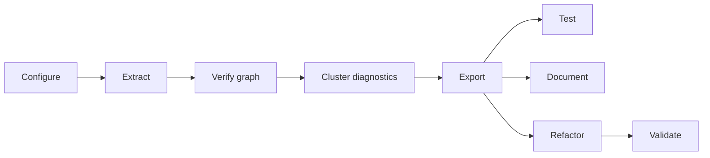

# Extraction Pipeline Template

Cookie-cutter template for turning an Excel financial model into a semantic, distributable Python library using [excel-grapher](https://github.com/Teal-Insights/excel-grapher). The pipeline combines target-driven graph extraction, explicit dynamic-reference constraints, series bindings, LLM-assisted naming and documentation, and Excel-backed parity tests.

See [technical_standard.md](technical_standard.md) for the acceptance bar and [lessons-learned.md](lessons-learned.md) for design rationale.

## Clone and configure (onboarding checklist)

Follow this order when adapting the template to a new workbook. Each step has a stage-gate owner who signs off before the next step begins.

| Step | Owner | Action |
|---|---|---|
| 1. Ingest | **Config author** | Clone the repo. Replace `data/workbook.xlsx` and `data/guide.md`. Clear workbook-specific state: reset `bindings/*.bindings.yaml` to empty `series: []` placeholders (or delete them), and delete `dist/` and `.cache/`. Point [workbook_config.py](workbook_config.py) paths at the new workbook. |
| 2. Audit | **Config author** | Run `uv run python -m src.workbook_audit --output artifacts/workbook-audit.md`. Resolve blocking automation (VBA, macros, external links) before graph work. |
| 3. Configure | **Config author** | Declare extraction targets and dynamic-ref constraints (empty `series: []` binding placeholders are fine). See [Configure](#1-configure) below. |
| 4. Extract | **Config author** | Run `uv run python -m src.extraction_pipeline --extract-graph`. Confirm the graph builds without `DynamicRefError` (bindings are not required yet). |
| 5. Review graph | **Graph reviewer** | Inspect `artifacts/dependency-graph/` (see [artifacts/README.md](artifacts/README.md)). Confirm expected sheets, no spurious nodes, and complete shock/engine paths. Optionally run opt-in LLM dependency audits: `uv run pytest tests/test_extraction_graph_accuracy.py --run-skipped` (workbook audits auto-select parents from the warm committed `.cache/dependency-graph/` entry — run `--only-stage extract` or `scripts.regenerate_graph_cache` first; `GRAPH_AUDIT_CASES` is optional steering only. The synthetic smoke-test audit runs without extra configuration). Set the provider API key for `LLM_GRAPH_AUDIT_MODEL` (defaults to `gpt-5.5`). |
| 6. Verify graph | **Parity owner** | Define a scenario matrix in `tests/differential/` and run graph-oracle differential parity before export (see [Verify graph](#3-verify-graph)). Prefer a warm `.cache/dependency-graph/` from extract first. Do not proceed to export until graph-oracle parity passes. |
| 7. Cluster diagnostics | **Config author** | Before first export, compare clustering modes and remodel shredded bindings (see [Cluster diagnostics](#4-cluster-diagnostics)). Do not run the full pipeline until `VARIATION_MODE` is chosen and shredded families are addressed. |
| 8. Export and test | **Parity owner** | Run the full pipeline (`uv run python -m src.extraction_pipeline`). Run exported-library differential parity; on Windows with Excel, re-run from the exported project (see [Test](#6-test)). |
| 9. Document and refactor | **Config author** | Generate docs, refactor internals behind parity gates, and update committed parity evidence under `data/differential/`. |

Copy the checkbox list in [Checklist for a new workbook](#checklist-for-a-new-workbook) into your extraction tracking issue and check items off as you go.

## What you provide

Before running the pipeline, populate this repository with workbook-specific inputs:

| Input | Location | Purpose |
|---|---|---|
| Workbook | `data/workbook.xlsx` | Source Excel model |
| Human guide | `data/guide.md` | Domain usage, public I/O catalog, scenario narrative |
| Targets | `workbook_config.py` → `TARGETS` | Named ranges or addresses driving graph extraction |
| Constraints | `workbook_config.py` → `CONSTRAINTS` | Dynamic-ref resolution and leaf input/constant classification |
| Series bindings | `bindings/inputs.bindings.yaml`, `bindings/outputs.bindings.yaml`, `bindings/internals.bindings.yaml`, `bindings/constants.bindings.yaml` | Records-shaped public API, internal formula-cell triangulation, and reader-only constant leaves |
| Package metadata | `workbook_config.py` → `DIST_METADATA` | Generated `dist/` project name, docs URLs, README |
| Variation mode | `workbook_config.py` → `VARIATION_MODE` | Formula-cluster splitting for internals refactor (see [Cluster diagnostics](#4-cluster-diagnostics) and [Refactor](#8-refactor)) |
| Clustering mode | `workbook_config.py` → `CLUSTERING_MODE` | Base formula-cluster grouping before variation splitting (see [Refactor](#8-refactor)) |
| Internal binding exemptions | `workbook_config.py` → `INTERNAL_BINDING_EXEMPT_CELLS` | Reviewed formula cells allowed to remain unbound |
| Graph-cache target bundles | `workbook_config.py` → `GRAPH_CACHE_TARGET_BUNDLES` | Optional extra target sets for `scripts/regenerate_graph_cache.py` |
| Scenario matrix | `tests/differential/*_scenario_matrix.py` (or hooks in `differential_test_graph.py`) | Representative input combinations for differential parity sweeps |
| Graph parity evidence | `data/differential/graph/` | Reference reports after passing pre-export graph-oracle sweeps (optional until configured) |
| Exported-library parity evidence | `data/differential/exported_library/` | Reference reports after passing post-export parity sweeps (optional until configured) |

Use [templates/binding-authoring-prompt.txt](templates/binding-authoring-prompt.txt) with a coding agent to draft bindings from the guide, workbook, and extracted graph.

### Iterative configuration

The linear `configure → extract` summary is a stage gate, not a one-shot workflow. Expect several passes:

1. **Draft** `TARGETS` and dynamic-ref `CONSTRAINTS`. Keep `bindings/*.bindings.yaml` as empty `series: []` placeholders (or draft shards) — extract does not load or merge series bindings.
2. **Extract** with `--extract-graph` and review `artifacts/dependency-graph/`.
3. **Constrain** any remaining unconstrained graph leaves (for input/constant classification), then author / refine bindings using what the graph reveals.
4. **Re-extract** as needed for graph review; run export (or `build_pipeline_graph`) only once bindings are mergeable and complete.

Extract is graph-first. Binding load, validation, derivation, and internal-coverage enforcement run at export (and any other bindings-ready path). Empty placeholder shards are expected during bootstrap.

## Pipeline stages

The end-to-end workflow follows the stage gates in [technical_standard.md](technical_standard.md):



### 1. Configure

1. Edit [workbook_config.py](workbook_config.py): paths, `TARGETS`, `CONSTRAINTS`, and `DIST_METADATA`. Keep `bindings/*.bindings.yaml` as empty `series: []` placeholders until after the first extract if needed.
2. **Dynamic-ref pass** — list leaves that need domains to resolve `OFFSET` / `INDIRECT` / `INDEX` (`excel_grapher.list_dynamic_ref_constraint_candidates` against `TARGETS`), constrain them, and iterate until `--extract-graph` succeeds without `DynamicRefError`. That lister only covers dynamic-ref argument leaves; it will not enumerate every leaf that later appears in the finished graph.
3. **Leaf-classification pass** — after a successful extract, constrain every remaining unconstrained graph leaf (`graph.leaf_keys()` minus `CONSTRAINTS`) so each leaf classifies as `input` or `constant`. Every mutable input leaf must appear in `inputs.bindings.yaml`. Fixed leaves that formulas should read via `read_*` (not `xl_cell`) need a `constant: {}` series in `constants.bindings.yaml` (see [Authoring constants](#authoring-constants)).
4. Author I/O `bindings/*.bindings.yaml` (schema version `1.13.0`, one logical series per public API function or input/constant group). Empty `series: []` placeholders load (excel-grapher 5.1.4+); author real series before export.
5. Bind every internal formula cell in `internals.bindings.yaml` (see [Authoring internals](#authoring-internals) below).

Validation checks:

- `validate_series_bindings(...)` reports `ok`
- `derive_input_series` / `derive_output_series` / `derive_internal_series` / `derive_constant_series` resolve every binding
- No unbound mutable input leaves
- Run the pre-extraction workbook audit and review blocking automation before graph work:

```bash
uv run python -m src.workbook_audit --output artifacts/workbook-audit.md
```

See [artifacts/README.md](artifacts/README.md) and [artifacts/artifacts-catalog.md](artifacts/artifacts-catalog.md) for report sections and commit policy. Optional hooks in [workbook_config.py](workbook_config.py) (`AUDIT_TITLE`, `AUDIT_PUBLIC_INPUTS`, `AUDIT_GUIDE_USE_CASES`) add workbook-specific inventory tables when populated.

### 2. Extract

Build the dependency graph with provenance enabled and write review artifacts before export:

```bash
uv run python -m src.extraction_pipeline --stop-after-stage extract
# equivalent: --extract-graph
```

This writes `artifacts/dependency-graph/` (see [artifacts/artifacts-catalog.md](artifacts/artifacts-catalog.md)), then exits. Review graph completeness manually (step 5 in the [onboarding checklist](#clone-and-configure-onboarding-checklist)): expected sheets, no spurious nodes, shock/engine paths present. See [artifacts/README.md](artifacts/README.md) for commit policy and [artifacts/artifacts-catalog.md](artifacts/artifacts-catalog.md) for the summary schema.

You can also build the graph programmatically:

```python
from excel_grapher.grapher import DynamicRefConfig, create_dependency_graph

graph = create_dependency_graph(
    workbook_path,
    targets,
    load_values=True,
    dynamic_refs=DynamicRefConfig.from_constraints(constraints, {}),
    capture_dependency_provenance=True,
)
```

After manual review (onboarding step 5), run graph-oracle differential parity (step 6) before export.

`--extract-graph` builds the dependency graph and writes review artifacts only. **Internal binding derivation** and optional **internal binding coverage validation** run later during export (and any other call that uses `build_pipeline_graph` / `resolve_pipeline_bindings`), once series bindings are mergeable.

#### Internal series bindings

After bindings are validated (export / bindings-ready path), the pipeline derives **internal series** for formula cells declared with `internal: {}` in `bindings/internals.bindings.yaml`. Each resolved cell carries `{address, key, record}` triangulation data used by the graph explorer and internals refactor. Effective dimension ids live in binding manifests and derived series records, not on graph node metadata.

#### Authoring internals

Author `internals.bindings.yaml` after `--extract-graph`, when you can see which formula cells still need triangulation. Coverage requires **every formula node** not already bound in `inputs.bindings.yaml` or `outputs.bindings.yaml`.

- **One series per logical group** — a single lookup/anchor cell or one formula row/range (e.g. `Engine!C10:G10`), not one entry per cell.
- **Same YAML shape as public bindings** — use `internal: {}` instead of `input` / `output`. Scalar examples are in [tests/fixtures/synthetic/internals.bindings.yaml](tests/fixtures/synthetic/internals.bindings.yaml).
- **Scalars vs row series** — lookup and anchor formulas usually use `layout: scalar` with `key: []`. Parallel time-series rows use `layout: row_series` with a key dimension (often concept `TIME_PERIOD`) bound from the **header row that labels that row**; different tables often use different header rows.
- **Give every dimension an explicit `id`** — `id` names the dimension itself and is the effective key used in records, cell keys, graph labels, and refactor parameters. `concept` is the SDMX-style meaning category. They match unless two dimensions in one series share a concept (e.g. projection axis and reference period both on `TIME_PERIOD`), in which case give each a distinct id such as `PROJECTION_PERIOD` / `REFERENCE_PERIOD`. Parameter names come from the effective id (`projection_period`). Concept-only keys remain valid only when the concept uniquely identifies one dimension.
- **Reuse public concepts** — prefer concept IDs already in your bindings / `concept_scheme` (`TIME_PERIOD`, `INDICATOR`, `PARAMETER`, etc.) so refactor prompts get meaningful semantic hints even when dimension ids differ.
- **Validate** — `validate_series_bindings(...)`, then `derive_internal_series(...)`. Run `uv run pytest tests/test_internal_binding_coverage.py` once `INTERNAL_BINDING_VALIDATION_MODE` is enabled.
- **Review** — re-run `--extract-graph` and confirm bound formula nodes show `keys:` / `record:` labels in the graph explorer.

Schema details and field shapes: excel-grapher `user_guide/05-series-bindings.qmd` (internal direction, schema 1.13.0). Use [templates/binding-authoring-prompt.txt](templates/binding-authoring-prompt.txt) for agent-assisted drafting.

#### Authoring constants

Author `constants.bindings.yaml` for graph **leaves** that formulas depend on but that are not user-editable public inputs. Classification via `Literal[...]` in `CONSTRAINTS` marks those leaves as `constant` for codegen `CONSTANTS`; a `constant: {}` binding additionally emits a semantic `read_*` and rewrites formula bodies off bare `xl_cell`.

- **Same YAML shape as public bindings** — use `constant: {}` instead of `input` / `output` / `internal`. Mutually exclusive with those directions.
- **Leaf-only** — `data_range` must cover graph leaves (not formula nodes). Formula triangulation stays in `internals.bindings.yaml`.
- **Reader name** — default `read_<series_id>`; override with `constant.reader.name` when needed.
- **No public setter** — do not declare `input.setter` on constant series. If downstream users must edit the cell, use an `input` binding instead.
- **Validate** — `validate_series_bindings(...)`, then `derive_constant_series(...)`. Run `uv run python -m scripts.binding_resolution_audit` (includes the `constant` direction by default).

Synthetic example: [tests/fixtures/synthetic/constants.bindings.yaml](tests/fixtures/synthetic/constants.bindings.yaml). Full rules: [bindings/README.md](bindings/README.md#constant-bindings-reader-only-leaves). Schema reference: excel-grapher `user_guide/05-series-bindings.qmd` (constant direction, schema 1.11.0+).

#### Internal binding coverage validation

Configure validation in [workbook_config.py](workbook_config.py):

- `INTERNAL_BINDING_VALIDATION_MODE` — `off`, `warn` (default), or `error`
- `INTERNAL_BINDING_EXEMPT_CELLS` — sheet-qualified formula addresses reviewed and intentionally allowed to remain unbound

Coverage applies to **formula nodes** that are not already covered by public input or output bindings.

| Mode | Pipeline | Pytest (`tests/test_internal_binding_coverage.py`) |
|---|---|---|
| `off` | Skipped | Skipped |
| `warn` | Logs warnings for unbound required formula cells | Fails the test suite |
| `error` | Raises before export/refactor | Fails the test suite |

Use `warn` while iterating locally; treat pytest failures as the CI gate once exemptions are committed. Add reviewed formula cells to `INTERNAL_BINDING_EXEMPT_CELLS` rather than weakening the mode.

#### Binding and graph-cache utilities

| Utility | Command | When to use |
|---|---|---|
| Graph-cache regeneration | `uv run python -m scripts.regenerate_graph_cache` | After changing the workbook, bindings, targets/constraints, or excel-grapher. Add `--force` to rebuild even when entries exist; `--force` also clears and prunes `.cache/series-resolution/`, `.cache/series-derived/`, and `.cache/bindings-validation/`, and clears `.cache/clusters/` and `.cache/internals/`. Optional extra bundles: `GRAPH_CACHE_TARGET_BUNDLES` in `workbook_config.py`. |
| Internal-binding burndown | `uv run python -m scripts.internal_binding_burndown` | After `--extract-graph` to see which formula rows still need `internals.bindings.yaml` entries. Supports `--per-sheet` and `--max-rows`. Reuses the newest cached graph even when bindings changed. |
| Programmatic binding emission | `uv run python -m scripts.author_bindings` | Large, regular binding surfaces defined in a declarative catalog (`templates/binding-catalog.example.yaml`). Complements [templates/binding-authoring-prompt.txt](templates/binding-authoring-prompt.txt). |

#### Clustering / schedule diagnostics

These CLIs inspect warm caches or recompute clustering without running the full export/refactor pipeline. **Before the first export**, run the compare utility (onboarding step 7); use diagnose/inspect when families shred or a mechanical refactor fails. See [Cluster diagnostics](#4-cluster-diagnostics).

| Utility | Command | When to use |
|---|---|---|
| Compare variation modes | `uv run python -m scripts.compare_cluster_variation_modes` | **Required before first export:** side-by-side `independent` vs `dominant_key_only` series-fingerprint family counts (and bucket diffs). Quiet summary by default; `--include changes members fingerprints` for detail; `--clustering-mode` to override the configured mode. |
| Schedule atomization | `uv run python -m scripts.diagnose_schedule_atomization` | Neighbor of compare: when fingerprint families shred into many schedule units, reports fan-out stats, worst families, peel samples, shredded series, and cyclical remodel recommendations (`--top-families`, `--peel-samples`, …). |
| Inspect one cluster | `uv run python -m scripts.inspect_cluster --cluster-id N` | After a mechanical refactor failure: print member addresses/formulas for fingerprint-family `N`. Add `--schedule` for peels, `--sources` (optionally `--internals path`) for `cell_*` bodies. Honors `--variation-mode` / `--clustering-mode` / `--no-cache`. |

Commit `.cache/dependency-graph/` only when your downstream pipeline vendors the cache for warm CI (override `.gitignore` for that directory). Run `uv run pytest tests/test_binding_utility_scripts.py` to exercise the synthetic fixture path end-to-end.

### 3. Verify graph

**Why:** Graph-oracle parity isolates extraction, configuration, and dynamic-ref resolution bugs from export and codegen bugs. When export happens first, exported-library differential failures are ambiguous — they may come from the graph, the bindings, or the generated package.

**What:** A scenario matrix (canonical baselines, single-axis shocks, categorical factorials, and boundary cases) exercised by [`tests/differential/differential_test_graph.py`](tests/differential/differential_test_graph.py). The harness compares Microsoft Excel (golden master via `xlwings`) against the in-memory dependency graph evaluated with `FormulaEvaluator.evaluate`.

**How:**

Prefer a warm `.cache/dependency-graph/` entry from extract (or
`scripts.regenerate_graph_cache`) so the harness loads the graph via the same
cache helpers as the pipeline instead of cold-building:

```bash
uv run python -m src.extraction_pipeline --only-stage extract
uv run python -m tests.differential.differential_test_graph
```

Reports land under `data/differential/graph/`. Exit codes: **`0`** all comparisons pass, **`1`** any failure, **`2`** prerequisite missing or scenarios not configured. See [tests/differential/README.md](tests/differential/README.md) for harness hooks, warm-cache policy, address-key normalization, and workbook-exact label resolution.

**Gate:** Do not run the full pipeline until graph-oracle parity passes.

### 4. Cluster diagnostics

**Why:** Formula clustering and the refactor schedule depend on binding geometry and `VARIATION_MODE`. Exporting first locks in an expensive codegen/refactor path; shredded fingerprint families produce many tiny schedule units that the mechanical refactor cannot collapse. Comparing modes and remodeling bindings up front avoids re-exporting after the first mechanical failure.

**What:** [`scripts/compare_cluster_variation_modes.py`](scripts/compare_cluster_variation_modes.py) builds clusters for `independent` vs `dominant_key_only` and prints series-fingerprint family counts (plus optional `--include changes|members|fingerprints` detail). Its neighbor [`scripts/diagnose_schedule_atomization.py`](scripts/diagnose_schedule_atomization.py) also reports fingerprint-family counts, but focuses on how those families fan out into schedule units (intact vs shredded), not on comparing clustering modes.

**How:**

```bash
uv run python -m scripts.compare_cluster_variation_modes
```

Pass `--clustering-mode` to override the configured mode, or `--include changes members fingerprints` for per-bucket detail. When families shred, run:

```bash
uv run python -m scripts.diagnose_schedule_atomization
```

In general, fix shredded groups by converting row bindings to column bindings (or vice versa), or by consolidating multiple series bindings into a `layout: matrix` series. Then set `VARIATION_MODE` / `CLUSTERING_MODE` in [workbook_config.py](workbook_config.py) (see [Refactor](#8-refactor)).

**Gate:** Do not run the full pipeline for the first export until compare has been run, `VARIATION_MODE` is chosen, and shredded families have been remodeled (or explicitly accepted).

### 5. Export

The pipeline applies `OptimalCompression` over the canonical graph, generates a records-shaped API (`make_context`, `set_*`, `compute_*`), writes `dist/<package>/`, and copies the validation bundle into `dist/tests/`. Cluster diagnostics (step 7 in the [onboarding checklist](#clone-and-configure-onboarding-checklist)) should already have chosen `VARIATION_MODE` and addressed shredded families.

### 6. Test

Run exported-library differential parity after export. Graph-oracle parity (step 6 in the [onboarding checklist](#clone-and-configure-onboarding-checklist)) should already have passed before you exported.

```bash
uv run python -m tests.differential.differential_test_exported_library
```

On Windows with Excel installed, re-run from the exported project:

```pwsh
uv run --project dist --group validation python -m tests.differential.differential_test_exported_library --layout exported
```

### 7. Document

Great Docs generates the distributable website from the exported package. LLM rewrites guide sections into Python-first user-guide pages when cache misses require an API key.

### 8. Refactor

Cluster parallel formula families, collapse internals with LLM-authored semantic helpers behind a parity gate, and prune thin wrappers. Each refactor pass re-runs differential tests. Choose `VARIATION_MODE` from [Cluster diagnostics](#4-cluster-diagnostics) before the first export/refactor.

#### Formula-cluster variation mode

Set `VARIATION_MODE` in [workbook_config.py](workbook_config.py) to control how parallel formula cells are grouped before the LLM refactor step. This affects **export** and **refactor-bucket recording** only — not graph extraction (`--extract-graph` ignores it). Run `uv run python -m scripts.compare_cluster_variation_modes` before committing a mode on a new workbook.

| Mode | Behavior |
|---|---|
| `independent` (default) | Keep one refactor cluster when formulas share the same AST shape and scalar literals, even if operand binding keys vary along multiple dimensions. |
| `dominant_key_only` | After AST clustering, split clusters where operand keys vary along more than one dimension, keeping only the dimension with the widest value spread as a refactor parameter. Use when a row of parallel formulas mixes, for example, country and time-period variation but you want helpers parameterized only by time period. |

#### Formula-cluster base mode

Set `CLUSTERING_MODE` in [workbook_config.py](workbook_config.py) to control how refactor units are formed before `VARIATION_MODE` splitting. Default is `series_ast`.

| Mode | Behavior |
|---|---|
| `series_ast` (default) | AST-cluster parallel formula families, partition each cluster by owning series id (internal first, else public output/input binding series), then apply `VARIATION_MODE` within each series partition. |
| `series` | One refactor unit per partition series id (internal first, else public output/input; no cross-series merging; `VARIATION_MODE` does not apply). |
| `ast` | Series-blind AST clustering only (legacy behavior). |

Structural fingerprints include literal numbers, strings, and booleans. Formulas that differ only by cell addresses or binding-key concepts can still share a cluster under `ast` or within a single series under `series_ast`.

Missing internal-series ownership is not the same as an intended singleton refactor unit. Output time-sweep cells that share a public `outputs.bindings.yaml` series id stay in one multi-member cluster so collapse can emit `_ADDRESS_DISPATCH` entries with per-cell binding keys (for example `TIME_PERIOD`).

Override per run on either entry point:

```bash
uv run python -m src.extraction_pipeline --clustering-mode series_ast --variation-mode dominant_key_only
uv run python -m src.record_refactor_buckets --clustering-mode series_ast --variation-mode dominant_key_only
```

Inspect planned refactor targets without calling the LLM:

```bash
uv run python -m src.record_refactor_buckets
```

#### Mechanical body synthesis and the naming-only contract

Generated cell translations are unpacked mechanically (excel-grapher
`unpack_return`): eager reads become statement-level `_tN` temporaries while
lazy `IF`/`CHOOSE` branches stay inline, preserving Excel error semantics.

For each cluster refactor unit, [src/mechanical_body.py](src/mechanical_body.py)
then attempts to synthesize the parameterized helper body directly from the
fingerprint reference relations: geometry lookup dictionaries, derived
lag/offset arguments, dependency pass-through calls, self-recurrence, and
cross-fingerprint routing (`series` clustering). Every synthesized read is
verified per member against the recorded ref addresses/keys. When synthesis
succeeds, the LLM receives the **naming-only contract**
([tests/fixtures/cluster_naming_prompt.md](tests/fixtures/cluster_naming_prompt.md)):
it writes the docstring and renames the mechanical locals, and the pipeline
applies the renames mechanically — the model cannot alter semantics. Units the
synthesizer cannot prove correct fall back to the legacy full-body contract,
and the per-helper parity gate guards both paths. Set
`MECHANICAL_REFACTOR_BODIES=0` to disable synthesis for a run.

Iterate on the refactor stage in isolation after a warm export (scratch output root by default; thin wrapper over `--only-stage refactor`):

```bash
uv run python -m src.extraction_pipeline --stop-after-stage export
uv run python -m scripts.run_refactor_stage --dump-prompts artifacts/refactor-lab-prompts
uv run python -m scripts.run_refactor_stage --report-synthesis artifacts/refactor-lab-synthesis
```

`--dump-prompts`, `--report-synthesis`, `--dry-run`, and `--no-parity-gate` all force a real Pass 1 / Pass 2 run: answering them from the refactored-internals cache would return before any prompt was built, making them silent no-ops. Add `--force-rebuild` to also discard warm graph / projection / cluster payloads.

## Run the pipeline

After graph-oracle parity and cluster diagnostics pass (see [Verify graph](#3-verify-graph) and [Cluster diagnostics](#4-cluster-diagnostics)), run the full export pipeline:

```bash
uv sync
uv run python -m src.extraction_pipeline
```

### Stage entry and exit

The pipeline is ordered as `extract → export → refactor → validate → document`. Each completed stage writes `artifacts/stages/<stage>.json` (cache keys, upstream keys, and input fingerprints). Use the flags below to enter or exit at a named stage without re-paying upstream work:

| Flag | Behavior | Typical use |
|---|---|---|
| `--stop-after-stage extract` (or `--extract-graph`) | Run extract only (graph review artifacts) | Bindings / constraint iteration |
| `--stop-after-stage export` | Run through export | Inspect generated API before LLM refactor |
| `--start-from-stage refactor` | Resume at refactor from warm `export.json` | Re-run internals after export is stable |
| `--only-stage validate` | Run validate only (rehydrates `dist/` from manifest keys) | Differential without export/refactor |
| `--only-stage document` | Run document only | Guide rewrite against an existing package |
| `--stop-after-stage document` (default) | Full pipeline from the start | Release / complete run |
| `--force-rebuild` | Rebuild warm on-disk caches even when keys match | Invalidate stale cache payloads |

`--start-from-stage` and `--only-stage` are mutually exclusive. `--only-stage` cannot be combined with `--stop-after-stage`. Loading a stage manifest recomputes workbook / bindings / constraints / mode fingerprints and **fails loudly** (naming the drifted input) when they disagree — it never silently falls back to a full run. Entering at `validate` or `document` rebuilds `dist/` via `materialize_package` from the manifest's codegen and internals keys.

When the default full run reaches `document` after a non-zero exported-library differential exit, the document stage is skipped so parity diagnosis is not gated on guide rewrite. Pass `--force-document` to rewrite guides anyway. Document-stage failures (timeouts, validation exhaustion, LLM errors) raise loudly after logging that export/differential artifacts under `dist/` are preserved.

Guide-rewrite LLM calls use `SECTION_REWRITE_REQUEST_TIMEOUT` (default 300s per request) and `SECTION_REWRITE_DEADLINE` (default timeout × 4 attempts) so a stuck rewrite cannot block the pipeline indefinitely. Set `PIPELINE_STALL_SECONDS` for heartbeat stack dumps during the document stage.

```bash
uv run python -m src.extraction_pipeline --stop-after-stage export
uv run python -m src.extraction_pipeline --start-from-stage refactor --stop-after-stage validate
uv run python -m src.extraction_pipeline --only-stage validate
```

### Prerequisites

LLM steps (docstrings, internals refactor, guide rewrites) cache results under `.cache/`. Dependency graph extraction caches under `.cache/dependency-graph/` as excel-grapher EGDG multipart payloads, keyed by workbook bytes, targets, constraints, load/provenance flags, and `excel-grapher` version — **not** bindings. `OptimalCompression` projection, `derive_*_series` resolution, `validate_series_bindings`, derived leaf/binding objects, formula clusters / refactor schedule, and codegen module texts cache gzipped pickle payloads under `.cache/projection/`, `.cache/series-resolution/`, `.cache/series-derived/`, `.cache/bindings-validation/`, `.cache/clusters/`, and `.cache/codegen/`. Series-resolution, series-derived, bindings-validation, and cluster keys fold a `bindings_fingerprint` (plus clustering modes, codegen options, and `excel-grapher` version as applicable); projection keys fold the graph cache key, preserve-scope flag, strategy, and `excel-grapher` version. A successful gated refactor also content-keys the final `internals.py` under `.cache/internals/<key>.py` (codegen key, clusters key, digest of `.cache/internals-refactors.json`, mechanical/parity schema versions, `MECHANICAL_REFACTOR_BODIES`, refactor model, and `excel-grapher` version) so a warm refactor is a file copy that skips Pass 1, the batched parity gate, and Pass 2. The Pass 1 mechanical checkpoint is stored under `.cache/internals/<package-namespace>/` (not under `dist/`). `dist/` is a disposable projection of those caches: `materialize_package` rebuilds it from the codegen (and optional internals) cache keys recorded in `dist/.pipeline-cache-keys.json`. That sidecar also records `internals_inputs` — the refactor model, mechanical/parity schema versions, `MECHANICAL_REFACTOR_BODIES`, and `excel-grapher` version the committed module was built under. Adopting a committed `dist/` happens before clustering, so the full content key cannot be recomputed there; the recorded provenance must match the current run or the refactor is rebuilt from pristine codegen instead. Stage entry/exit also records those keys (plus fingerprints) under `artifacts/stages/*.json`. Pass `--no-cache` to bypass graph, projection, series-resolution, series-derived, bindings-validation, cluster, codegen, and refactored-internals caches for a single run; pass `--force-rebuild` to rewrite warm cache entries. A clean run reproduces committed output without an API key unless inputs change. For uncached steps, set provider API keys and per-stage model names in a `.env` file at the repository root:

```bash
# .env — logging verbosity for pipeline entry points (default: INFO)
LOG_LEVEL=INFO

# .env — provider API keys (set the key for whichever model family you use)
OPENAI_API_KEY=sk-...
ZAI_API_KEY=...
DEEPSEEK_API_KEY=...

# Per-stage model selection (optional; default gpt-5.5 when unset)
# Name prefix selects the provider: gpt-*, glm-*, deepseek-*
DOCSTRING_MODEL=gpt-5.5
REFACTOR_MODEL=gpt-5.5
SECTION_REWRITE_MODEL=gpt-5.5
LLM_GRAPH_AUDIT_MODEL=gpt-5.5
```

If an uncached LLM step is reached without the required API key, the pipeline fails fast with an `*_API_KEY is required ...` error.

Opt-in graph dependency audits (`pytest --run-skipped`) use the same multi-provider routing: set `LLM_GRAPH_AUDIT_MODEL` to a `gpt-*`, `glm-*`, or `deepseek-*` model name and provide the matching API key (`OPENAI_API_KEY`, `ZAI_API_KEY`, or `DEEPSEEK_API_KEY`). One model drives every audit case in a run. Workbook audits auto-select difficulty-ranked formula parents from the warm committed `.cache/dependency-graph/` cache (they never cold-build under pytest's redirected cache — miss skips with a hint to run `--only-stage extract`). Optional `workbook_config.GRAPH_AUDIT_CASES` entries steer selection (`required` pins and labeled focuses); the synthetic smoke-test audit uses the fixture catalog.

DeepSeek runs with thinking mode disabled by default. To enable it (and pass reasoning effort through, which DeepSeek only honors in thinking mode), set `DEEPSEEK_THINKING` to a truthy value (`1`, `true`, `yes`, or `on`):

```bash
DEEPSEEK_THINKING=1
```

## Graph exploration

The `--extract-graph` stage writes an interactive Cytoscape site under `artifacts/dependency-graph/`. To regenerate it manually from an in-memory graph:

```python
from pathlib import Path

from src.dependency_graph_viz import (
    constant_keys_from_leaf_classification,
    series_cell_keys,
    write_dependency_graph_site,
)
from src.internal_bindings import binding_node_labels, build_internal_binding_index

output_dir = Path("artifacts/dependency-graph")
internal_binding_index = build_internal_binding_index(internal_series)
write_dependency_graph_site(
    graph,
    output_dir,
    node_labels=binding_node_labels(graph, internal_binding_index),
    input_keys=series_cell_keys(input_series),
    output_keys=series_cell_keys(output_series),
    internal_binding_index=internal_binding_index,
    constant_keys=constant_keys_from_leaf_classification(leaf_classification),
)
```

Serve locally (do not commit generated JSON/HTML):

```bash
uv run python -m http.server 8000 --directory artifacts/dependency-graph
```

Open `http://localhost:8000/`.

## Checklist for a new workbook

Ordered to match the [onboarding checklist](#clone-and-configure-onboarding-checklist):

- [ ] **Ingest:** `data/workbook.xlsx` and `data/guide.md` populated; bindings reset to empty placeholders (or removed); `dist/` and `.cache/` cleared
- [ ] **Audit:** Pre-extraction workbook audit reviewed (`uv run python -m src.workbook_audit`); blocking automation resolved
- [ ] **Configure:** Outputs declared as extraction targets in `workbook_config.py`
- [ ] **Configure:** Dynamic-ref constraint candidates constrained (`list_dynamic_ref_constraint_candidates`; graph builds without `DynamicRefError`)
- [ ] **Extract:** Graph extracts with provenance (`--extract-graph`; empty `series: []` placeholders OK)
- [ ] **Configure:** Remaining graph leaves constrained and classified; mutable leaves bound
- [ ] **Configure:** `bindings/inputs.bindings.yaml` + `outputs.bindings.yaml` authored and validated
- [ ] **Configure:** Fixed leaves that need semantic `read_*` bound in `bindings/constants.bindings.yaml` (`constant: {}`)
- [ ] **Configure:** Internal binding exemptions reviewed (`INTERNAL_BINDING_EXEMPT_CELLS`)
- [ ] **Configure:** `bindings/internals.bindings.yaml` covers internal formula cells
- [ ] **Review graph:** Manual completeness review done; optional LLM dependency audit passed (`pytest --run-skipped`)
- [ ] **Verify graph:** Scenario matrix defined in `tests/differential/`; warm `.cache/dependency-graph/` from extract (or `scripts.regenerate_graph_cache`); graph-oracle parity passes (`uv run python -m tests.differential.differential_test_graph`)
- [ ] **Configure:** Internal binding coverage passes (`uv run pytest tests/test_internal_binding_coverage.py`)
- [ ] **Cluster diagnostics:** `uv run python -m scripts.compare_cluster_variation_modes` run; `VARIATION_MODE` chosen; shredded families remodeled via `diagnose_schedule_atomization` (row↔column series or consolidate to matrix) or explicitly accepted
- [ ] **Export:** `dist/` package builds; semantic API scenario runs (bindings authored beyond empty placeholders)
- [ ] **Export:** Validation bundle exported; exported-library differential parity passes (Windows Excel sweep when available)
- [ ] **Document / refactor:** Public API uses domain language; docstrings present
- [ ] **Document / refactor:** Internals refactored; parity re-confirmed after refactor passes

## Development

```bash
uv sync
uv run pre-commit install
uv run pytest
uv run ruff check
uv run ruff format
uv run ty check
```

Pull requests run the same test suite on Ubuntu via `.github/workflows/test.yml`.

### Deploying the generated package

The deploy workflow (`.github/workflows/deploy.yml`) is available from the Actions tab via `workflow_dispatch`. It is **publish-only**: the extraction pipeline calls LLM providers and can take hours, so generation is run locally and never in CI. Generate the package and commit `dist/`, then dispatch the workflow:

```bash
uv run python -m src.extraction_pipeline
git add -f dist && git commit -m "Regenerate dist/"
```

`dist/` is gitignored by default; commit it explicitly (`git add -f dist`) so the deploy workflow has something to publish. On dispatch the workflow verifies the committed `dist/`, uploads it as a build artifact, and — when `DIST_METADATA.repository_url` points at a GitHub repository — publishes `dist/` to that repository by rsyncing over its contents and pushing to `main`. Publishing requires a `DEPLOY_TOKEN` repository secret (a token with write access to the target repository); when `repository_url` is unset or not a GitHub URL, the publish steps are skipped and only the artifact is produced. The generated package ships its own docs deploy workflow (`dist/.github/workflows/deploy-docs.yml`), so the target repository can publish the user guide to GitHub Pages on push.

Opt-in LLM graph spot-check tests: `uv run pytest --run-skipped` (workbook audits auto-select from a warm `.cache/dependency-graph/`; optional `GRAPH_AUDIT_CASES` steers pins/labels; synthetic fixture audits run without extra setup; provider API key required for `LLM_GRAPH_AUDIT_MODEL`).

## Repository layout

| Path | Role |
|---|---|
| `workbook_config.py` | Workbook-specific configuration boundary |
| `src/` | Reusable pipeline implementation |
| `bindings/` | Series binding sidecars (user-authored) |
| `data/` | Workbook, guide, differential reports |
| `dist/` | Generated distributable package (gitignored) |
| `templates/` | Binding prompt and canonical API usage reference |
| `.github/workflows/` | Template CI (PR tests) and manual deploy workflow |
| `technical_standard.md` | Acceptance bar and stage gates |
| `lessons-learned.md` | Design rationale from the Tiny DSA rehearsal |
| `artifacts/` | Generated exploration artifacts; see [artifacts/README.md](artifacts/README.md) |
