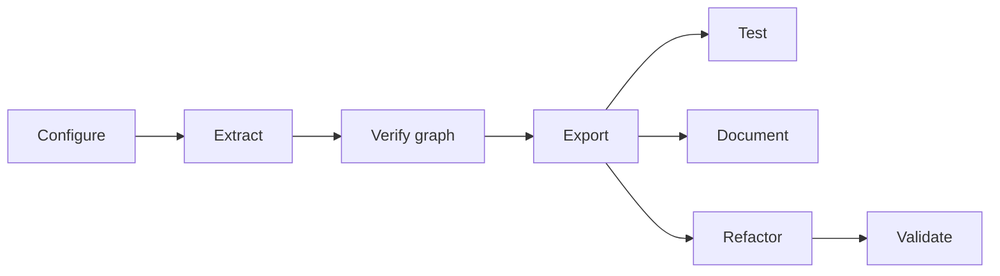

# Tiny DSA extraction pipeline

This repository reverse-engineers the illustrative Excel workbook at [`data/tiny-dsa.xlsx`](data/tiny-dsa.xlsx) and exports a standalone Python package (plus its documentation site sources) into `dist/`. It is configured from the [extraction-pipeline-template](https://github.com/Teal-Insights/extraction-pipeline-template); see [technical_standard.md](technical_standard.md) for the acceptance bar and [lessons-learned.md](lessons-learned.md) for design rationale.

## Clone and configure (onboarding checklist)

Follow this order when adapting the pipeline to a new workbook (or re-onboarding after a major template merge). Each step has a stage-gate owner who signs off before the next step begins.

| Step | Owner | Action |
|---|---|---|
| 1. Ingest | **Config author** | Clone the repo. Replace `data/tiny-dsa.xlsx` and `data/tiny-dsa-guide.md`. Clear workbook-specific state: delete `bindings/*.bindings.yaml`, `dist/`, and `.cache/`. Point [workbook_config.py](workbook_config.py) paths at the new workbook. |
| 2. Audit | **Config author** | Run `uv run python -m src.workbook_audit --output artifacts/workbook-audit.md`. Resolve blocking automation (VBA, macros, external links) before graph work. |
| 3. Configure | **Config author** | Declare extraction targets, author bindings, constrain every dynamic-ref controller, and classify all graph leaves. See [Configure](#1-configure) below. |
| 4. Extract | **Config author** | Run `uv run python -m src.extraction_pipeline --extract-graph`. Confirm the graph builds without `DynamicRefError`. |
| 5. Review graph | **Graph reviewer** | Inspect `artifacts/dependency-graph/` (see [artifacts/README.md](artifacts/README.md)). Confirm expected sheets, no spurious nodes, and complete shock/engine paths. Optionally run opt-in LLM dependency audits: `uv run pytest tests/test_extraction_graph_accuracy.py --run-skipped` (workbook audits require `GRAPH_AUDIT_CASES` in `workbook_config.py`; the synthetic smoke-test audit runs without extra configuration). Set the provider API key for `LLM_GRAPH_AUDIT_MODEL` (defaults to `gpt-5.5`). |
| 6. Verify graph | **Parity owner** | Define a scenario matrix in `tests/differential/` and run graph-oracle differential parity before export (see [Verify graph](#3-verify-graph)). Do not proceed to export until graph-oracle parity passes. |
| 7. Export and test | **Parity owner** | Run the full pipeline (`uv run python -m src.extraction_pipeline`). Run exported-library differential parity; on Windows with Excel, re-run from the exported project (see [Test](#5-test)). |
| 8. Document and refactor | **Config author** | Generate docs, refactor internals behind parity gates, and update committed parity evidence under `data/differential/`. |

Copy the checkbox list in [Checklist for a new workbook](#checklist-for-a-new-workbook) into your extraction tracking issue and check items off as you go.

## What you provide

Before running the pipeline, populate this repository with workbook-specific inputs:

| Input | Location | Purpose |
|---|---|---|
| Workbook | `data/tiny-dsa.xlsx` | Source Excel model |
| Human guide | `data/tiny-dsa-guide.md` | Domain usage, public I/O catalog, scenario narrative |
| Targets | `workbook_config.py` → `TARGETS` | Named ranges or addresses driving graph extraction |
| Constraints | `workbook_config.py` → `CONSTRAINTS` | Dynamic-ref resolution and leaf input/constant classification |
| Series bindings | `bindings/inputs.bindings.yaml`, `bindings/outputs.bindings.yaml`, `bindings/internals.bindings.yaml` | Records-shaped public API surface and internal formula-cell triangulation |
| Package metadata | `workbook_config.py` → `DIST_METADATA` | Generated `dist/` project name, docs URLs, README |
| Projection layout | `workbook_config.py` → `PROJECTION_LAYOUT` | Optional Engine/Outputs column mapping for internals refactor (see below) |
| Variation mode | `workbook_config.py` → `VARIATION_MODE` | Formula-cluster splitting for internals refactor (see [Refactor](#7-refactor)) |
| Internal binding exemptions | `workbook_config.py` → `INTERNAL_BINDING_EXEMPT_CELLS` | Reviewed formula cells allowed to remain unbound |
| Scenario matrix | `tests/differential/*_scenario_matrix.py` (or hooks in `differential_test_graph.py`) | Representative input combinations for differential parity sweeps |
| Graph parity evidence | `data/differential/graph/` | Reference reports after passing pre-export graph-oracle sweeps (optional until configured) |
| Exported-library parity evidence | `data/differential/exported_library/` | Reference reports after passing post-export parity sweeps (optional until configured) |

Use [templates/binding-authoring-prompt.txt](templates/binding-authoring-prompt.txt) with a coding agent to draft bindings from the guide, workbook, and extracted graph.

### Iterative configuration

The linear `configure → extract` summary is a stage gate, not a one-shot workflow. Expect several passes:

1. **Draft** `TARGETS`, `CONSTRAINTS`, and minimal bindings so the graph can build.
2. **Extract** with `--extract-graph` and review `artifacts/dependency-graph/`.
3. **Refine** bindings, constraints, and leaf classification using what the graph reveals (missing paths, unbound leaves, lookup tables).
4. **Re-extract** and repeat until graph review and graph-oracle parity are stable.

Binding authoring explicitly assumes an extracted graph. Leaf classification (`CONSTRAINTS`) and series bindings belong to the same configure bundle and should settle before you treat export as done.

## Pipeline stages

The end-to-end workflow follows the stage gates in [technical_standard.md](technical_standard.md):



### 1. Configure

1. Edit [workbook_config.py](workbook_config.py): paths, `TARGETS`, `CONSTRAINTS`, and `DIST_METADATA`.
2. Author `bindings/*.bindings.yaml` (schema version `1.8.0`, one logical series per public API function or internal formula group).
3. Constrain cells that control `OFFSET` / `INDEX` / `MATCH` / `CHOOSE` so dynamic refs resolve completely.
4. Classify every leaf as `input` or `constant`; every mutable input leaf must appear in `inputs.bindings.yaml`.
5. Bind every internal formula cell in `internals.bindings.yaml` (see [Authoring internals](#authoring-internals) below).

Validation checks:

- `validate_series_bindings(...)` reports `ok`
- `derive_input_series` / `derive_output_series` / `derive_internal_series` resolve every binding
- No unbound mutable input leaves
- Run the pre-extraction workbook audit and review blocking automation before graph work:

```bash
uv run python -m src.workbook_audit --output artifacts/workbook-audit.md
```

See [artifacts/README.md](artifacts/README.md) and [artifacts/artifacts-catalog.md](artifacts/artifacts-catalog.md) for report sections and commit policy. Optional hooks in [workbook_config.py](workbook_config.py) (`AUDIT_TITLE`, `AUDIT_PUBLIC_INPUTS`, `AUDIT_GUIDE_USE_CASES`) add workbook-specific inventory tables when populated.

#### Projection column layout

`PROJECTION_LAYOUT` in [workbook_config.py](workbook_config.py) maps Tiny DSA Engine columns C–G to Outputs columns B–F so the internals refactor names helpers by economic time period instead of raw column letters. Set `projection_dimension_id` when the projection axis uses an explicit dimension id other than `TIME_PERIOD` (for example `PROJECTION_PERIOD`).

### 2. Extract

Build the dependency graph with provenance enabled and write review artifacts before export:

```bash
uv run python -m src.extraction_pipeline --extract-graph
```

This writes `artifacts/dependency-graph/` (see [artifacts/artifacts-catalog.md](artifacts/artifacts-catalog.md)), then exits. Review graph completeness manually (step 5 in the [onboarding checklist](#clone-and-configure-onboarding-checklist)): expected sheets, no spurious nodes, shock/engine paths present.

The extraction design is documented in [docs/extraction-pipeline.qmd](docs/extraction-pipeline.qmd) (rendered to [docs/extraction-pipeline.md](docs/extraction-pipeline.md)).

After manual review (onboarding step 5), run graph-oracle differential parity (step 6) before export.

During graph build the pipeline also runs **internal binding derivation** and optional **internal binding coverage validation** (see below). Both run on `--extract-graph` and on the full export path.

#### Internal series bindings

After the dependency graph is extracted and bindings are validated, the pipeline derives **internal series** for formula cells declared with `internal: {}` in `bindings/internals.bindings.yaml`. Each resolved cell carries `{address, key, record}` triangulation data used by the graph explorer and internals refactor. Effective dimension ids live in binding manifests and derived series records, not on graph node metadata.

#### Authoring internals

Author `internals.bindings.yaml` after `--extract-graph`, when you can see which formula cells still need triangulation. Coverage requires **every formula node** not already bound in `inputs.bindings.yaml` or `outputs.bindings.yaml`.

- **One series per logical group** — a single lookup/anchor cell or one formula row/range (e.g. `Engine!C10:G10`), not one entry per cell.
- **Same YAML shape as public bindings** — use `internal: {}` instead of `input` / `output`. Scalar examples are in [tests/fixtures/synthetic/internals.bindings.yaml](tests/fixtures/synthetic/internals.bindings.yaml).
- **Scalars vs row series** — lookup and anchor formulas usually use `layout: scalar` with `key: []`. Parallel time-series rows use `layout: row_series` with a key dimension (often concept `TIME_PERIOD`) bound from the **header row that labels that row**; different tables often use different header rows.
- **Give every dimension an explicit `id`** — `id` names the dimension itself and is the effective key used in records, cell keys, graph labels, and refactor parameters. `concept` is the SDMX-style meaning category. They match unless two dimensions in one series share a concept (e.g. projection axis and reference period both on `TIME_PERIOD`), in which case give each a distinct id such as `PROJECTION_PERIOD` / `REFERENCE_PERIOD`. Parameter names come from the effective id (`projection_period`). Concept-only keys remain valid only when the concept uniquely identifies one dimension.
- **Reuse public concepts** — prefer concept IDs already in your bindings / `concept_scheme` (`TIME_PERIOD`, `INDICATOR`, `PARAMETER`, etc.) so refactor prompts get meaningful semantic hints even when dimension ids differ.
- **Validate** — `validate_series_bindings(...)`, then `derive_internal_series(...)`. Run `uv run pytest tests/test_internal_binding_coverage.py` once `INTERNAL_BINDING_VALIDATION_MODE` is enabled.
- **Review** — re-run `--extract-graph` and confirm bound formula nodes show `keys:` / `record:` labels in the graph explorer.

Schema details and field shapes: excel-grapher `user_guide/05-series-bindings.qmd` (internal direction, schema 1.8.0). Use [templates/binding-authoring-prompt.txt](templates/binding-authoring-prompt.txt) for agent-assisted drafting.

#### Internal binding coverage validation

Configure validation in [workbook_config.py](workbook_config.py):

- `INTERNAL_BINDING_VALIDATION_MODE` — `off`, `warn` (default), or `error`
- `INTERNAL_BINDING_EXEMPT_CELLS` — sheet-qualified formula addresses reviewed and intentionally allowed to remain unbound

Coverage applies to **formula nodes** that are not already covered by public input or output bindings.

| Mode | Pipeline | Pytest (`tests/test_internal_binding_coverage.py`) |
|---|---|---|
| `off` | Skipped | Skipped |
| `warn` | Logs warnings for unbound required formula cells | Fails the test suite |
| `error` | Raises before export/refactor | Fails the test suite |

Use `warn` while iterating locally; treat pytest failures as the CI gate once exemptions are committed. Add reviewed formula cells to `INTERNAL_BINDING_EXEMPT_CELLS` rather than weakening the mode.

### 3. Verify graph

**Why:** Graph-oracle parity isolates extraction, configuration, and dynamic-ref resolution bugs from export and codegen bugs. When export happens first, exported-library differential failures are ambiguous — they may come from the graph, the bindings, or the generated package.

**What:** A scenario matrix (canonical baselines, single-axis shocks, categorical factorials, and boundary cases) exercised by [`tests/differential/differential_test_graph.py`](tests/differential/differential_test_graph.py). The harness compares Microsoft Excel (golden master via `xlwings`) against the in-memory dependency graph evaluated with `FormulaEvaluator.evaluate`.

**How:**

```bash
uv run python -m tests.differential.differential_test_graph
```

Reports land under `data/differential/graph/`. Exit codes: **`0`** all comparisons pass, **`1`** any failure, **`2`** prerequisite missing or scenarios not configured. See [tests/differential/README.md](tests/differential/README.md) for harness hooks, address-key normalization, and workbook-exact label resolution.

**Gate:** Do not run the full pipeline until graph-oracle parity passes.

### 4. Export

The pipeline applies `OptimalCompression` over the canonical graph, generates a records-shaped API (`make_context`, `set_*`, `compute_*`), writes `dist/tiny_dsa/`, and copies the validation bundle into `dist/tests/`.

On every push to `main`, [`.github/workflows/deploy.yml`](.github/workflows/deploy.yml) runs the full pipeline and syncs `dist/` to the [`Teal-Insights/py-tiny-dsa`](https://github.com/Teal-Insights/py-tiny-dsa) repository.

### 5. Test

Run exported-library differential parity after export. Graph-oracle parity (step 6 in the [onboarding checklist](#clone-and-configure-onboarding-checklist)) should already have passed before you exported.

```bash
uv run python -m tests.differential.differential_test_exported_library
```

On Windows with Excel installed, re-run from the exported project:

```pwsh
uv run --project dist --group validation python -m tests.differential.differential_test_exported_library --layout exported
```

See [tests/differential/README.md](tests/differential/README.md) for coverage details and report locations.

### 6. Document

Great Docs generates the distributable website from the exported package. LLM rewrites guide sections into Python-first user-guide pages when cache misses require an API key.

### 7. Refactor

Cluster parallel formula families, collapse internals with LLM-authored semantic helpers behind a parity gate, and prune thin wrappers. Each refactor pass re-runs differential tests.

#### Formula-cluster variation mode

Set `VARIATION_MODE` in [workbook_config.py](workbook_config.py) to control how parallel formula cells are grouped before the LLM refactor step. This affects **export** and **refactor-bucket recording** only — not graph extraction (`--extract-graph` ignores it).

| Mode | Behavior |
|---|---|
| `independent` (default) | Keep one refactor cluster when formulas share the same AST shape and scalar literals, even if operand binding keys vary along multiple dimensions. |
| `dominant_key_only` | After AST clustering, split clusters where operand keys vary along more than one dimension, keeping only the dimension with the widest value spread as a refactor parameter. Use when a row of parallel formulas mixes, for example, country and time-period variation but you want helpers parameterized only by time period. |

Structural fingerprints include literal numbers, strings, and booleans. Formulas that differ only by cell addresses or binding-key concepts can still share a cluster.

Override per run on either entry point:

```bash
uv run python -m src.extraction_pipeline --variation-mode dominant_key_only
uv run python -m src.record_refactor_buckets --variation-mode dominant_key_only
```

Inspect planned refactor targets without calling the LLM:

```bash
uv run python -m src.record_refactor_buckets
```

## Run the pipeline

After graph-oracle parity passes (see [Verify graph](#3-verify-graph)), run the full export pipeline:

```bash
uv sync
uv run python -m src.extraction_pipeline
```

### Prerequisites

LLM steps (docstrings, internals refactor, guide rewrites) cache results under `.cache/`. Dependency graph extraction and `OptimalCompression` projection also cache gzipped pickle payloads under `.cache/dependency-graph/` and `.cache/projection/` (keyed by workbook bytes, targets, constraints, bindings, and `excel-grapher` version). Pass `--no-cache` to bypass graph and projection caches for a single run. A clean run reproduces committed output without an API key unless inputs change. For uncached steps, set provider API keys and per-stage model names in a `.env` file at the repository root:

```bash
# .env — logging verbosity for pipeline entry points (default: INFO)
LOG_LEVEL=INFO

# .env — provider API keys (set the key for whichever model family you use)
OPENAI_API_KEY=sk-...
ZAI_API_KEY=...
DEEPSEEK_API_KEY=...

# Per-stage model selection (optional; default gpt-5.5 when unset)
# Name prefix selects the provider: gpt-*, glm-*, deepseek-*
DOCSTRING_MODEL=gpt-5.5
REFACTOR_MODEL=gpt-5.5
SECTION_REWRITE_MODEL=gpt-5.5
LLM_GRAPH_AUDIT_MODEL=gpt-5.5
```

If an uncached LLM step is reached without the required API key, the pipeline fails fast with an `*_API_KEY is required ...` error.

Opt-in graph dependency audits (`pytest --run-skipped`) use the same multi-provider routing: set `LLM_GRAPH_AUDIT_MODEL` to a `gpt-*`, `glm-*`, or `deepseek-*` model name and provide the matching API key (`OPENAI_API_KEY`, `ZAI_API_KEY`, or `DEEPSEEK_API_KEY`). One model drives every audit case in a run. Declare audit parents in `workbook_config.GRAPH_AUDIT_CASES` (loaded into `PipelineConfig.graph_audit_cases`) for workbook-specific checks; the synthetic smoke-test audit uses the fixture catalog and runs on a fresh clone without copying cases.

DeepSeek runs with thinking mode disabled by default. To enable it (and pass reasoning effort through, which DeepSeek only honors in thinking mode), set `DEEPSEEK_THINKING` to a truthy value (`1`, `true`, `yes`, or `on`):

```bash
DEEPSEEK_THINKING=1
```

## Graph exploration

The `--extract-graph` stage writes an interactive Cytoscape site under `artifacts/dependency-graph/`. To regenerate it manually from an in-memory graph:

```python
from pathlib import Path

from src.dependency_graph_viz import (
    constant_keys_from_leaf_classification,
    series_cell_keys,
    write_dependency_graph_site,
)
from src.internal_bindings import binding_node_labels, build_internal_binding_index

output_dir = Path("artifacts/dependency-graph")
internal_binding_index = build_internal_binding_index(internal_series)
write_dependency_graph_site(
    graph,
    output_dir,
    node_labels=binding_node_labels(graph, internal_binding_index),
    input_keys=series_cell_keys(input_series),
    output_keys=series_cell_keys(output_series),
    internal_binding_index=internal_binding_index,
    constant_keys=constant_keys_from_leaf_classification(leaf_classification),
)
```

Serve locally (do not commit generated JSON/HTML):

```bash
uv run python -m http.server 8000 --directory artifacts/dependency-graph
```

Open `http://localhost:8000/`.

## Checklist for a new workbook

Ordered to match the [onboarding checklist](#clone-and-configure-onboarding-checklist):

- [ ] **Ingest:** `data/tiny-dsa.xlsx` and `data/tiny-dsa-guide.md` populated; stale bindings, `dist/`, and `.cache/` cleared
- [ ] **Audit:** Pre-extraction workbook audit reviewed (`uv run python -m src.workbook_audit`); blocking automation resolved
- [ ] **Configure:** Outputs declared as extraction targets in `workbook_config.py`
- [ ] **Configure:** `bindings/inputs.bindings.yaml` + `outputs.bindings.yaml` validated
- [ ] **Configure:** Dynamic-ref constraint candidates constrained
- [ ] **Configure:** All leaves classified; mutable leaves bound
- [ ] **Configure:** Internal binding exemptions reviewed (`INTERNAL_BINDING_EXEMPT_CELLS`)
- [ ] **Configure:** `bindings/internals.bindings.yaml` covers internal formula cells
- [ ] **Extract:** Graph extracts with provenance (`--extract-graph`)
- [ ] **Review graph:** Manual completeness review done; optional LLM dependency audit passed (`pytest --run-skipped`)
- [ ] **Verify graph:** Scenario matrix defined in `tests/differential/`; graph-oracle parity passes (`uv run python -m tests.differential.differential_test_graph`)
- [ ] **Configure:** Internal binding coverage passes (`uv run pytest tests/test_internal_binding_coverage.py`)
- [ ] **Export:** `dist/` package builds; semantic API scenario runs
- [ ] **Export:** Validation bundle exported; exported-library differential parity passes (Windows Excel sweep when available)
- [ ] **Document / refactor:** Public API uses domain language; docstrings present
- [ ] **Document / refactor:** Internals refactored; parity re-confirmed after refactor passes

## Development

### Setup

Clone the repository and install the dependencies:

```bash
git clone https://github.com/Teal-Insights/tiny-dsa-extraction-pipeline.git
cd tiny-dsa-extraction-pipeline
uv sync
uv run pre-commit install
```

### Workflow

Type, lint, and format checks are run automatically when you commit.

```bash
uv run pytest
uv run ruff check
uv run ruff format
uv run ty check
```

Pull requests run the same test suite on Ubuntu via `.github/workflows/test.yml`.

Opt-in LLM graph spot-check tests: `uv run pytest --run-skipped` (workbook audits require `GRAPH_AUDIT_CASES` in `workbook_config.py`; synthetic fixture audits run without extra setup; provider API key required for `LLM_GRAPH_AUDIT_MODEL`).

## Repository layout

| Path | Role |
|---|---|
| `workbook_config.py` | Workbook-specific configuration boundary |
| `src/` | Reusable pipeline implementation |
| `bindings/` | Series binding sidecars (user-authored) |
| `data/` | Workbook, guide, differential reports |
| `dist/` | Generated distributable package (gitignored) |
| `templates/` | Binding prompt and canonical API usage reference |
| `.github/workflows/` | Template CI (PR tests) and manual deploy workflow |
| `technical_standard.md` | Acceptance bar and stage gates |
| `lessons-learned.md` | Design rationale from the Tiny DSA rehearsal |
| `artifacts/` | Generated exploration artifacts; see [artifacts/README.md](artifacts/README.md) |
