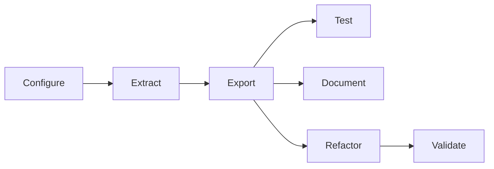

# Tiny DSA extraction pipeline

This repository reverse-engineers the illustrative Excel workbook at [`data/tiny-dsa.xlsx`](data/tiny-dsa.xlsx) and exports a standalone Python package (plus its documentation site sources) into `dist/`. It is configured from the [extraction-pipeline-template](https://github.com/Teal-Insights/extraction-pipeline-template); see [technical_standard.md](technical_standard.md) for the acceptance bar and [lessons-learned.md](lessons-learned.md) for design rationale.

## Clone and configure (onboarding checklist)

Follow this order when adapting the pipeline to a new workbook (or re-onboarding after a major template merge). Each step has a stage-gate owner who signs off before the next step begins.

| Step | Owner | Action |
|---|---|---|
| 1. Ingest | **Config author** | Clone the repo. Replace `data/tiny-dsa.xlsx` and `data/tiny-dsa-guide.md`. Clear workbook-specific state: delete `bindings/*.bindings.yaml`, `dist/`, and `.cache/`. Point [workbook_config.py](workbook_config.py) paths at the new workbook. |
| 2. Audit | **Config author** | Run `uv run python -m src.workbook_audit --output artifacts/workbook-audit.md`. Resolve blocking automation (VBA, macros, external links) before graph work. |
| 3. Configure | **Config author** | Declare extraction targets, author bindings, constrain every dynamic-ref controller, and classify all graph leaves. See [Configure](#1-configure) below. |
| 4. Extract | **Config author** | Run `uv run python -m src.extraction_pipeline --extract-graph`. Confirm the graph builds without `DynamicRefError`. |
| 5. Review graph | **Graph reviewer** | Inspect `artifacts/dependency-graph/` (see [artifacts/README.md](artifacts/README.md)). Confirm expected sheets, no spurious nodes, and complete shock/engine paths. Optionally run opt-in LLM dependency audits: `uv run pytest tests/test_extraction_graph_accuracy.py --run-skipped` (requires `GRAPH_AUDIT_CASES` in `workbook_config.py` and the provider API key for `LLM_GRAPH_AUDIT_MODEL`; defaults to `gpt-5.5`). |
| 6. Export and test | **Parity owner** | Run the full pipeline (`uv run python -m src.extraction_pipeline`). Run differential parity; on Windows with Excel, re-run from the exported project (see [Test](#4-test)). |
| 7. Document and refactor | **Config author** | Generate docs, refactor internals behind parity gates, and update committed parity evidence under `data/differential/`. |

Copy the checkbox list in [Checklist for a new workbook](#checklist-for-a-new-workbook) into your extraction tracking issue and check items off as you go.

## What you provide

Before running the pipeline, populate this repository with workbook-specific inputs:

| Input | Location | Purpose |
|---|---|---|
| Workbook | `data/tiny-dsa.xlsx` | Source Excel model |
| Human guide | `data/tiny-dsa-guide.md` | Domain usage, public I/O catalog, scenario narrative |
| Targets | `workbook_config.py` → `TARGETS` | Named ranges or addresses driving graph extraction |
| Constraints | `workbook_config.py` → `CONSTRAINTS` | Dynamic-ref resolution and leaf input/constant classification |
| Series bindings | `bindings/inputs.bindings.yaml`, `bindings/outputs.bindings.yaml` | Records-shaped public API surface |
| Package metadata | `workbook_config.py` → `DIST_METADATA` | Generated `dist/` project name, docs URLs, README |
| Projection layout | `workbook_config.py` → `PROJECTION_LAYOUT` | Engine/Outputs column mapping for internals refactor |
| Parity evidence | `data/differential/graph/`, `data/differential/exported_library/` | Reference reports after passing Excel sweeps |

Use [templates/binding-authoring-prompt.txt](templates/binding-authoring-prompt.txt) with a coding agent to draft bindings from the guide, workbook, and extracted graph.

## Pipeline stages

The end-to-end workflow follows the stage gates in [technical_standard.md](technical_standard.md):



### 1. Configure

1. Edit [workbook_config.py](workbook_config.py): paths, `TARGETS`, `CONSTRAINTS`, and `DIST_METADATA`.
2. Author `bindings/*.bindings.yaml` (schema version `1.5.0`, one logical series per public API function).
3. Constrain cells that control `OFFSET` / `INDEX` / `MATCH` / `CHOOSE` so dynamic refs resolve completely.
4. Classify every leaf as `input` or `constant`; every mutable input leaf must appear in `inputs.bindings.yaml`.

Validation checks:

- `validate_series_bindings(...)` reports `ok`
- `derive_input_series` / `derive_output_series` resolve every binding
- No unbound mutable input leaves
- Run the pre-extraction workbook audit and review blocking automation before graph work:

```bash
uv run python -m src.workbook_audit --output artifacts/workbook-audit.md
```

See [artifacts/README.md](artifacts/README.md) and [artifacts/artifacts-catalog.md](artifacts/artifacts-catalog.md) for report sections and commit policy. Optional hooks in [workbook_config.py](workbook_config.py) (`AUDIT_TITLE`, `AUDIT_PUBLIC_INPUTS`, `AUDIT_GUIDE_USE_CASES`) add workbook-specific inventory tables when populated.

#### Projection column layout

`PROJECTION_LAYOUT` in [workbook_config.py](workbook_config.py) maps Tiny DSA Engine columns C–G to Outputs columns B–F so the internals refactor names helpers by economic time period instead of raw column letters.

### 2. Extract

Build the dependency graph with provenance enabled and write review artifacts before export:

```bash
uv run python -m src.extraction_pipeline --extract-graph
```

This writes `artifacts/dependency-graph/` (see [artifacts/artifacts-catalog.md](artifacts/artifacts-catalog.md)), then exits. Review graph completeness manually (step 5 in the [onboarding checklist](#clone-and-configure-onboarding-checklist)): expected sheets, no spurious nodes, shock/engine paths present.

The extraction design is documented in [docs/extraction-pipeline.qmd](docs/extraction-pipeline.qmd) (rendered to [docs/extraction-pipeline.md](docs/extraction-pipeline.md)).

After review, run the full pipeline (`uv run python -m src.extraction_pipeline`) to export.

### 3. Export

The pipeline applies `OptimalCompression` over the canonical graph, generates a records-shaped API (`make_context`, `set_*`, `compute_*`), writes `dist/tiny_dsa/`, and copies the validation bundle into `dist/tests/`.

On every push to `main`, [`.github/workflows/deploy.yml`](.github/workflows/deploy.yml) runs the full pipeline and syncs `dist/` to the [`Teal-Insights/py-tiny-dsa`](https://github.com/Teal-Insights/py-tiny-dsa) repository.

### 4. Test

Run graph parity against Excel before export, then exported-library parity after:

```bash
uv run python -m tests.differential.differential_test_graph
uv run python -m tests.differential.differential_test_exported_library
```

On Windows with Excel installed, re-run from the exported project:

```pwsh
uv run --project dist --group validation python -m tests.differential.differential_test_exported_library --layout exported
```

See [tests/differential/README.md](tests/differential/README.md) for coverage details and report locations.

### 5. Document

Great Docs generates the distributable website from the exported package. LLM rewrites guide sections into Python-first user-guide pages when cache misses require an API key.

### 6. Refactor

Cluster parallel formula families, collapse internals with LLM-authored semantic helpers behind a parity gate, and prune thin wrappers. Each refactor pass re-runs differential tests.

## Run the pipeline

```bash
uv sync
uv run python -m src.extraction_pipeline
```

### Prerequisites

LLM steps (semantic labeling, docstrings, internals refactor, guide rewrites) cache results under `.cache/`. A clean run reproduces committed output without an API key unless inputs change. For uncached steps, set provider API keys and per-stage model names in a `.env` file at the repository root:

```bash
# .env — logging verbosity for pipeline entry points (default: INFO)
LOG_LEVEL=INFO

# .env — provider API keys (set the key for whichever model family you use)
OPENAI_API_KEY=sk-...
ZAI_API_KEY=...
DEEPSEEK_API_KEY=...

# Per-stage model selection (optional; default gpt-5.5 when unset)
# Name prefix selects the provider: gpt-*, glm-*, deepseek-*
SEMANTIC_LABEL_MODEL=gpt-5.5
DOCSTRING_MODEL=gpt-5.5
REFACTOR_MODEL=gpt-5.5
SECTION_REWRITE_MODEL=gpt-5.5
LLM_GRAPH_AUDIT_MODEL=gpt-5.5
```

If an uncached LLM step is reached without the required API key, the pipeline fails fast with an `*_API_KEY is required ...` error.

Opt-in graph dependency audits (`pytest --run-skipped`) use the same multi-provider routing: set `LLM_GRAPH_AUDIT_MODEL` to a `gpt-*`, `glm-*`, or `deepseek-*` model name and provide the matching API key (`OPENAI_API_KEY`, `ZAI_API_KEY`, or `DEEPSEEK_API_KEY`). One model drives every audit case in a run.

DeepSeek runs with thinking mode disabled by default. To enable it (and pass reasoning effort through, which DeepSeek only honors in thinking mode), set `DEEPSEEK_THINKING` to a truthy value (`1`, `true`, `yes`, or `on`):

```bash
DEEPSEEK_THINKING=1
```

## Graph exploration

The `--extract-graph` stage writes an interactive Cytoscape site under `artifacts/dependency-graph/`. To regenerate it manually from an in-memory graph:

```python
from pathlib import Path
from src.dependency_graph_viz import (
    constant_keys_from_leaf_classification,
    semantic_node_labels,
    series_cell_keys,
    write_dependency_graph_site,
)

output_dir = Path("artifacts/dependency-graph")
write_dependency_graph_site(
    graph,
    output_dir,
    node_labels=semantic_node_labels(graph),
    input_keys=series_cell_keys(input_series),
    output_keys=series_cell_keys(output_series),
    constant_keys=constant_keys_from_leaf_classification(leaf_classification),
)
```

Serve locally (do not commit generated JSON/HTML):

```bash
uv run python -m http.server 8000 --directory artifacts/dependency-graph
```

Open `http://localhost:8000/`.

## Checklist for a new workbook

Ordered to match the [onboarding checklist](#clone-and-configure-onboarding-checklist):

- [ ] **Ingest:** `data/tiny-dsa.xlsx` and `data/tiny-dsa-guide.md` populated; stale bindings, `dist/`, and `.cache/` cleared
- [ ] **Audit:** Pre-extraction workbook audit reviewed (`uv run python -m src.workbook_audit`); blocking automation resolved
- [ ] **Configure:** Outputs declared as extraction targets in `workbook_config.py`
- [ ] **Configure:** `bindings/inputs.bindings.yaml` + `outputs.bindings.yaml` validated
- [ ] **Configure:** Dynamic-ref constraint candidates constrained
- [ ] **Configure:** All leaves classified; mutable leaves bound
- [ ] **Extract:** Graph extracts with provenance (`--extract-graph`)
- [ ] **Review graph:** Manual completeness review done; optional LLM dependency audit passed (`pytest --run-skipped`)
- [ ] **Export:** `dist/` package builds; semantic API scenario runs
- [ ] **Export:** Validation bundle exported; differential parity passes (Windows Excel sweep when available)
- [ ] **Document / refactor:** Public API uses domain language; docstrings present
- [ ] **Document / refactor:** Internals refactored; parity re-confirmed after refactor passes

## Development

### Setup

Clone the repository and install the dependencies:

```bash
git clone https://github.com/Teal-Insights/tiny-dsa-extraction-pipeline.git
cd tiny-dsa-extraction-pipeline
uv sync
uv run pre-commit install
```

### Workflow

Type, lint, and format checks are run automatically when you commit.

```bash
uv run pytest
uv run ruff check
uv run ruff format
uv run ty check
```

Pull requests run the same test suite on Ubuntu via `.github/workflows/test.yml`.

Opt-in LLM graph spot-check tests: `uv run pytest --run-skipped` (requires `GRAPH_AUDIT_CASES` in `workbook_config.py` and the provider API key for `LLM_GRAPH_AUDIT_MODEL`).
