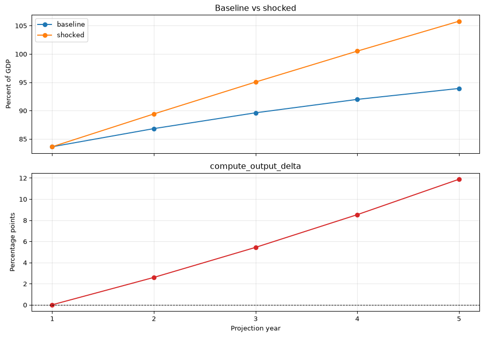
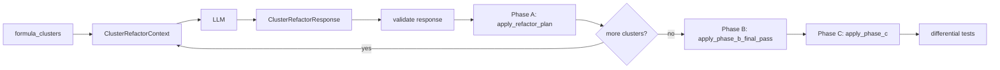

# Tiny-DSA Extraction Pipeline


The illustrative Tiny DSA workbook, [data/tiny-dsa.xlsx](tiny-dsa.xlsx),
was created by Teal Emery as a test case for reverse-engineering an
Excel financial model with `excel-grapher` and turning it into a
standalone Python library. This workbook demonstrates the extraction and
export workflow. The workflow consists of three stages:

1.  **configure**: declare input/output series bindings, classify leaves
    as inputs or constants, and constrain input cells’ domains
2.  **extract and export**: extract the graph and export it to Python
    code
3.  **refactor**: refactor the exported code to improve readability and
    maintainability

Extraction and export (stage 2) are fully automated by `excel-grapher`.
`excel-grapher` provides an API for configuration (stage 1) and tooling
for refactoring (stage 3), but these stages require manual human/AI work
informed by understanding of intended usage.

## Stage 1: Configure

### Load the workbook

We will load the Tiny DSA workbook from the `data` folder.

``` python
import sys
from pathlib import Path

# Load the Tiny DSA workbook
workbook_path = Path("../data/tiny-dsa.xlsx")
```

### Define the targets

The [tiny-dsa-guide.md](data/tiny-dsa-guide.md) file contains a detailed
description of the Tiny DSA workbook and its intended usage, including a
table of inputs and outputs. Here are the outputs, from that table:

| Named range | Cells | Description |
|----|----|----|
| `output_baseline` | Outputs!B12:F12 | Baseline debt-to-GDP path on the Outputs sheet |
| `output_shocked` | Outputs!B13:F13 | Shocked debt-to-GDP path on the Outputs sheet |
| `output_delta` | Outputs!B14:F14 | Difference, shocked minus baseline, in percentage points |

We define these ranges as the “targets” of our extraction pipeline,
which will trace their dependencies to achieve a “target-driven graph
extraction”. The same three ranges are also declared as output series in
`bindings/outputs.bindings.yaml`, where each one receives a generated
records-shaped `compute_*` function.

We can pass either range names or sheet-qualified cell/range addresses
as targets. We’ll use range names:

``` python
targets = ["output_baseline", "output_shocked", "output_delta"]
```

**Note:** Identifying input and output series is trivial in this
workbook because we have a guidance note that catalogs them, but this is
a proof of concept for tackling larger workbooks that won’t have such
guidance. I imagine the workflow would be roughly:

1.  Have an AI agent look at workbook sheets and list the logical tables
    with their Excel ranges, inclusive of headers and titles and labels.
2.  Filter out any of these tables that don’t include leaf nodes or
    target nodes from the graph.
3.  For each logical table, have an AI agent catalog the series, and
    their ranges, that include leaf or target cells from our graph.

For this workbook, the following prompt is sufficient to have an AI
agent generate the binding sidecars from the guide, the workbook, and
the extracted graph surface:

``` text
You are authoring excel-grapher series bindings for a workbook.

Workbook:
- data/tiny-dsa.xlsx

Human documentation:
- data/tiny-dsa-guide.md

Binding schema and conventions:
- Before authoring YAML, load the bundled JSON Schema from excel-grapher and use it as the authoritative field and shape reference:

  from importlib.resources import files

  schema_text = (
      files("excel_grapher.series_bindings")
      .joinpath("series_binding.schema.json")
      .read_text(encoding="utf-8")
  )

- Use schema_version: 1.2.0.
- Create a bindings/ directory with two files:
  - inputs.bindings.yaml for public input setters.
  - outputs.bindings.yaml for public output compute functions.
- Use one series[] entry per logical public input or output series.
- Use layout: scalar for one-cell inputs and layout: row_series for one-row time series.
- Use structure.measure.concept: OBS_VALUE with bind.kind: data_cell.
- Use key fields only for record matching. For row time series, use TIME_PERIOD from the column header row. For scalar parameters, use keyless bindings (`key: []`) and keep PARAMETER in series_context. For shock magnitudes, use the shock-type header as the key.
- Add input.setter.name values matching set_[a-z][a-z0-9_]* for input series.
- Add output.compute.name values matching compute_[a-z][a-z0-9_]* for output series.
- Include useful series_context and UNIT_MEASURE attributes where they clarify records.
- Do not include internal engine calculations or read-only lookup/profile data as public API bindings unless the guide says downstream users should set or read them directly.

Task:
1. Read the guide's named-range API table and functional overview.
2. Identify public input series that require user configuration.
3. Identify public output series that downstream users should read.
4. Cross-check each proposed series against the extracted graph:
   - input bindings should overlap graph leaves;
   - output bindings should overlap graph target/output nodes.
5. Write bindings/inputs.bindings.yaml and bindings/outputs.bindings.yaml.
6. Validate by loading the binding directory with load_series_bindings("bindings"), then running validate_series_bindings(graph, bindings, workbook=workbook_path), derive_input_series(...), and derive_output_series(...).

Expected Tiny-DSA public inputs:
- country_name: Inputs!B5
- growth_baseline: Inputs!C16:G16
- interest_baseline: Inputs!C17:G17
- primary_balance_baseline: Inputs!C18:G18
- shock_year: Inputs!B21
- shock_type: Inputs!B22
- shock_magnitudes: Inputs!B26:D26

Expected Tiny-DSA public outputs:
- output_baseline: Outputs!B12:F12
- output_shocked: Outputs!B13:F13
- output_delta: Outputs!B14:F14

Return the two YAML files and a short validation summary. If any series is ambiguous, explain the ambiguity instead of guessing.
```

### Declare series bindings

Series bindings are the machine-readable source of truth for the public
input and output surface. We keep them outside the workbook in a
`bindings` folder:

``` text
bindings/
  inputs.bindings.yaml
  outputs.bindings.yaml
```

The input bindings file declares the user-editable surface described in
the guide: selected country, the three baseline parameter rows, shock
year, shock type, and shock magnitudes. The output bindings file
declares the three published trajectory rows on the Outputs sheet. The
profile lookup table is a graph leaf, but it is not part of the public
API bindings because users do not edit it.

We do not duplicate the full YAML here. The important shape is one
logical series per generated API:

``` yaml
series:
  - id: growth_baseline
    data_range: Inputs!C16:G16
    layout: row_series
    input:
      setter:
        name: set_growth_baseline
    key: [TIME_PERIOD]
```

At runtime, `excel-grapher` merges all `*.bindings.yaml` files in the
directory:

``` python
from excel_grapher.series_bindings import (
    derive_input_series,
    derive_output_series,
    load_series_bindings,
    validate_series_bindings,
)

bindings_path = Path("../bindings")
series_bindings = load_series_bindings(bindings_path)
```

### Constrain key input cells

Note that if we try to extract the graph without any further
configuration, we get an error:

``` python
from excel_grapher.grapher import (
    DynamicRefError,
    create_dependency_graph,
    DependencyGraph,
)

try:
    graph: DependencyGraph = create_dependency_graph(workbook_path, targets, load_values=True)
except DynamicRefError as e:
    print(e)
```

Formula at Inputs!B6 contains INDEX that require resolution. Pass
dynamic_refs=DynamicRefConfig.from_constraints(…) or set
use_cached_dynamic_refs=True.

That is because the workbook contains `OFFSET` and `INDEX` functions
that resolve to different dependency ranges depending on the values in
input cells, so `excel-grapher` cannot resolve their dependency graphs
without knowing more about the input cells. To resolve this, we need to
“constrain” the input cells that inform these dynamic references so that
`excel-grapher` can include all plausible dependencies in the graph.

`excel-grapher` provides a helper function to list the candidate input
cells for constraining:

``` python
from excel_grapher.grapher import (
    list_dynamic_ref_constraint_candidates,
)

list_dynamic_ref_constraint_candidates(workbook_path, targets)
```

    ['Inputs!A10', 'Inputs!A11', 'Inputs!A12', 'Inputs!B22', 'Inputs!B5']

For each of these candidate cells, we apply our domain knowledge to
constrain the range of plausible values we will allow a user to set for
the cell:

``` python
from typing import Literal, Annotated
from excel_grapher.core.cell_types import Between, RealBetween

constraints = {
    'Inputs!A10': Literal['Borvelia'],
    'Inputs!A11': Literal['Litellia'],
    'Inputs!A12': Literal['Aurelium'],
    'Inputs!B22': Literal[1, 2, 3],
    'Inputs!B5': Literal['Borvelia', 'Litellia', 'Aurelium'],
}
```

To support testing, code generation, and library documentation, we will
also constrain the rest of the leaf cells in the workbook, even though
these aren’t required for dynamic ref resolution:

``` python
_cols = ("C", "D", "E", "F", "G")
constraints = constraints | {
    "Engine!C5": Literal[1],
    "Engine!D5": Literal[2],
    "Engine!E5": Literal[3],
    "Engine!F5": Literal[4],
    "Engine!G5": Literal[5],
    "Inputs!B10": Annotated[float, RealBetween(0.0, 200.0)],
    "Inputs!B11": Annotated[float, RealBetween(0.0, 200.0)],
    "Inputs!B12": Annotated[float, RealBetween(0.0, 200.0)],
    "Inputs!B21": Annotated[int, Between(1, 5)],
    "Inputs!B26": Annotated[float, RealBetween(-30.0, 30.0)],
    "Inputs!C26": Annotated[float, RealBetween(-30.0, 30.0)],
    "Inputs!D26": Annotated[float, RealBetween(-30.0, 30.0)],
    **{f"Inputs!{c}16": Annotated[float, RealBetween(-10.0, 15.0)] for c in _cols},
    **{f"Inputs!{c}17": Annotated[float, RealBetween(0.0, 20.0)] for c in _cols},
    **{f"Inputs!{c}18": Annotated[float, RealBetween(-15.0, 15.0)] for c in _cols},
}
```

Every leaf we classify as a mutable input for codegen must also appear
in `inputs.bindings.yaml`. Otherwise the exported library can write
cells that have no public setter on the API surface. As a sanity check,
we can derive the input series and compare the leaves to the keys in
`inputs.bindings.yaml`:

``` python
import sys
from typing import Literal, get_args, get_origin

repo_root = Path("..").resolve()
if str(repo_root) not in sys.path:
    sys.path.insert(0, str(repo_root))

from excel_grapher.grapher import DynamicRefConfig, create_dependency_graph
from src.dependency_graph_viz import series_cell_keys


def is_constant_constraint(constraint: object) -> bool:
    return get_origin(constraint) is Literal and len(get_args(constraint)) == 1


configure_graph = create_dependency_graph(
    workbook_path,
    targets,
    load_values=True,
    dynamic_refs=DynamicRefConfig.from_constraints(constraints, {}),
    capture_dependency_provenance=True,
)
leaf_classification = {
    key: "constant" if is_constant_constraint(constraints[key]) else "input"
    for key in configure_graph.leaf_keys()
}
input_series_for_check = derive_input_series(
    configure_graph,
    series_bindings,
    workbook=workbook_path,
)
mutable_input_leaves = {
    key for key, kind in leaf_classification.items() if kind == "input"
}
bound_input_cells = series_cell_keys(input_series_for_check)
unbound_input_leaves = sorted(mutable_input_leaves - bound_input_cells)
assert not unbound_input_leaves, (
    "Mutable input leaves missing from inputs.bindings.yaml: "
    + ", ".join(unbound_input_leaves)
)
```

### Define the Docstring Callback

`excel-grapher` handles the deterministic parts of docstring
construction: required and optional field sections, expected constant
values, source binding metadata, and workbook-cached example records.
But we must define a callback to return the prose fields that cannot be
derived mechanically.

This rendering cell uses the docstring cache when available and calls
DeepSeek only for uncached generated series API functions.

``` python
import hashlib
import json
import os
from dataclasses import asdict
from pathlib import Path

from dotenv import load_dotenv
from excel_grapher.exporter import (
    CodeGenerator,
    FieldDoc as SeriesFieldDoc,
    SeriesFunctionDoc,
    register_series_docstring_callback,
)
from openai import OpenAI
from pydantic import BaseModel, ConfigDict, Field, create_model


def pascal_case(value: str) -> str:
    return "".join(part.capitalize() for part in value.split("_"))


def build_doc_response_model(ctx) -> type[BaseModel]:
    model_name = pascal_case(ctx.contract.series_id)
    field_description_model = create_model(
        f"{model_name}FieldDescription",
        __config__=ConfigDict(extra="forbid"),
        description=(
            str,
            Field(
                description=(
                    "Concise user-facing description. "
                    "Do not restate deterministic expected values."
                )
            ),
        ),
    )
    field_descriptions_model = create_model(
        f"{model_name}FieldDescriptions",
        __config__=ConfigDict(extra="forbid"),
        **{
            field_name: (
                field_description_model,
                Field(description=f"Description for `{field_name}`."),
            )
            for field_name in ctx.contract.fields
        },
    )

    return create_model(
        f"{model_name}DocResponse",
        __config__=ConfigDict(extra="forbid"),
        summary=(
            str,
            Field(description="One-line summary for the generated series API function."),
        ),
        purpose=(
            str,
            Field(
                description=(
                    "One short sentence explaining what this function updates or returns."
                )
            ),
        ),
        record_matching=(
            str,
            Field(
                description=(
                    "One short sentence explaining how records relate to workbook cells."
                )
            ),
        ),
        field_descriptions=(
            field_descriptions_model,
            Field(description="Descriptions for the exact record fields."),
        ),
    )


def prompt_for_docstring(guide_text: str, ctx, response_schema: dict) -> str:
    contract_json = json.dumps(asdict(ctx.contract), indent=2, default=str)
    series_json = json.dumps(ctx.series, indent=2, default=str)
    schema_json = json.dumps(response_schema, indent=2)
    return f"""
Write the LLM-authored parts of a Python docstring for one generated
series API function.

Use the user guide for domain language. Use the deterministic contract and
series binding as hard constraints. The code generator will render required
fields, optional fields, expected constants, source binding details, and
examples from the deterministic contract.

Only return JSON data that matches the response schema. Do not include
Markdown. Do not invent fields, ranges, units, accepted keys, or examples.
For fields with an expected_value in the contract, describe the field's role
only; the template will add the expected value.

For input setter functions, avoid language that says the setter validates
input domains, units, or context constants. The setter currently checks
record shape and key matching.

Function name: {ctx.function_name}
Function kind: {ctx.function_kind}

User guide:
{guide_text}

Series binding:
{series_json}

Deterministic docstring contract:
{contract_json}

Response schema:
{schema_json}
""".strip()


load_dotenv(Path("../.env"))
guide_text = Path("../data/tiny-dsa-guide.md").read_text(encoding="utf-8")
DOCSTRING_MODEL = "deepseek-v4-pro"
DOCSTRING_PROMPT_VERSION = 2
DOCSTRING_CACHE_PATH = Path("../.cache/series-docstrings.json")


def stable_json(value: object) -> str:
    return json.dumps(value, sort_keys=True, separators=(",", ":"), default=str)


def docstring_cache_key(ctx, response_schema: dict, guide_text: str) -> str:
    payload = {
        "model": DOCSTRING_MODEL,
        "prompt_version": DOCSTRING_PROMPT_VERSION,
        "function_name": ctx.function_name,
        "function_kind": str(ctx.function_kind),
        "series": ctx.series,
        "contract": asdict(ctx.contract),
        "response_schema": response_schema,
        "guide_sha256": hashlib.sha256(guide_text.encode()).hexdigest(),
    }
    return hashlib.sha256(stable_json(payload).encode()).hexdigest()


def load_docstring_cache() -> dict[str, str]:
    if not DOCSTRING_CACHE_PATH.exists():
        return {}
    return json.loads(DOCSTRING_CACHE_PATH.read_text(encoding="utf-8"))


def save_docstring_cache(cache: dict[str, str]) -> None:
    DOCSTRING_CACHE_PATH.parent.mkdir(parents=True, exist_ok=True)
    DOCSTRING_CACHE_PATH.write_text(
        json.dumps(cache, indent=2, sort_keys=True),
        encoding="utf-8",
    )


def deepseek_series_docstring(ctx) -> SeriesFunctionDoc:
    ResponseModel = build_doc_response_model(ctx)
    schema = ResponseModel.model_json_schema()
    cache = load_docstring_cache()
    cache_key = docstring_cache_key(ctx, schema, guide_text)
    if cache_key in cache:
        content = cache[cache_key]
    else:
        api_key = os.environ.get("DEEPSEEK_API_KEY")
        if not api_key:
            raise RuntimeError(
                "DEEPSEEK_API_KEY is required to generate uncached docstrings"
            )
        client = OpenAI(api_key=api_key, base_url="https://api.deepseek.com")
        response = client.chat.completions.create(
            model=DOCSTRING_MODEL,
            messages=[
                {
                    "role": "system",
                    "content": (
                        "You write concise, production-quality Python docstring "
                        "prose. Return only valid JSON matching the supplied schema."
                    ),
                },
                {
                    "role": "user",
                    "content": prompt_for_docstring(guide_text, ctx, schema),
                },
            ],
            stream=False,
            reasoning_effort="high",
            response_format={"type": "json_object"},
            extra_body={"thinking": {"type": "enabled"}},
        )
        content = response.choices[0].message.content
        if content is None:
            raise RuntimeError("DeepSeek returned empty docstring content")
        ResponseModel.model_validate_json(content)
        cache[cache_key] = content
        save_docstring_cache(cache)

    doc_data = ResponseModel.model_validate_json(content)
    return SeriesFunctionDoc(
        summary=doc_data.summary,
        purpose=doc_data.purpose,
        record_matching=doc_data.record_matching,
        field_descriptions={
            field_name: SeriesFieldDoc(
                description=getattr(
                    doc_data.field_descriptions,
                    field_name,
                ).description
            )
            for field_name in ctx.contract.fields
        },
    )


callback_name = "tiny_dsa_series_docs"
register_series_docstring_callback(
    callback_name,
    deepseek_series_docstring,
    replace=True,
)
```

## Stage 2A: Extract

Now `excel-grapher` can successfully extract the graph with the
`create_dependency_graph` function. This returns a `DependencyGraph`
object.

``` python
from excel_grapher.grapher import DynamicRefConfig

config = DynamicRefConfig.from_constraints(constraints, {})
graph: DependencyGraph = create_dependency_graph(
    workbook_path,
    targets,
    load_values=True,
    dynamic_refs=config,
    capture_dependency_provenance=True,
)

binding_validation_report = validate_series_bindings(
    graph,
    series_bindings,
    workbook=workbook_path,
)
assert binding_validation_report["ok"], binding_validation_report["issues"]

input_series = derive_input_series(graph, series_bindings, workbook=workbook_path)
output_series = derive_output_series(graph, series_bindings, workbook=workbook_path)
```

Since the workbook is relatively small, we can visualize it as a Mermaid
diagram.

``` python
from excel_grapher.grapher import to_mermaid

print("```mermaid")
print(to_mermaid(graph))
print("```\n")
```



``` mermaid
flowchart TD
  Inputs_B5["Inputs!B5"]
  Inputs_B6("Inputs!B6<br>=INDEX($A$10:$C$12,MATCH($B$5,$A$10:$A$12,0),2)")
  Inputs_A10["Inputs!A10"]
  Inputs_B10["Inputs!B10"]
  Inputs_A11["Inputs!A11"]
  Inputs_B11["Inputs!B11"]
  Inputs_A12["Inputs!A12"]
  Inputs_B12["Inputs!B12"]
  Inputs_C16["Inputs!C16"]
  Inputs_D16["Inputs!D16"]
  Inputs_E16["Inputs!E16"]
  Inputs_F16["Inputs!F16"]
  Inputs_G16["Inputs!G16"]
  Inputs_C17["Inputs!C17"]
  Inputs_D17["Inputs!D17"]
  Inputs_E17["Inputs!E17"]
  Inputs_F17["Inputs!F17"]
  Inputs_G17["Inputs!G17"]
  Inputs_C18["Inputs!C18"]
  Inputs_D18["Inputs!D18"]
  Inputs_E18["Inputs!E18"]
  Inputs_F18["Inputs!F18"]
  Inputs_G18["Inputs!G18"]
  Inputs_B21["Inputs!B21"]
  Inputs_B22["Inputs!B22"]
  Inputs_B26["Inputs!B26"]
  Inputs_C26["Inputs!C26"]
  Inputs_D26["Inputs!D26"]
  Engine_C5["Engine!C5"]
  Engine_D5["Engine!D5"]
  Engine_E5["Engine!E5"]
  Engine_F5["Engine!F5"]
  Engine_G5["Engine!G5"]
  Engine_B6("Engine!B6<br>=Inputs!B6")
  Engine_C6("Engine!C6<br>=B6*(1+Inputs!C17/100)/(1+Inputs!C16/100)-Inputs!C18")
  Engine_D6("Engine!D6<br>=C6*(1+Inputs!D17/100)/(1+Inputs!D16/100)-Inputs!D18")
  Engine_E6("Engine!E6<br>=D6*(1+Inputs!E17/100)/(1+Inputs!E16/100)-Inputs!E18")
  Engine_F6("Engine!F6<br>=E6*(1+Inputs!F17/100)/(1+Inputs!F16/100)-Inputs!F18")
  Engine_G6("Engine!G6<br>=F6*(1+Inputs!G17/100)/(1+Inputs!G16/100)-Inputs!G18")
  Engine_B9("Engine!B9<br>=OFFSET(Inputs!$B$26,0,Inputs!$B$22-1)")
  Engine_C10("Engine!C10<br>=IF(C5>=Inputs!$B$21,1,0)")
  Engine_D10("Engine!D10<br>=IF(D5>=Inputs!$B$21,1,0)")
  Engine_E10("Engine!E10<br>=IF(E5>=Inputs!$B$21,1,0)")
  Engine_F10("Engine!F10<br>=IF(F5>=Inputs!$B$21,1,0)")
  Engine_G10("Engine!G10<br>=IF(G5>=Inputs!$B$21,1,0)")
  Engine_C14("Engine!C14<br>=Inputs!C16+CHOOSE(Inputs!$B$22,$B$9,0,0)*C10")
  Engine_D14("Engine!D14<br>=Inputs!D16+CHOOSE(Inputs!$B$22,$B$9,0,0)*D10")
  Engine_E14("Engine!E14<br>=Inputs!E16+CHOOSE(Inputs!$B$22,$B$9,0,0)*E10")
  Engine_F14("Engine!F14<br>=Inputs!F16+CHOOSE(Inputs!$B$22,$B$9,0,0)*F10")
  Engine_G14("Engine!G14<br>=Inputs!G16+CHOOSE(Inputs!$B$22,$B$9,0,0)*G10")
  Engine_C15("Engine!C15<br>=Inputs!C17+CHOOSE(Inputs!$B$22,0,$B$9,0)*C10")
  Engine_D15("Engine!D15<br>=Inputs!D17+CHOOSE(Inputs!$B$22,0,$B$9,0)*D10")
  Engine_E15("Engine!E15<br>=Inputs!E17+CHOOSE(Inputs!$B$22,0,$B$9,0)*E10")
  Engine_F15("Engine!F15<br>=Inputs!F17+CHOOSE(Inputs!$B$22,0,$B$9,0)*F10")
  Engine_G15("Engine!G15<br>=Inputs!G17+CHOOSE(Inputs!$B$22,0,$B$9,0)*G10")
  Engine_C16("Engine!C16<br>=Inputs!C18+CHOOSE(Inputs!$B$22,0,0,$B$9)*C10")
  Engine_D16("Engine!D16<br>=Inputs!D18+CHOOSE(Inputs!$B$22,0,0,$B$9)*D10")
  Engine_E16("Engine!E16<br>=Inputs!E18+CHOOSE(Inputs!$B$22,0,0,$B$9)*E10")
  Engine_F16("Engine!F16<br>=Inputs!F18+CHOOSE(Inputs!$B$22,0,0,$B$9)*F10")
  Engine_G16("Engine!G16<br>=Inputs!G18+CHOOSE(Inputs!$B$22,0,0,$B$9)*G10")
  Engine_B20("Engine!B20<br>=Inputs!B6")
  Engine_C20("Engine!C20<br>=B20*(1+C15/100)/(1+C14/100)-C16")
  Engine_D20("Engine!D20<br>=C20*(1+D15/100)/(1+D14/100)-D16")
  Engine_E20("Engine!E20<br>=D20*(1+E15/100)/(1+E14/100)-E16")
  Engine_F20("Engine!F20<br>=E20*(1+F15/100)/(1+F14/100)-F16")
  Engine_G20("Engine!G20<br>=F20*(1+G15/100)/(1+G14/100)-G16")
  Outputs_B12("Outputs!B12<br>=Engine!C6")
  Outputs_C12("Outputs!C12<br>=Engine!D6")
  Outputs_D12("Outputs!D12<br>=Engine!E6")
  Outputs_E12("Outputs!E12<br>=Engine!F6")
  Outputs_F12("Outputs!F12<br>=Engine!G6")
  Outputs_B13("Outputs!B13<br>=Engine!C20")
  Outputs_C13("Outputs!C13<br>=Engine!D20")
  Outputs_D13("Outputs!D13<br>=Engine!E20")
  Outputs_E13("Outputs!E13<br>=Engine!F20")
  Outputs_F13("Outputs!F13<br>=Engine!G20")
  Outputs_B14("Outputs!B14<br>=B13-B12")
  Outputs_C14("Outputs!C14<br>=C13-C12")
  Outputs_D14("Outputs!D14<br>=D13-D12")
  Outputs_E14("Outputs!E14<br>=E13-E12")
  Outputs_F14("Outputs!F14<br>=F13-F12")
  Inputs_B6 --> Inputs_B5
  Inputs_B6 --> Inputs_A10
  Inputs_B6 --> Inputs_B10
  Inputs_B6 --> Inputs_A11
  Inputs_B6 --> Inputs_B11
  Inputs_B6 --> Inputs_A12
  Inputs_B6 --> Inputs_B12
  Engine_B6 --> Inputs_B6
  Engine_C6 --> Inputs_C16
  Engine_C6 --> Inputs_C17
  Engine_C6 --> Inputs_C18
  Engine_C6 --> Engine_B6
  Engine_D6 --> Inputs_D16
  Engine_D6 --> Inputs_D17
  Engine_D6 --> Inputs_D18
  Engine_D6 --> Engine_C6
  Engine_E6 --> Inputs_E16
  Engine_E6 --> Inputs_E17
  Engine_E6 --> Inputs_E18
  Engine_E6 --> Engine_D6
  Engine_F6 --> Inputs_F16
  Engine_F6 --> Inputs_F17
  Engine_F6 --> Inputs_F18
  Engine_F6 --> Engine_E6
  Engine_G6 --> Inputs_G16
  Engine_G6 --> Inputs_G17
  Engine_G6 --> Inputs_G18
  Engine_G6 --> Engine_F6
  Engine_B9 --> Inputs_B22
  Engine_B9 --> Inputs_B26
  Engine_B9 --> Inputs_C26
  Engine_B9 --> Inputs_D26
  Engine_C10 --> Inputs_B21
  Engine_C10 --> Engine_C5
  Engine_D10 --> Inputs_B21
  Engine_D10 --> Engine_D5
  Engine_E10 --> Inputs_B21
  Engine_E10 --> Engine_E5
  Engine_F10 --> Inputs_B21
  Engine_F10 --> Engine_F5
  Engine_G10 --> Inputs_B21
  Engine_G10 --> Engine_G5
  Engine_C14 --> Inputs_C16
  Engine_C14 --> Inputs_B22
  Engine_C14 --> Engine_B9
  Engine_C14 --> Engine_C10
  Engine_D14 --> Inputs_D16
  Engine_D14 --> Inputs_B22
  Engine_D14 --> Engine_B9
  Engine_D14 --> Engine_D10
  Engine_E14 --> Inputs_E16
  Engine_E14 --> Inputs_B22
  Engine_E14 --> Engine_B9
  Engine_E14 --> Engine_E10
  Engine_F14 --> Inputs_F16
  Engine_F14 --> Inputs_B22
  Engine_F14 --> Engine_B9
  Engine_F14 --> Engine_F10
  Engine_G14 --> Inputs_G16
  Engine_G14 --> Inputs_B22
  Engine_G14 --> Engine_B9
  Engine_G14 --> Engine_G10
  Engine_C15 --> Inputs_C17
  Engine_C15 --> Inputs_B22
  Engine_C15 --> Engine_B9
  Engine_C15 --> Engine_C10
  Engine_D15 --> Inputs_D17
  Engine_D15 --> Inputs_B22
  Engine_D15 --> Engine_B9
  Engine_D15 --> Engine_D10
  Engine_E15 --> Inputs_E17
  Engine_E15 --> Inputs_B22
  Engine_E15 --> Engine_B9
  Engine_E15 --> Engine_E10
  Engine_F15 --> Inputs_F17
  Engine_F15 --> Inputs_B22
  Engine_F15 --> Engine_B9
  Engine_F15 --> Engine_F10
  Engine_G15 --> Inputs_G17
  Engine_G15 --> Inputs_B22
  Engine_G15 --> Engine_B9
  Engine_G15 --> Engine_G10
  Engine_C16 --> Inputs_C18
  Engine_C16 --> Inputs_B22
  Engine_C16 --> Engine_B9
  Engine_C16 --> Engine_C10
  Engine_D16 --> Inputs_D18
  Engine_D16 --> Inputs_B22
  Engine_D16 --> Engine_B9
  Engine_D16 --> Engine_D10
  Engine_E16 --> Inputs_E18
  Engine_E16 --> Inputs_B22
  Engine_E16 --> Engine_B9
  Engine_E16 --> Engine_E10
  Engine_F16 --> Inputs_F18
  Engine_F16 --> Inputs_B22
  Engine_F16 --> Engine_B9
  Engine_F16 --> Engine_F10
  Engine_G16 --> Inputs_G18
  Engine_G16 --> Inputs_B22
  Engine_G16 --> Engine_B9
  Engine_G16 --> Engine_G10
  Engine_B20 --> Inputs_B6
  Engine_C20 --> Engine_C14
  Engine_C20 --> Engine_C15
  Engine_C20 --> Engine_C16
  Engine_C20 --> Engine_B20
  Engine_D20 --> Engine_D14
  Engine_D20 --> Engine_D15
  Engine_D20 --> Engine_D16
  Engine_D20 --> Engine_C20
  Engine_E20 --> Engine_E14
  Engine_E20 --> Engine_E15
  Engine_E20 --> Engine_E16
  Engine_E20 --> Engine_D20
  Engine_F20 --> Engine_F14
  Engine_F20 --> Engine_F15
  Engine_F20 --> Engine_F16
  Engine_F20 --> Engine_E20
  Engine_G20 --> Engine_G14
  Engine_G20 --> Engine_G15
  Engine_G20 --> Engine_G16
  Engine_G20 --> Engine_F20
  Outputs_B12 --> Engine_C6
  Outputs_C12 --> Engine_D6
  Outputs_D12 --> Engine_E6
  Outputs_E12 --> Engine_F6
  Outputs_F12 --> Engine_G6
  Outputs_B13 --> Engine_C20
  Outputs_C13 --> Engine_D20
  Outputs_D13 --> Engine_E20
  Outputs_E13 --> Engine_F20
  Outputs_F13 --> Engine_G20
  Outputs_B14 --> Outputs_B12
  Outputs_B14 --> Outputs_B13
  Outputs_C14 --> Outputs_C12
  Outputs_C14 --> Outputs_C13
  Outputs_D14 --> Outputs_D12
  Outputs_D14 --> Outputs_D13
  Outputs_E14 --> Outputs_E12
  Outputs_E14 --> Outputs_E13
  Outputs_F14 --> Outputs_F12
  Outputs_F14 --> Outputs_F13
```

The graph is a DAG with the outputs at the top and the inputs at the
bottom. Cells from the Engine sheet largely comprise a middle layer
between the inputs and outputs.

We can also review the input and output series that resolved against the
extracted graph:

``` python
print("```text")
for item in input_series:
    cells = ", ".join(cell["address"] for cell in item["cells"])
    print(f"input {item['id']}: {cells}")
for item in output_series:
    cells = ", ".join(cell["address"] for cell in item["cells"])
    print(f"output {item['id']}: {cells}")
print("```")
```

``` text
input country_name: Inputs!B5
input country_initial_debt: Inputs!B10, Inputs!B11, Inputs!B12
input growth_baseline: Inputs!C16, Inputs!D16, Inputs!E16, Inputs!F16, Inputs!G16
input interest_baseline: Inputs!C17, Inputs!D17, Inputs!E17, Inputs!F17, Inputs!G17
input primary_balance_baseline: Inputs!C18, Inputs!D18, Inputs!E18, Inputs!F18, Inputs!G18
input shock_year: Inputs!B21
input shock_type: Inputs!B22
input shock_magnitudes: Inputs!B26, Inputs!C26, Inputs!D26
output output_baseline: Outputs!B12, Outputs!C12, Outputs!D12, Outputs!E12, Outputs!F12
output output_shocked: Outputs!B13, Outputs!C13, Outputs!D13, Outputs!E13, Outputs!F13
output output_delta: Outputs!B14, Outputs!C14, Outputs!D14, Outputs!E14, Outputs!F14
```

## Stage 2B: Export

In the current architecture of `excel-grapher`, constraints do not
persist on the graph object, so we still attach a leaf classification
before code generation. The binding manifests define the public `set_*`
and `compute_*` records APIs; the leaf classification tells codegen
which dependency leaves should be emitted as mutable inputs rather than
fixed constants.

We can define some helpers to turn our constraints dictionary into an
inputs/constraints classification:

``` python
from typing import Iterable, Literal, Mapping, get_args, get_origin

LeafKind = Literal["input", "constant"]


def is_constant_constraint(constraint: object) -> bool:
    """True when the constraint fixes a single value (lookup/structural data)."""
    return get_origin(constraint) is Literal and len(get_args(constraint)) == 1


def classify_leaves_from_constraints(
    constraint_map: Mapping[str, object],
    leaf_keys: Iterable[str],
) -> dict[str, LeafKind]:
    """Classify graph leaves as inputs or constants from their constraints."""
    keys = list(leaf_keys)
    missing = [key for key in keys if key not in constraint_map]
    if missing:
        raise KeyError(f"missing constraints for leaf cells: {missing}")
    return {
        key: "constant" if is_constant_constraint(constraint_map[key]) else "input"
        for key in keys
    }

leaf_classification = classify_leaves_from_constraints(constraints, graph.leaf_keys())
graph.leaf_classification = leaf_classification
```

Finally, we can generate the code and write a distributable package in
`dist/tiny_dsa/`. Passing `series_bindings` and `bindings_workbook`
emits records-shaped input setters such as `set_growth_baseline` and
output compute functions such as `compute_output_baseline`.

``` python
from excel_grapher.exporter import CodeGenerator

with CodeGenerator(graph) as generator:
    modules = generator.generate_modules(
        targets,
        series_bindings=series_bindings,
        bindings_workbook=workbook_path,
        series_docstring_callback=callback_name,
        docstring_renderer="google"
    )

dist_root = Path("../dist")
package_root = dist_root / "tiny_dsa"
package_root.mkdir(parents=True, exist_ok=True)

for filepath, code in modules.items():
    output_path = package_root / filepath
    output_path.parent.mkdir(parents=True, exist_ok=True)
    with open(output_path, "w", encoding="utf-8") as f:
        f.write(code)
```

We also write a `dist/.gitignore` file and a `dist/pyproject.toml` file
so documentation tooling can auto-discover the generated library as
project `tiny-dsa`. The dev dependency list is defined once in
`src/qmd_python_validation.py` as `DOCUMENTATION_BASELINE_DEV_DEPS`;
Excel-parity validation dependencies live in a separate `validation`
group as `VALIDATION_BASELINE_DEV_DEPS`. `src/extraction_pipeline.py`
uses `render_dist_pyproject_toml()` to write the initial
`pyproject.toml`, and the documentation stage may append packages
discovered while validating runnable user-guide cells.

We also export the Excel parity validation bundle into `dist/tests/`:
the differential harness, workbook fixture, reference parity reports
from `data/differential/exported_library/`, and a short README. The
bundle is not included in the installed wheel; it documents correctness
evidence and lets maintainers re-run the sweep on Windows with Excel.

``` python
import sys

repo_root = Path("..").resolve()
if str(repo_root) not in sys.path:
    sys.path.insert(0, str(repo_root))

from src.export_validation_assets import export_validation_assets
from src.qmd_python_validation import (
    DOCUMENTATION_BASELINE_DEV_DEPS,
    VALIDATION_BASELINE_DEV_DEPS,
    render_dist_pyproject_toml,
)

gitignore_content = """
*.egg-info/
*.pyc
__pycache__/
.venv/
_validate_user_guide_cells.py
tests/results/local/
"""

with open(dist_root / ".gitignore", "w", encoding="utf-8") as f:
    f.write(gitignore_content)

with open(dist_root / "pyproject.toml", "w", encoding="utf-8") as f:
    f.write(
        render_dist_pyproject_toml(
            dev_dependencies=list(DOCUMENTATION_BASELINE_DEV_DEPS),
            validation_dependencies=list(VALIDATION_BASELINE_DEV_DEPS),
        )
    )

export_validation_assets(repo_root=repo_root, dist_root=dist_root)
```

## Stage 3: Test

Now we can test the semantic API from `dist/tiny_dsa/api.py` by running
a full scenario with the generated `set_*` and `compute_*` functions.

The extraction pipeline also ships an Excel parity validation bundle
under `dist/tests/`. Reference reports in
`dist/tests/results/reference/` were produced by
[`tests/differential/differential_test_exported_library.py`](../tests/differential/differential_test_exported_library.py)
in the extraction repo. Maintainers can re-run the same harness from the
exported project on Windows with Excel:

``` pwsh
uv run --project dist --group validation python tests/differential_test_exported_library.py --layout exported
```

``` python
repo_root = Path("..").resolve()
dist_root = (repo_root / "dist").resolve()
if str(dist_root) not in sys.path:
    sys.path.append(str(dist_root))

from tiny_dsa.api import (
    make_context,
    set_country_name,
    set_growth_baseline,
    set_interest_baseline,
    set_primary_balance_baseline,
    set_shock_magnitudes,
    set_shock_type,
    set_shock_year,
    compute_output_baseline,
    compute_output_delta,
    compute_output_shocked,
)


def time_series_records(values: list[float]) -> list[dict[str, float | int]]:
    return [{"TIME_PERIOD": i + 1, "OBS_VALUE": value} for i, value in enumerate(values)]
```

Here is one scenario: Litellia with weaker growth, tighter financing
conditions, and a larger growth shock starting in year 2.

``` python
ctx = make_context()

# Scalar inputs
set_country_name(
    ctx,
    [{"OBS_VALUE": "Litellia"}],
)
set_shock_year(
    ctx,
    [{"OBS_VALUE": 2}],
)
set_shock_type(
    ctx,
    [{"OBS_VALUE": 1}],  # growth shock
)

# Baseline trajectories
set_growth_baseline(
    ctx,
    time_series_records([2.5, 2.4, 2.3, 2.2, 2.1]),
)
set_interest_baseline(
    ctx,
    time_series_records([5.2, 5.1, 5.0, 4.9, 4.8]),
)
set_primary_balance_baseline(
    ctx,
    time_series_records([-1.5, -1.0, -0.5, 0.0, 0.5]),
)

# Shock table values (growth, interest, primary balance)
set_shock_magnitudes(
    ctx,
    [
        {"SHOCK_PARAMETER": "Growth", "OBS_VALUE": -3.0},
        {"SHOCK_PARAMETER": "Interest", "OBS_VALUE": 2.5},
        {"SHOCK_PARAMETER": "Primary balance", "OBS_VALUE": -1.5},
    ],
)
```

Compute each output surface with its semantic `compute_*` function:

``` python
baseline_records = compute_output_baseline(ctx=ctx)
shocked_records = compute_output_shocked(ctx=ctx)
delta_records = compute_output_delta(ctx=ctx)

print("```text")
print("baseline:", baseline_records)
print("shocked :", shocked_records)
print("delta   :", delta_records)
print("```")
```

``` text
baseline: [{'SCENARIO': 'baseline', 'TIME_PERIOD': 1, 'UNIT_MEASURE': 'PC_GDP', 'OBS_VALUE': 83.60731707317073}, {'SCENARIO': 'baseline', 'TIME_PERIOD': 2, 'UNIT_MEASURE': 'PC_GDP', 'OBS_VALUE': 86.81180687881097}, {'SCENARIO': 'baseline', 'TIME_PERIOD': 3, 'UNIT_MEASURE': 'PC_GDP', 'OBS_VALUE': 89.6030275882224}, {'SCENARIO': 'baseline', 'TIME_PERIOD': 4, 'UNIT_MEASURE': 'PC_GDP', 'OBS_VALUE': 91.97023086110106}, {'SCENARIO': 'baseline', 'TIME_PERIOD': 5, 'UNIT_MEASURE': 'PC_GDP', 'OBS_VALUE': 93.90235253911256}]
shocked : [{'SCENARIO': 'shocked', 'TIME_PERIOD': 1, 'UNIT_MEASURE': 'PC_GDP', 'OBS_VALUE': 83.60731707317073}, {'SCENARIO': 'shocked', 'TIME_PERIOD': 2, 'UNIT_MEASURE': 'PC_GDP', 'OBS_VALUE': 89.40170044658193}, {'SCENARIO': 'shocked', 'TIME_PERIOD': 3, 'UNIT_MEASURE': 'PC_GDP', 'OBS_VALUE': 95.03352010967878}, {'SCENARIO': 'shocked', 'TIME_PERIOD': 4, 'UNIT_MEASURE': 'PC_GDP', 'OBS_VALUE': 100.49411551920667}, {'SCENARIO': 'shocked', 'TIME_PERIOD': 5, 'UNIT_MEASURE': 'PC_GDP', 'OBS_VALUE': 105.77430178014994}]
delta   : [{'SCENARIO': 'shocked_minus_baseline', 'TIME_PERIOD': 1, 'UNIT_MEASURE': 'PP', 'OBS_VALUE': 0.0}, {'SCENARIO': 'shocked_minus_baseline', 'TIME_PERIOD': 2, 'UNIT_MEASURE': 'PP', 'OBS_VALUE': 2.5898935677709574}, {'SCENARIO': 'shocked_minus_baseline', 'TIME_PERIOD': 3, 'UNIT_MEASURE': 'PP', 'OBS_VALUE': 5.430492521456372}, {'SCENARIO': 'shocked_minus_baseline', 'TIME_PERIOD': 4, 'UNIT_MEASURE': 'PP', 'OBS_VALUE': 8.523884658105615}, {'SCENARIO': 'shocked_minus_baseline', 'TIME_PERIOD': 5, 'UNIT_MEASURE': 'PP', 'OBS_VALUE': 11.871949241037385}]
```

Then plot the outputs in a two-panel layout:

``` python
import matplotlib.pyplot as plt


def series_values(records: list[dict[str, object]]) -> tuple[list[int], list[float]]:
    sorted_records = sorted(records, key=lambda r: int(r["TIME_PERIOD"]))
    x = [int(r["TIME_PERIOD"]) for r in sorted_records]
    y = [float(r["OBS_VALUE"]) for r in sorted_records]
    return x, y


x, baseline_values = series_values(baseline_records)
_, shocked_values = series_values(shocked_records)
_, delta_values = series_values(delta_records)

fig, axes = plt.subplots(2, 1, figsize=(10, 7), sharex=True)

axes[0].plot(x, baseline_values, marker="o", label="baseline")
axes[0].plot(x, shocked_values, marker="o", label="shocked")
axes[0].set_title("Baseline vs shocked")
axes[0].set_ylabel("Percent of GDP")
axes[0].legend()
axes[0].grid(alpha=0.3)

axes[1].plot(x, delta_values, marker="o", color="tab:red")
axes[1].axhline(0.0, color="black", linewidth=0.8, linestyle="--")
axes[1].set_title("compute_output_delta")
axes[1].set_xlabel("Projection year")
axes[1].set_ylabel("Percentage points")
axes[1].grid(alpha=0.3)

for ax in axes:
    ax.set_xticks(x)

fig.tight_layout()
plt.show()
```

<div id="fig-output-panels">



Figure 1: Tiny-DSA scenario outputs

</div>

## Canonical API usage

User-guide runnable cells should follow this interaction model: import
from `tiny_dsa.api`, create a context with `make_context()`, configure
the scenario with `set_*` functions that take records, then read results
with `compute_*`.

Each `compute_output_*` call returns a list of records with fields such
as `TIME_PERIOD`, `OBS_VALUE`, `SCENARIO`, and `UNIT_MEASURE`. Tabulate
results with Polars: sort by `TIME_PERIOD` and `select` the `OBS_VALUE`
column (with a clear alias), as in the helper below.

``` python
import polars as pl

from tiny_dsa.api import (
    make_context,
    set_country_name,
    set_growth_baseline,
    set_interest_baseline,
    set_primary_balance_baseline,
    set_shock_year,
    set_shock_type,
    set_shock_magnitudes,
    compute_output_baseline,
    compute_output_shocked,
    compute_output_delta,
)


def time_series(values: list[float]) -> list[dict[str, float | int]]:
    return [{"TIME_PERIOD": i + 1, "OBS_VALUE": value} for i, value in enumerate(values)]


def debt_to_gdp_frame(records: list[dict[str, object]]) -> pl.DataFrame:
    return (
        pl.DataFrame(records)
        .sort("TIME_PERIOD")
        .select(
            "TIME_PERIOD",
            pl.col("OBS_VALUE").alias("Debt/GDP (%)"),
        )
    )


ctx = make_context()
set_country_name(ctx, [{"OBS_VALUE": "Litellia"}])
set_growth_baseline(ctx, time_series([2.5, 2.4, 2.3, 2.2, 2.1]))
set_interest_baseline(ctx, time_series([5.2, 5.1, 5.0, 4.9, 4.8]))
set_primary_balance_baseline(ctx, time_series([-1.5, -1.0, -0.5, 0.0, 0.5]))
set_shock_year(ctx, [{"OBS_VALUE": 2}])
set_shock_type(ctx, [{"OBS_VALUE": 1}])
set_shock_magnitudes(
    ctx,
    [
        {"SHOCK_PARAMETER": "Growth", "OBS_VALUE": -3.0},
        {"SHOCK_PARAMETER": "Interest", "OBS_VALUE": 2.5},
        {"SHOCK_PARAMETER": "Primary balance", "OBS_VALUE": -1.5},
    ],
)

baseline_debt = debt_to_gdp_frame(compute_output_baseline(ctx=ctx))
shocked_debt = debt_to_gdp_frame(compute_output_shocked(ctx=ctx))
delta_pp = (
    pl.DataFrame(compute_output_delta(ctx=ctx))
    .sort("TIME_PERIOD")
    .select(
        "TIME_PERIOD",
        pl.col("OBS_VALUE").alias("Delta (pp GDP)"),
    )
)
```

## Stage 4: Document

To generate documentation for the generated library, we will use
GreatDocs, by Posit. GreatDocs will auto-detect the public API of the
generated library and generate documentation for it. (It is compatible
with all the docstring styles supported by `excel-grapher`.)

``` python
from pathlib import Path
import os
import subprocess

dist_root = (Path("..").resolve() / "dist").resolve()
great_docs_yml = dist_root / "great-docs.yml"

def run_cmd(
    args: list[str],
    *,
    cwd: Path | None = None,
) -> None:
    subprocess.run(
        args,
        check=True,
        cwd=str(cwd) if cwd is not None else None,
    )

# Initialize once (or regenerate if you prefer --force)
if not great_docs_yml.exists():
    run_cmd([
        "uv", "run",
        "--project", str(dist_root),
        "--with", "great-docs",
        "great-docs", "init",
        "--project-path", str(dist_root),
    ])
```

The `great-docs init` command will create a `dist/great-docs.yml` file
that configures GreatDocs for the generated library, and will add
GreatDocs build files to `.gitignore`.

By default, GreatDocs tries to import the library from a folder of the
same name as the project. In our case, the project name is `tiny-dsa`,
so GreatDocs will try to import the library from `dist/tiny-dsa/`. Since
Python doesn’t support hyphens in module names, we named the modules
`tiny_dsa` instead. We need to tell GreatDocs to use this module name.
We will open great-docs.yml and replace the `# module: yaml12`
placeholder with `module: tiny_dsa`.

We also set `display_name: Tiny DSA` and `homepage: user_guide` so the
navbar title is friendly and the first user guide page becomes the
landing page. These settings are added idempotently on each run.

``` python
GREAT_DOCS_SETTINGS = [
    ("display_name", "Tiny DSA"),
    ("homepage", "user_guide"),
]


def has_top_level_key(yaml_content: str, key: str) -> bool:
    for line in yaml_content.splitlines():
        stripped = line.lstrip()
        if stripped.startswith("#"):
            continue
        if stripped.startswith(f"{key}:"):
            return True
    return False


with open(great_docs_yml, "r", encoding="utf-8") as f:
    content = f.read()
content = content.replace("# module: yaml12", "module: tiny_dsa")

insert_lines = [
    f"{key}: {value}"
    for key, value in GREAT_DOCS_SETTINGS
    if not has_top_level_key(content, key)
]
if insert_lines:
    if "module: tiny_dsa" in content:
        content = content.replace(
            "module: tiny_dsa",
            "module: tiny_dsa\n" + "\n".join(insert_lines),
            1,
        )
    else:
        content = content.rstrip() + "\n\n" + "\n".join(insert_lines) + "\n"

with open(great_docs_yml, "w", encoding="utf-8") as f:
    f.write(content)
```

Then we can use LLM calls to rewrite guide sections into Python-first
user guide pages. We keep a cache, call the LLM only for uncached
sections, and pass a focused reference example from the
`Canonical API usage` section above (not the full Stage 3 test chapter).

``` python
import ast
import hashlib
import json
import os
import re
from pathlib import Path

from openai import OpenAI
from pydantic import BaseModel, ConfigDict, Field

guide_path = Path("../data/tiny-dsa-guide.md")
pipeline_doc_path = Path("extraction-pipeline.qmd")
api_module_path = dist_root / "tiny_dsa" / "api.py"
user_guide_root = dist_root / "user_guide"
rewrite_cache_path = Path("../.cache/guide-rewrites.json")

SECTION_REWRITE_MODEL = "deepseek-v4-pro"
SECTION_REWRITE_PROMPT_VERSION = 3
CANONICAL_API_USAGE_HEADING = "Canonical API usage"
NO_API_SIGNATURES = "No tiny_dsa.api symbols are required for this section."

FUNCTIONAL_OVERVIEW_FOCUS_INSTRUCTIONS = (
    "Preserve section structure and conceptual flow, but replace workbook "
    "navigation and manual cell editing with tiny_dsa.api usage. "
    "Mirror the canonical_api_usage reference example for import style, "
    "ctx = make_context(), records-shaped setters, and compute_output_* calls. "
    "Tabulate outputs with Polars using debt_to_gdp_frame-style select on OBS_VALUE."
)

ILLUSTRATIVE_EXAMPLE_FOCUS_INSTRUCTIONS = (
    "Keep the scenario faithful to the original narrative. "
    "Express each step with tiny_dsa.api using the same interaction model as "
    "canonical_api_usage, including debt_to_gdp_frame-style Polars tables for "
    "compute_output_* results. Split the workflow into several short runnable "
    "cells that reuse ctx = make_context() and records-shaped setters."
)

INTRODUCTION_FOCUS_INSTRUCTIONS = (
    "Rewrite the source introduction as the landing page for the generated "
    "Python package documentation. Recommend installing the package with uv "
    "from https://github.com/Teal-Insights/py-tiny-dsa. Clarify that Tiny DSA "
    "is a Python reimplementation of the illustrative Excel workbook, produced "
    "using a combination of programmatic extraction, machine translation, and AI. "
    "Keep the provenance concise and do not add pipeline details beyond that summary."
)


class SectionRewriteResponse(BaseModel):
    model_config = ConfigDict(extra="forbid")

    title: str = Field(
        description=(
            "Section title in sentence case, without roman numeral prefixes."
        )
    )
    purpose: str = Field(
        description="One short sentence describing why this section matters."
    )
    rewritten_markdown: str = Field(
        description=(
            "Final Markdown body for the section without top-level heading. "
            "Include Python code examples where useful, and use Quarto runnable "
            "fences (` ```{python} `) for executable snippets."
        )
    )
    api_symbols_used: list[str] = Field(
        description="Symbols from tiny_dsa.api referenced in the rewritten section."
    )
    fidelity_notes: list[str] = Field(
        description=(
            "Short notes describing key Excel-to-Python rewrites while preserving intent."
        )
    )


def stable_json(value: object) -> str:
    return json.dumps(value, sort_keys=True, separators=(",", ":"), default=str)


def load_rewrite_cache() -> dict[str, str]:
    if not rewrite_cache_path.exists():
        return {}
    return json.loads(rewrite_cache_path.read_text(encoding="utf-8"))


def save_rewrite_cache(cache: dict[str, str]) -> None:
    rewrite_cache_path.parent.mkdir(parents=True, exist_ok=True)
    rewrite_cache_path.write_text(
        json.dumps(cache, indent=2, sort_keys=True),
        encoding="utf-8",
    )


def extract_markdown_section(markdown_text: str, heading: str) -> str:
    pattern = rf"^## {re.escape(heading)}\n(.*?)(?=^## |\Z)"
    match = re.search(pattern, markdown_text, flags=re.DOTALL | re.MULTILINE)
    if not match:
        raise ValueError(f"Could not find markdown heading: {heading}")
    return match.group(1).strip()


def extract_qmd_section(qmd_text: str, heading: str) -> str:
    pattern = rf"^## {re.escape(heading)}\n(.*?)(?=^## |\Z)"
    match = re.search(pattern, qmd_text, flags=re.DOTALL | re.MULTILINE)
    if not match:
        raise ValueError(f"Could not find qmd heading: {heading}")
    return match.group(1).strip()


def load_canonical_api_example(pipeline_doc_text: str) -> str:
    return extract_qmd_section(pipeline_doc_text, CANONICAL_API_USAGE_HEADING)


def canonical_api_context(pipeline_doc_text: str) -> dict[str, str]:
    return {
        "canonical_api_usage": load_canonical_api_example(pipeline_doc_text),
    }


def extract_api_signatures(api_path: Path, symbol_names: list[str]) -> str:
    source = api_path.read_text(encoding="utf-8")
    tree = ast.parse(source)
    blocks: list[str] = []
    lines = source.splitlines()
    wanted = set(symbol_names)
    for node in tree.body:
        if isinstance(node, ast.FunctionDef) and node.name in wanted:
            start = node.lineno - 1
            end = node.end_lineno
            blocks.append("\n".join(lines[start:end]))
    if not blocks:
        raise ValueError(f"No signatures found for symbols: {symbol_names}")
    return "\n\n".join(blocks)


def build_section_prompt(
    *,
    section_name: str,
    source_section_markdown: str,
    python_focus_instructions: str,
    pipeline_context_blocks: dict[str, str],
    api_signatures: str,
    response_schema: dict,
) -> str:
    reference_blocks = "\n\n".join(
        [f"[{label}]\n{text}" for label, text in pipeline_context_blocks.items()]
    )
    return f"""
Rewrite one section from the Tiny-DSA guide into Python-first documentation for a generated library website.

Goals:
- Stay faithful to the source section's structure and intent.
- Replace Excel workbook/user-interface instructions with Python API usage.
- Keep tone clear, concise, and production-ready.
- Match the import and call style in the reference example for every runnable cell.

Reference example (follow this interaction model):
{reference_blocks}

Hard constraints:
- Do not invent API symbols.
- Do not mention internal pipeline implementation details unless explicitly present in provided context.
- Do not include claims that conflict with provided API signatures.
- For runnable code examples, use Quarto executable fences exactly as ` ```{python} ` and not ` ```python `.
- Return valid JSON matching the response schema exactly.
- Runnable code may only use Python standard library, polars, and matplotlib.
- Tabulate compute_output_* results with polars, following the reference example.
- Use matplotlib when plots are needed.

Section name: {section_name}

Source section:
{source_section_markdown}

Python focus instructions:
{python_focus_instructions}

tiny_dsa.api signatures:
{api_signatures}

Response schema:
{json.dumps(response_schema, indent=2)}
""".strip()


def rewrite_cache_key(
    *,
    section_id: str,
    source_section_markdown: str,
    python_focus_instructions: str,
    pipeline_context_blocks: dict[str, str],
    api_signatures: str,
    response_schema: dict,
) -> str:
    payload = {
        "model": SECTION_REWRITE_MODEL,
        "prompt_version": SECTION_REWRITE_PROMPT_VERSION,
        "section_id": section_id,
        "source_section_markdown": source_section_markdown,
        "python_focus_instructions": python_focus_instructions,
        "pipeline_context_blocks": pipeline_context_blocks,
        "api_signatures": api_signatures,
        "response_schema": response_schema,
    }
    return hashlib.sha256(stable_json(payload).encode()).hexdigest()


def rewrite_guide_section(
    *,
    client: OpenAI | None,
    section_id: str,
    section_name: str,
    source_section_markdown: str,
    python_focus_instructions: str,
    pipeline_context_blocks: dict[str, str],
    api_signatures: str,
) -> SectionRewriteResponse:
    response_schema = SectionRewriteResponse.model_json_schema()
    cache = load_rewrite_cache()
    cache_key = rewrite_cache_key(
        section_id=section_id,
        source_section_markdown=source_section_markdown,
        python_focus_instructions=python_focus_instructions,
        pipeline_context_blocks=pipeline_context_blocks,
        api_signatures=api_signatures,
        response_schema=response_schema,
    )
    if cache_key in cache:
        return SectionRewriteResponse.model_validate_json(cache[cache_key])

    if client is None:
        raise RuntimeError(
            "DEEPSEEK_API_KEY is required to generate uncached guide rewrites"
        )

    prompt = build_section_prompt(
        section_name=section_name,
        source_section_markdown=source_section_markdown,
        python_focus_instructions=python_focus_instructions,
        pipeline_context_blocks=pipeline_context_blocks,
        api_signatures=api_signatures,
        response_schema=response_schema,
    )
    response = client.chat.completions.create(
        model=SECTION_REWRITE_MODEL,
        messages=[
            {
                "role": "system",
                "content": (
                    "You are a technical documentation writer for the tiny_dsa library. "
                    "Runnable examples use tiny_dsa.api with make_context(), "
                    "records-shaped setters, and compute_output_* functions, "
                    "as shown in the reference example. "
                    "Return only valid JSON matching the provided schema."
                ),
            },
            {"role": "user", "content": prompt},
        ],
        stream=False,
        reasoning_effort="high",
        response_format={"type": "json_object"},
        extra_body={"thinking": {"type": "enabled"}},
    )
    content = response.choices[0].message.content
    if content is None:
        raise RuntimeError("LLM returned empty section rewrite response")
    parsed = SectionRewriteResponse.model_validate_json(content)
    cache[cache_key] = content
    save_rewrite_cache(cache)
    return parsed
```

We will rewrite the first section of the guide, `I. Introduction`, into
the documentation website’s landing page, which must be named
`index.qmd`. The landing page should tell readers how to install the
package and concisely explain its relationship to the illustrative
workbook.

``` python
api_key = os.environ.get("DEEPSEEK_API_KEY")
section_client = (
    OpenAI(api_key=api_key, base_url="https://api.deepseek.com")
    if api_key
    else None
)

guide_text = guide_path.read_text(encoding="utf-8")
introduction_source = extract_markdown_section(
    guide_text,
    "I. Introduction[^1]",
)
introduction_rewrite = rewrite_guide_section(
    client=section_client,
    section_id="introduction",
    section_name="Introduction",
    source_section_markdown=introduction_source,
    python_focus_instructions=INTRODUCTION_FOCUS_INSTRUCTIONS,
    pipeline_context_blocks={},
    api_signatures=NO_API_SIGNATURES,
)

user_guide_root.mkdir(parents=True, exist_ok=True)
landing_page_output = user_guide_root / "index.qmd"
landing_page_qmd = f"""---
title: "{introduction_rewrite.title}"
---

{introduction_rewrite.rewritten_markdown}
"""
landing_page_output.write_text(landing_page_qmd, encoding="utf-8")
```

    3530

Here is a concrete rewrite item for the `II. Functional Overview`
section.

``` python
guide_text = guide_path.read_text(encoding="utf-8")
pipeline_doc_text = pipeline_doc_path.read_text(encoding="utf-8")

functional_overview_source = extract_markdown_section(
    guide_text,
    "II. Functional Overview",
)
functional_overview_context = canonical_api_context(pipeline_doc_text)
functional_overview_api = extract_api_signatures(
    api_module_path,
    [
        "make_context",
        "set_country_name",
        "set_growth_baseline",
        "set_interest_baseline",
        "set_primary_balance_baseline",
        "set_shock_year",
        "set_shock_type",
        "set_shock_magnitudes",
        "compute_output_baseline",
        "compute_output_shocked",
        "compute_output_delta",
    ],
)

functional_overview_rewrite = rewrite_guide_section(
    client=section_client,
    section_id="functional_overview",
    section_name="Functional Overview",
    source_section_markdown=functional_overview_source,
    python_focus_instructions=FUNCTIONAL_OVERVIEW_FOCUS_INSTRUCTIONS,
    pipeline_context_blocks=functional_overview_context,
    api_signatures=functional_overview_api,
)
```

Finally, write the section into GreatDocs `user_guide/` content.

``` python
user_guide_root.mkdir(parents=True, exist_ok=True)
functional_overview_output = user_guide_root / "01-functional-overview.qmd"

functional_overview_qmd = f"""---
title: "{functional_overview_rewrite.title}"
---

{functional_overview_rewrite.rewritten_markdown}
"""
functional_overview_output.write_text(functional_overview_qmd, encoding="utf-8")
```

    4824

Next, run the same workflow for `III. Illustrative Example`, using the
same canonical API reference example.

``` python
illustrative_example_source = extract_markdown_section(
    guide_text,
    "III. Illustrative Example",
)
illustrative_example_context = canonical_api_context(pipeline_doc_text)
illustrative_example_api = extract_api_signatures(
    api_module_path,
    [
        "make_context",
        "set_country_name",
        "set_growth_baseline",
        "set_interest_baseline",
        "set_primary_balance_baseline",
        "set_shock_year",
        "set_shock_type",
        "set_shock_magnitudes",
        "compute_output_baseline",
        "compute_output_shocked",
        "compute_output_delta",
    ],
)

illustrative_example_rewrite = rewrite_guide_section(
    client=section_client,
    section_id="illustrative_example",
    section_name="Illustrative Example",
    source_section_markdown=illustrative_example_source,
    python_focus_instructions=ILLUSTRATIVE_EXAMPLE_FOCUS_INSTRUCTIONS,
    pipeline_context_blocks=illustrative_example_context,
    api_signatures=illustrative_example_api,
)
```

Then write the second page to `user_guide/`.

``` python
illustrative_example_output = user_guide_root / "02-illustrative-example.qmd"

illustrative_example_qmd = f"""---
title: "{illustrative_example_rewrite.title}"
---

{illustrative_example_rewrite.rewritten_markdown}
"""
illustrative_example_output.write_text(illustrative_example_qmd, encoding="utf-8")
```

    5919

### Validate runnable user-guide cells

LLM-generated Quarto pages can fail at documentation render time when
runnable ```` ```{python} ```` cells import missing packages or call
APIs with hidden optional dependencies—for example,
`DataFrame.to_markdown()` requires `tabulate` even though the cell only
imports `pandas`.

We do not run `great-docs build` during extraction because it is
difficult to control which Python interpreter Great Docs uses. Instead,
`src/qmd_python_validation.py` validates cells before export:

1.  Extract every ```` ```{python} ```` block from
    `dist/user_guide/*.qmd` and concatenate them in document order
    (matching Quarto’s shared-kernel semantics), prefixing each block
    with `# qmd: <filename> cell N`.
2.  Write the aggregate to a temporary
    `dist/_validate_user_guide_cells.py` and execute it with
    `uv run --project dist --with pandas --with polars --with matplotlib python _validate_user_guide_cells.py`.
3.  On `ModuleNotFoundError` or pandas-style
    `` `Import <package>` failed `` messages, parse the package name,
    add `--with <package>`, and retry (up to a fixed attempt limit).
4.  On `NameError`, optionally call the LLM to rewrite only the failing
    cell (requires `DEEPSEEK_API_KEY`, limited retries).
5.  Remove the temporary script and rewrite `dist/pyproject.toml`,
    merging any newly required packages into `[dependency-groups].dev`
    alongside `DOCUMENTATION_BASELINE_DEV_DEPS`.

Before validating runnable cells, `src/documentation_pipeline.py` also
writes a deterministic `03-excel-parity-validation.qmd` page from
`dist/tests/results/reference/parity_report.txt`. This page is not
LLM-generated: it parses the parity report’s headline fields, links to
the shipped validation bundle, and adds a landing-page pointer so users
can find the correctness evidence on the GreatDocs site.

After validation succeeds, the pipeline syncs validated LLM-authored
pages back into `.cache/guide-rewrites.json`. This matters because QMD
validation may repair runnable cells after a section rewrite cache hit;
without the sync, the next run would reload the stale cached section and
repair the same cell again.

`src/documentation_pipeline.py` runs validation after writing all
user-guide pages and before generating the deploy workflow:

``` python
from src.qmd_python_validation import validate_qmd_files
from src.documentation_pipeline import (
    sync_validated_pages_to_rewrite_cache,
    write_validation_page,
)

write_validation_page()
validate_qmd_files(
    dist_root=dist_root,
    qmd_paths=sorted(user_guide_root.glob("*.qmd")),
    client=section_client,
)
pipeline_doc_text = pipeline_doc_path.read_text(encoding="utf-8")
sync_validated_pages_to_rewrite_cache(
    guide_text=guide_text,
    pipeline_doc_text=pipeline_doc_text,
)
```

The automated entry point is `uv run -m src.extraction_pipeline`, which
exports the package (including codegen `internals.py`), runs
`refactor_internals_all_clusters()` to rewrite that file in place, and
then calls `run_documentation_pipeline()`.

To keep documentation deployment reproducible, we also generate a GitHub
Actions workflow in `dist/.github/workflows/` for the destination
`py-tiny-dsa` repository. This workflow builds Great Docs on every push
to `main` and deploys the site to GitHub Pages. The workflow runs
`uv sync --group dev`, so any packages recorded in `dist/pyproject.toml`
during validation are available when Quarto executes the user guide.

``` python
workflow_dir = dist_root / ".github" / "workflows"
workflow_dir.mkdir(parents=True, exist_ok=True)
docs_workflow_path = workflow_dir / "deploy-docs.yml"

docs_workflow = """name: Build and deploy docs

on:
  push:
    branches: [main]
  workflow_dispatch:

permissions:
  contents: read
  pages: write
  id-token: write

concurrency:
  group: pages
  cancel-in-progress: true

jobs:
  build-and-deploy:
    runs-on: ubuntu-latest
    steps:
      - name: Checkout
        uses: actions/checkout@v6

      - name: Set up Pages
        uses: actions/configure-pages@v5

      - name: Install uv
        uses: astral-sh/setup-uv@v4

      - name: Install Quarto
        uses: quarto-dev/quarto-actions/setup@v2

      - name: Set up Python
        run: uv python install

      - name: Install project dependencies
        run: uv sync --group dev

      - name: Build documentation site
        run: uv run --with great-docs great-docs build --project-path .

      - name: Upload Pages artifact
        uses: actions/upload-pages-artifact@v4
        with:
          path: great-docs/_site

      - name: Deploy to GitHub Pages
        id: deployment
        uses: actions/deploy-pages@v4
"""

docs_workflow_path.write_text(docs_workflow, encoding="utf-8")
```

    1014

## Stage 5: Refactor

Now that we have a well documented user-facing API in the shape we want,
we can work on refactoring the library internals to make it
macrofinance-shaped rather than Excel-shaped.

### Human Hypothesis

#### Semantic Labeling

It’s possible that semantic labels might also provide information that
is useful for refactoring—especially for function naming and docstring
authoring.

We can ask an LLM to extract and annotate spreadsheet labels for each
non-input, non-target graph cell. The labels need more structure than
plain strings: a label like `1` or `2024` may be a value in a known
concept such as `TIME_PERIOD`, while a label like `Debt-to-GDP ratio`
may be an `INDICATOR`. We store labels as node metadata under
`table_labels`, `row_labels`, and `column_labels` keys, but with an
optional `concept` ID from the binding concept scheme.

``` python
import os
from pathlib import Path

from dotenv import load_dotenv

from src.dependency_graph_viz import (
    constant_keys_from_leaf_classification,
    semantic_node_labels,
    series_cell_keys,
)
from src.semantic_labeling import label_internal_graph_cells


load_dotenv(Path("../.env"))

output_cells = series_cell_keys(output_series)
input_cells = series_cell_keys(input_series)
constant_cells = constant_keys_from_leaf_classification(leaf_classification)

semantic_label_summary = label_internal_graph_cells(
    graph=graph,
    workbook_path=workbook_path,
    input_cells=input_cells,
    target_cells=output_cells,
    concept_scheme=series_bindings["concept_scheme"],
    model=os.environ.get("SEMANTIC_LABEL_MODEL", "deepseek-v4-pro"),
    cache_path=Path("../.cache/semantic-labels.json"),
)

print("```text")
print(
    "Labeled "
    f"{semantic_label_summary.labeled_cell_count} "
    "non-input, non-target graph cells across "
    f"{semantic_label_summary.sheet_count} sheets."
)
print("```")
```

``` text
Labeled 42 non-input, non-target graph cells across 2 sheets.
```

Label information can be added to graph visualization as node labels,
tooltips, or colors, or alternatively can be used for generating
subgraph groupings or driving semantic cluster layout algorithms.

#### Exploring Graph Connectivity

Before refactoring, it helps to explore the extracted graph
interactively. We use the same pattern as workflow mapping elsewhere in
Teal docs: Graphviz computes layout (`dot -Tjson`), then Cytoscape
renders those preset positions in the browser with pan/zoom and filters.

`excel-grapher` exports the graph to DOT with `to_graphviz`. We wrap
that output in one Graphviz cluster per worksheet, run `dot`, and write
a small Cytoscape site you can browse with a local HTTP server.

``` python
from src.dependency_graph_viz import write_dependency_graph_site

dependency_graph_dir = Path("dependency-graph")

graph_site_meta = write_dependency_graph_site(
    graph,
    dependency_graph_dir,
    node_labels=semantic_node_labels(graph),
    target_keys=output_cells,
    input_keys=input_cells,
    output_keys=output_cells,
    constant_keys=constant_cells,
    rankdir="TB",
)

print("```text")
print(f"Wrote interactive graph site to {dependency_graph_dir.resolve()}/")
print(
    f"{graph_site_meta['node_count']} cells · "
    f"{graph_site_meta['edge_count']} edges · "
    f"{graph_site_meta['cluster_count']} sheet clusters"
)
print("Serve docs/dependency-graph and open index.html, e.g.:")
print("  uv run python -m http.server 8000 --directory docs/dependency-graph")
print("  http://localhost:8000/")
print("```")
```

``` text
Wrote interactive graph site to C:\Users\chris\Software\tiny-dsa-extraction-pipeline\docs\dependency-graph/
81 cells · 143 edges · 3 sheet clusters
Serve docs/dependency-graph and open index.html, e.g.:
  uv run python -m http.server 8000 --directory docs/dependency-graph
  http://localhost:8000/
```

One hypothesis is that we can modularize the internals by grouping
non-constant, non-input, non-target cells into modules by looking for
connected subgraphs that have only one cell with incoming edges.

There are a few different ways to group the cells that satisfy that
constraint. But another thing we might want to do is create groups of
the same shape, that could be represented by a single function.

Eyeballing it, it looks like applying those two criteria would give the
following groupings:

``` python
group_1 = [
    "Engine!C10", "Engine!C14", "Engine!C15", "Engine!C16", "Engine!C20",
]
group_2 = [
    "Engine!D10", "Engine!D14", "Engine!D15", "Engine!D16", "Engine!D20",
]
group_3 = [
    "Engine!E10", "Engine!E14", "Engine!E15", "Engine!E16", "Engine!E20",
]
group_4 = [
    "Engine!F10", "Engine!F14", "Engine!F15", "Engine!F16", "Engine!F20",
]
group_5 = [
    "Engine!G10", "Engine!G14", "Engine!G15", "Engine!G16", "Engine!G20",
]
group_6 = ["Engine!B6", "Engine!C6"]
ungrouped = [
    "Engine!D6", "Engine!E6", "Engine!F6", "Engine!G6", "Engine!B9", "Engine!B20"
]
```

Groups 1-5 are all the same shape and are good candidates for
deduplication.

It also appears that Engine!C6:Engine!G6 are all the same shape and
could be similarly deduplicated.

Note that I have listed cell addresses here roughly left to right, top
to bottom (in the workbook), but the dependency order is roughly the
reverse of that, because the direction of the dependency graph goes from
targets to inputs, or right to left in the workbook.

#### Visualizing the Human Hypothesis

Let’s visualize the workbook graph with the groupings identified earlier
(during our graph connectivity exploration) represented as subgraphs,
and with row and column labels on the nodes to help us characterize the
groupings.

``` python
human_hypothesis_graph_dir = Path("human-hypothesis-graph")
human_hypothesis_groups = {
    "Group 1": group_1,
    "Group 2": group_2,
    "Group 3": group_3,
    "Group 4": group_4,
    "Group 5": group_5,
    "Group 6": group_6,
}

human_hypothesis_graph_meta = write_dependency_graph_site(
    graph,
    human_hypothesis_graph_dir,
    clusters=human_hypothesis_groups,
    node_labels=semantic_node_labels(graph),
    target_keys=output_cells,
    input_keys=input_cells,
    output_keys=output_cells,
    constant_keys=constant_cells,
    rankdir="TB",
)

print("```text")
print(f"Wrote human hypothesis graph site to {human_hypothesis_graph_dir.resolve()}/")
print(
    f"{human_hypothesis_graph_meta['node_count']} cells · "
    f"{human_hypothesis_graph_meta['edge_count']} edges · "
    f"{human_hypothesis_graph_meta['cluster_count']} hypothesis clusters"
)
print("Serve docs/human-hypothesis-graph and open index.html, e.g.:")
print("  uv run python -m http.server 8000 --directory docs/human-hypothesis-graph")
print("  http://localhost:8000/")
print("```")
```

``` text
Wrote human hypothesis graph site to C:\Users\chris\Software\tiny-dsa-extraction-pipeline\docs\human-hypothesis-graph/
81 cells · 143 edges · 6 hypothesis clusters
Serve docs/human-hypothesis-graph and open index.html, e.g.:
  uv run python -m http.server 8000 --directory docs/human-hypothesis-graph
  http://localhost:8000/
```

Groups 1-5 appear to propagate the shocks for years 1-5, respectively.
Group 6 will actually collapse into a single cell after graph
compression, because it consists of just two cells, one of which is a
pure transit cell.

#### Operationalizing Graph Deduplication

**Hypothesis**

The way I see it, the process of getting library internals reduced and
refactored is going to have several steps:

1.  Identify subgraphs with incoming edges to only the top-level node.
2.  Either choose the “optimal” packing of subgraphs (by deleting all
    nodes that only have to be substituted in one place), or, once we’ve
    identified all cartesian combinations of subgraphs that satisfy the
    incoming edge constraint, select the one that maximizes formula
    similarity across consolidated groups.
3.  Compress the subgraphs by formula substitution and node deletion.
4.  Pattern-match across formulas to find sets of formulas that are
    similar enough to be represented by a single parameterizable
    function.
5.  Refactor the candidate formulas into parameterized functions with an
    LLM, and delete the nodes and update all call sites to point to the
    new function and specify parameters.
6.  Re-run the differential test suite against the export library to
    ensure all test cases still pass testing against the Excel golden
    master.

One difficult problem to solve here is which of steps 2-5 should be done
over the DependencyGraph, with its Excel formula representation of the
code logic, and which should be done over the exported standalone Python
library. And part of what makes this difficult is that step 2 requires,
to some degree, we have already solved step 4, and step 3 potentially
loses information that could inform step 5.

Consider Group 1:

``` python
group_1 = [
    "Engine!C10", "Engine!C14", "Engine!C15", "Engine!C16", "Engine!C20",
]

data = [
    {
        "id": "Engine!C10",
        "formula": "=IF(C5>=Inputs!$B$21,1,0)",
        "row_labels": "Shock active (1 if year >= shock_year, else 0)",
        "column_labels": "1",
    },
    {
        "id": "Engine!C14",
        "formula": "=Inputs!C16+CHOOSE(Inputs!$B$22,$B$9,0,0)*C10",
        "row_labels": "Real GDP growth, shocked (%)",
        "column_labels": "1",
    },
    {
        "id": "Engine!C15",
        "formula": "=Inputs!C17+CHOOSE(Inputs!$B$22,0,$B$9,0)*C10",
        "row_labels": "Real interest rate, shocked (%)",
        "column_labels": "1",
    },
    {
        "id": "Engine!C16",
        "formula": "=Inputs!C18+CHOOSE(Inputs!$B$22,0,0,$B$9)*C10",
        "row_labels": "Primary balance, shocked (% of GDP)",
        "column_labels": "1",
    },
    {
        "id": "Engine!C20",
        "formula": "=B20*(1+C15/100)/(1+C14/100)-C16",
        "row_labels": "Debt-to-GDP (%)",
        "column_labels": "1",
    },
]
```

If we merge the Excel formulas by substitution into a single
`Engine!C20` formula, we get:

    =Engine!B20*(1+(Inputs!C17+CHOOSE(Inputs!B22,0,Engine!B9,0)*(IF(Engine!C5>=Inputs!B21,1,0)))/100)/(1+(Inputs!C16+CHOOSE(Inputs!B22,Engine!B9,0,0)*(IF(Engine!C5>=Inputs!B21,1,0)))/100)-(Inputs!C18+CHOOSE(Inputs!B22,0,0,Engine!B9)*(IF(Engine!C5>=Inputs!B21,1,0)))

This is arguably ideal for formula pattern-matching. However, the final
ideal parameterized Python shape might be more like a series of
assignment operations sequenced from leaf to root, with each assignment
operation either handling a parameter-switching operation or
representing a single cell’s formula body:

``` python
def debt-to-gdp(year: float) -> float:
    """
    "Engine!C10:G10", "Engine!C14:G14", "Engine!C15:G15", "Engine!C16:G16", "Engine!C20:G20"
    """
    output_cell = ("Engine!C20", "Engine!D20", "Engine!E20", "Engine!F20", "Engine!G20")[int(year)-1]
    prior_debt_input = ("Engine!B20", "Engine!C20", "Engine!D20", "Engine!E20", "Engine!F20", "Engine!G20")[int(year)]
    # (1 if year >= shock_year, else 0)
    shock_active = (_t2 if isinstance((_t2 := to_bool((_t1 := xl_ge(year, xl_cell(ctx, 'Inputs!B21'))))), XlError) else ((1.0) if _t2 else (0.0)))
    # %
    real_gdp_growth_shocked = xl_add(xl_cell(ctx, 'Inputs!C16'), xl_mul((_t1 if isinstance((_t1 := xl_cell(ctx, 'Inputs!B22')), XlError) else (_t2 if isinstance((_t2 := to_int(_t1)), XlError) else XlError.VALUE if _t2 < 1 or _t2 > 3 else ((xl_eval(ctx, 'Engine!B9', cell_engine_b9)) if _t2 == 1 else (((0.0) if _t2 == 2 else (((0.0) if _t2 == 3 else (XlError.VALUE)))))))), shock_active))
    # and so on...
```

Perhaps it makes sense to do steps 2-4 over the graph, but step 5 over
the Python code. But the challenge here is that if we permanently mutate
the graph state by deleting nodes, then we lose information that could
be useful for Python refactoring. The saving grace is that we already
have support in `excel-grapher` for running arbitrary “export
projection” as part of the export operation, and this projection doesn’t
permanently alter graph state; it only mutates the copy of the graph
that informs export. So an LLM-powered Python refactor/postprocessing
pipeline could still correlate against the unaltered graph, especially
if the export projection is adding metadata to the condensed node that
lists the addresses of all the original-graph nodes that contributed to
the condensed node.

**Proof of Concept**

This proof of concept treats compression as an export projection rather
than a destructive mutation of the canonical workbook graph. The
canonical `graph` remains useful for validation, semantic labeling, and
workbook-address provenance; the notebook-local `refactor_projection` is
the graph-like view used only for this demonstration.

For now, this is intentionally a notebook-local proof of concept rather
than the final reusable algorithm in `src/`. The code below takes the
human-hypothesis groups we identified earlier, validates that each group
has a single retained root, substitutes group-internal formulas into
that root, removes the collapsed internal nodes from a copied graph, and
records lineage in a durable projection manifest.

``` python
import re
from collections.abc import Mapping, Sequence
from dataclasses import dataclass

from excel_grapher.exporter import (
    BaseProjectionManifest,
    CollapsedGroup,
    FormulaRewrite,
    IdentityTransitCompression,
    ProjectedNodeSnapshot,
    ProjectionResult,
    apply_projection,
)
from excel_grapher.grapher.graph import DependencyGraph


@dataclass(frozen=True)
class FormulaPair:
    formula: str
    normalized_formula: str


class NotebookSubgraphCollapse:
    def __init__(self, groups: Mapping[str, Sequence[str]]) -> None:
        self.groups = {label: tuple(keys) for label, keys in groups.items()}

    def project(self, graph: DependencyGraph) -> ProjectionResult:
        projected = graph.copy()
        retained_to_collapsed_sources: dict[str, tuple[str, ...]] = {}
        removed_node_snapshots: dict[str, ProjectedNodeSnapshot] = {}
        formula_rewrites: list[FormulaRewrite] = []
        collapsed_groups: list[CollapsedGroup] = []

        for _label, group_keys in self.groups.items():
            members = set(group_keys)
            root = find_group_root(projected, group_keys)
            removed = tuple(key for key in group_keys if key != root)

            for key in removed:
                outside_dependents = set(projected.get_dependents(key)) - members
                if outside_dependents:
                    raise ValueError(
                        f"Cannot delete {key}; outside dependents: {outside_dependents}"
                    )

            before = projected.get_node(root)
            if before is None:
                raise KeyError(f"Cell {root} not found in graph")

            expanded = expanded_group_formula(projected, root, members)
            external_dependencies = tuple(
                sorted(
                    {
                        dependency
                        for key in group_keys
                        for dependency in projected.get_dependencies(key)
                        if dependency not in members
                    }
                )
            )

            formula_rewrites.append(
                FormulaRewrite(
                    dependent=root,
                    before_formula=before.formula,
                    after_formula=expanded.formula,
                    before_normalized=before.normalized_formula,
                    after_normalized=expanded.normalized_formula,
                )
            )

            projected.set_node_formula(
                root,
                expanded.formula,
                expanded.normalized_formula,
            )
            set_collapsed_metadata(projected, root, group_keys)
            for dependency in external_dependencies:
                projected.add_edge(root, dependency)

            for key in removed:
                removed_node_snapshots[key] = snapshot_node(projected, key)
                projected.remove_node(key)

            retained_to_collapsed_sources[root] = removed
            collapsed_groups.append(
                CollapsedGroup(
                    retained=root,
                    collapsed_sources=removed,
                    statement_order=tuple(group_keys),
                    external_dependencies=external_dependencies,
                )
            )

        manifest = BaseProjectionManifest(
            kind="notebook_subgraph_collapse",
            forwarding_map={},
            retained_to_collapsed_sources=retained_to_collapsed_sources,
            removed_node_snapshots=removed_node_snapshots,
            formula_rewrites=tuple(formula_rewrites),
            collapsed_groups=tuple(collapsed_groups),
        )
        return ProjectionResult(graph, projected, manifest)


def find_group_root(graph: DependencyGraph, group_keys: Sequence[str]) -> str:
    members = set(group_keys)
    roots = [
        key for key in group_keys if not (set(graph.get_dependents(key)) & members)
    ]
    if len(roots) != 1:
        raise ValueError(f"Expected one group root for {group_keys}, found {roots}")
    return roots[0]


def expanded_group_formula(
    graph: DependencyGraph,
    key: str,
    members: set[str],
    visiting: set[str] | None = None,
) -> FormulaPair:
    visiting = set() if visiting is None else visiting
    if key in visiting:
        raise ValueError(f"Cycle found while expanding {key}")
    visiting.add(key)

    node = graph.get_node(key)
    if node is None:
        raise KeyError(f"Cell {key} not found in graph")
    if node.formula is None or node.normalized_formula is None:
        raise ValueError(f"Cannot substitute non-formula group member {key}")

    formula = node.formula
    normalized_formula = node.normalized_formula
    for dependency in sorted(set(graph.get_dependencies(key)) & members):
        expanded_dependency = expanded_group_formula(
            graph,
            dependency,
            members,
            visiting,
        )
        formula = substitute_cell_reference(
            formula,
            dependency,
            expanded_dependency.formula,
        )
        normalized_formula = substitute_cell_reference(
            normalized_formula,
            dependency,
            expanded_dependency.normalized_formula,
        )

    visiting.remove(key)
    return FormulaPair(formula=formula, normalized_formula=normalized_formula)


def formula_body(formula: str) -> str:
    return formula[1:] if formula.startswith("=") else formula


def substitute_cell_reference(
    formula: str,
    cell_key: str,
    replacement_formula: str,
) -> str:
    replacement = f"({formula_body(replacement_formula)})"
    fully_qualified_pattern = re.compile(
        rf"(?<![A-Za-z0-9_.$!':]){re.escape(cell_key)}(?![A-Za-z0-9_.$:])"
    )
    substituted, replacements = fully_qualified_pattern.subn(replacement, formula)
    if replacements > 0:
        return substituted

    local_reference = cell_key.split("!", 1)[1]
    local_pattern = re.compile(
        rf"(?<![A-Za-z0-9_.$!':]){re.escape(local_reference)}(?![A-Za-z0-9_.$:])"
    )
    substituted, replacements = local_pattern.subn(replacement, formula)
    if replacements == 0:
        raise ValueError(f"Expected {cell_key} or {local_reference} in {formula!r}")
    return substituted


def snapshot_node(graph: DependencyGraph, key: str) -> ProjectedNodeSnapshot:
    node = graph.get_node(key)
    if node is None:
        raise KeyError(f"Cell {key} not found in graph")
    return ProjectedNodeSnapshot(
        address=key,
        sheet=node.sheet,
        column=node.column,
        row=node.row,
        formula=node.formula,
        normalized_formula=node.normalized_formula,
        value=node.value,
        is_target=node.is_target,
        is_leaf=node.is_leaf,
        metadata=dict(node.metadata),
    )


def set_collapsed_metadata(
    graph: DependencyGraph,
    root: str,
    group_keys: Sequence[str],
) -> None:
    node = graph.get_node(root)
    if node is None:
        raise KeyError(f"Cell {root} not found in graph")
    metadata = dict(node.metadata)
    metadata["collapsed_from"] = tuple(group_keys)
    graph.set_node_metadata(root, metadata)
```

Now we can apply the notebook-local subgraph projection and compose it
with excel-grapher’s built-in optimal-compression step. That step is a
superset of identity-transit forwarding: it also inlines safely
substitutable formula nodes with a single call site. On this workbook it
does not materially change the graph after subgraph collapse, but
including it documents the intended projection pipeline.

``` python
refactor_projection = apply_projection(
    graph,
    [
        NotebookSubgraphCollapse(human_hypothesis_groups),
        IdentityTransitCompression(),
    ],
)

projection_manifest = refactor_projection.manifest.to_dict()
projection_steps = projection_manifest.get("steps", [projection_manifest])
subgraph_manifest = next(
    step for step in projection_steps if step["kind"] == "notebook_subgraph_collapse"
)

original_edge_count = sum(len(graph.get_dependencies(key)) for key in graph)
projected_edge_count = sum(
    len(refactor_projection.get_dependencies(key)) for key in refactor_projection
)

print("```text")
print(f"Original graph: {len(graph)} nodes, {original_edge_count} edges")
print(
    f"Refactor projection: {len(refactor_projection)} nodes, "
    f"{projected_edge_count} edges"
)
print(
    "Collapsed groups: "
    f"{len(subgraph_manifest['collapsed_groups'])}"
)
print(
    "Removed cells recorded in manifest: "
    f"{len(subgraph_manifest['removed_node_snapshots'])}"
)
print("```")
```

``` text
Original graph: 81 nodes, 143 edges
Refactor projection: 49 nodes, 81 edges
Collapsed groups: 6
Removed cells recorded in manifest: 21
```

The manifest is intentionally richer than the projected formula graph.
The projected graph gives codegen the simplified formulas and dependency
closure; the manifest preserves the cell-level program that produced
each retained node, including deleted node snapshots, original formulas,
dependency-order statement lists, and external dependency boundaries.
That is the information a later Python refactoring pass will need in
order to turn a large substituted formula back into readable assignment
steps.

``` python
print("```text")
for group in subgraph_manifest["collapsed_groups"]:
    print(f"{group['retained']}")
    print(f"  collapsed sources: {', '.join(group['collapsed_sources'])}")
    print(f"  statement order: {', '.join(group['statement_order'])}")
    print(f"  external dependencies: {', '.join(group['external_dependencies'])}")
print("```")
```

``` text
Engine!C20
  collapsed sources: Engine!C10, Engine!C14, Engine!C15, Engine!C16
  statement order: Engine!C10, Engine!C14, Engine!C15, Engine!C16, Engine!C20
  external dependencies: Engine!B20, Engine!B9, Engine!C5, Inputs!B21, Inputs!B22, Inputs!C16, Inputs!C17, Inputs!C18
Engine!D20
  collapsed sources: Engine!D10, Engine!D14, Engine!D15, Engine!D16
  statement order: Engine!D10, Engine!D14, Engine!D15, Engine!D16, Engine!D20
  external dependencies: Engine!B9, Engine!C20, Engine!D5, Inputs!B21, Inputs!B22, Inputs!D16, Inputs!D17, Inputs!D18
Engine!E20
  collapsed sources: Engine!E10, Engine!E14, Engine!E15, Engine!E16
  statement order: Engine!E10, Engine!E14, Engine!E15, Engine!E16, Engine!E20
  external dependencies: Engine!B9, Engine!D20, Engine!E5, Inputs!B21, Inputs!B22, Inputs!E16, Inputs!E17, Inputs!E18
Engine!F20
  collapsed sources: Engine!F10, Engine!F14, Engine!F15, Engine!F16
  statement order: Engine!F10, Engine!F14, Engine!F15, Engine!F16, Engine!F20
  external dependencies: Engine!B9, Engine!E20, Engine!F5, Inputs!B21, Inputs!B22, Inputs!F16, Inputs!F17, Inputs!F18
Engine!G20
  collapsed sources: Engine!G10, Engine!G14, Engine!G15, Engine!G16
  statement order: Engine!G10, Engine!G14, Engine!G15, Engine!G16, Engine!G20
  external dependencies: Engine!B9, Engine!F20, Engine!G5, Inputs!B21, Inputs!B22, Inputs!G16, Inputs!G17, Inputs!G18
Engine!C6
  collapsed sources: Engine!B6
  statement order: Engine!B6, Engine!C6
  external dependencies: Inputs!B6, Inputs!C16, Inputs!C17, Inputs!C18
```

The resulting `internals.py` still preserves the public output API, but
the shocked-path internals are emitted from the projected graph. For
example, `cell_engine_c20` is retained and `cell_engine_c10`,
`cell_engine_c14`, `cell_engine_c15`, and `cell_engine_c16` are no
longer emitted as standalone functions.

``` python
with CodeGenerator(refactor_projection) as generator:
    projected_modules = generator.generate_modules(
        targets,
        series_bindings=series_bindings,
        bindings_workbook=workbook_path,
        series_docstring_callback=callback_name,
        docstring_renderer="google"
    )

internals_code = projected_modules["internals.py"]

print("```text")
for function_name in [
    "cell_engine_c10",
    "cell_engine_c14",
    "cell_engine_c15",
    "cell_engine_c16",
    "cell_engine_c20",
]:
    status = "emitted" if f"def {function_name}" in internals_code else "collapsed"
    print(f"{function_name}: {status}")
print("```")
```

``` text
cell_engine_c10: collapsed
cell_engine_c14: collapsed
cell_engine_c15: collapsed
cell_engine_c16: collapsed
cell_engine_c20: emitted
```

The emitted `internals.py` is reduced in size by about 1/3.

### Programmatic Graph Analysis and Compression

The proof of concept above demonstrates the *shape* of graph
deduplication we want: multi-node subgraph collapse with manifest
lineage. For the reusable pipeline in `src/`, we start with
excel-grapher’s built-in `OptimalCompression` instead of hand-picked
groups. That step is safe, provenance-aware compression over the
dependency graph: it forwards identity transits and inlines
single-call-site formula nodes when substitution is safe.

`OptimalCompression` requires edge provenance. Stage 2A therefore builds
the canonical `graph` with `capture_dependency_provenance=True`,
matching `src/extraction_pipeline.py`.

Similarity-aware packing from step 2 of the hypothesis
workflow—enumerating candidate subgraphs, ranking packings by size
reduction, and choosing the cluster-tightest formula family—is deferred
as future work. For now, `build_tiny_dsa_refactor_projection()` in
`src/subgraph_projection.py` applies `OptimalCompression` alone.

``` python
from src.subgraph_projection import (
    TINY_DSA_HYPOTHESIS_GROUPS,
    SubgraphCollapse,
    build_tiny_dsa_refactor_projection,
)

optimal_projection = build_tiny_dsa_refactor_projection(graph)
hypothesis_projection = SubgraphCollapse(TINY_DSA_HYPOTHESIS_GROUPS).project(graph)

optimal_manifest = optimal_projection.manifest.to_dict()
original_edge_count = sum(len(graph.get_dependencies(key)) for key in graph)
optimal_edge_count = sum(
    len(optimal_projection.get_dependencies(key)) for key in optimal_projection
)

print("```text")
print(f"Canonical graph: {len(graph)} nodes, {original_edge_count} edges")
print(
    f"Optimal projection: {len(optimal_projection)} nodes, "
    f"{optimal_edge_count} edges"
)
print(
    f"Human-hypothesis projection: {len(hypothesis_projection)} nodes"
)
print(
    "Optimal collapsed groups: "
    f"{len(optimal_manifest['collapsed_groups'])}"
)
print(
    "Removed cells recorded in manifest: "
    f"{len(optimal_manifest['removed_node_snapshots'])}"
)
print("```")
```

``` text
Canonical graph: 81 nodes, 143 edges
Optimal projection: 59 nodes, 106 edges
Human-hypothesis projection: 60 nodes
Optimal collapsed groups: 11
Removed cells recorded in manifest: 22
```

On this workbook, optimal compression removes slightly more nodes than
the human-hypothesis packing (22 vs. 21). Optimal keeps shared
shock-active cells such as `Engine!C10` because they have multiple
dependents, while it removes output-layer identity transits and inlines
intermediate growth cells into the debt-to-GDP formulas.

``` python
print("```text")
for group in optimal_manifest["collapsed_groups"]:
    print(f"{group['retained']}")
    print(f"  collapsed sources: {', '.join(group['collapsed_sources'])}")
print("```")
```

``` text
Inputs!B6
  collapsed sources: Engine!B20, Engine!B6
Engine!C6
  collapsed sources: Outputs!B12
Engine!C20
  collapsed sources: Outputs!B13, Engine!C14, Engine!C15
Engine!D6
  collapsed sources: Outputs!C12
Engine!D20
  collapsed sources: Outputs!C13, Engine!D14, Engine!D15
Engine!E6
  collapsed sources: Outputs!D12
Engine!E20
  collapsed sources: Outputs!D13, Engine!E14, Engine!E15
Engine!F6
  collapsed sources: Outputs!E12
Engine!F20
  collapsed sources: Outputs!E13, Engine!F14, Engine!F15
Engine!G6
  collapsed sources: Outputs!F12
Engine!G20
  collapsed sources: Outputs!F13, Engine!G14, Engine!G15
```

`src/extraction_pipeline.py` exports the distributable package from this
optimal projection rather than the canonical graph. The public series
API is unchanged; internals are first emitted from the projected graph,
then rewritten in place by the refactor pass in the next section (and by
`refactor_internals_all_clusters()` when you run
`uv run -m src.extraction_pipeline`). The cell below writes the
**codegen** export—the parallel `cell_*` bodies that clustering and the
LLM refactor consume as input.

``` python
GENERATED_MODULE_NAMES = frozenset(
    {"__init__.py", "api.py", "data.py", "runtime.py", "internals.py"}
)

with CodeGenerator(optimal_projection) as generator:
    optimal_modules = generator.generate_modules(
        targets,
        series_bindings=series_bindings,
        bindings_workbook=workbook_path,
        series_docstring_callback=callback_name,
        docstring_renderer="google",
    )

package_root.mkdir(parents=True, exist_ok=True)
for filepath, code in optimal_modules.items():
    output_path = package_root / filepath
    output_path.parent.mkdir(parents=True, exist_ok=True)
    with open(output_path, "w", encoding="utf-8") as f:
        f.write(code)

for stale_module in GENERATED_MODULE_NAMES:
    stale_path = dist_root / stale_module
    if stale_path.is_file():
        stale_path.unlink()

optimal_internals = optimal_modules["internals.py"]

print("```text")
for function_name in [
    "cell_engine_c10",
    "cell_engine_c14",
    "cell_engine_c15",
    "cell_engine_c16",
    "cell_engine_c20",
    "cell_engine_b6",
]:
    status = "emitted" if f"def {function_name}" in optimal_internals else "collapsed"
    print(f"{function_name}: {status}")
print(f"Wrote compressed package to {package_root.resolve()}")
print("```")
```

``` text
cell_engine_c10: emitted
cell_engine_c14: collapsed
cell_engine_c15: collapsed
cell_engine_c16: emitted
cell_engine_c20: emitted
cell_engine_b6: collapsed
Wrote compressed package to C:\Users\chris\Software\tiny-dsa-extraction-pipeline\dist\tiny_dsa
```

Future work: replace or augment `OptimalCompression` with
similarity-aware subgraph packing that targets parallel, parameterizable
formula families across columns and years.

### Programmatic Python Deduplication and Refactoring

Graph compression gets us most of the way to a smaller export, but
`dist/tiny_dsa/internals.py` still contains parallel column copies of
the same logic after codegen. We cluster those copies by formula
similarity, ask the LLM for one parameterized helper body per cluster,
validate the response, run Phase A (helper insert plus thin wrappers),
Phase B (call-site lowering), and Phase C (wrapper pruning), then
**write the refactored source back to `internals.py`**. That
post-refactor file is what the differential suite exercises.

#### Formula similarity clustering

We cluster on **normalized formulas** from the optimal export
projection, not on emitted Python. Python adds `xl_eval` noise; the
Excel-shaped `normalized_formula` strings preserve the parallel
structure we care about.

The first pass uses Levenshtein distance over a **canonical template**
per cell:

- `Inputs!C16` → `Inputs!{COL}16` for the cell’s logical Engine column
- `Engine!D10` → `Engine!{COL}10`
- first-year carry-ins (`Inputs!B6` on `Engine!C6`, or `Engine!C6` on
  `Engine!D6`) → `{PRIOR_DEBT}` so year-one and chain columns land in
  the same cluster

With that preprocessing, Tiny DSA yields **five parallel families** of
five cells each (rows 6, 10, 16, 20 on Engine, plus output deltas on row
14) and two singletons (`Inputs!B6`, `Engine!B9`). Each family is a
candidate for one parameterized Python function with a
`column`/`year_index` argument and, where applicable, a first-year
branch on `{PRIOR_DEBT}`.

The implementation lives in `src/formula_clustering.py`:

``` python
from src.formula_clustering import cluster_graph_formulas

formula_clusters = cluster_graph_formulas(optimal_projection)

print("```text")
print(f"Formula clusters: {len(formula_clusters)}")
for cluster in formula_clusters:
    members = ", ".join(cluster.members)
    row = cluster.row if cluster.row is not None else "mixed"
    print(f"[row {row}] {len(cluster.members)} cells")
    print(f"  members: {members}")
    print(f"  template: {cluster.canonical_template}")
print("```")
```

``` text
Formula clusters: 7
[row 9] 1 cells
  members: Engine!B9
  template: =OFFSET(Inputs!B26,0,Inputs!B22-1)
[row 10] 5 cells
  members: Engine!C10, Engine!D10, Engine!E10, Engine!F10, Engine!G10
  template: =IF(Engine!{COL}5>=Inputs!B21,1,0)
[row 16] 5 cells
  members: Engine!C16, Engine!D16, Engine!E16, Engine!F16, Engine!G16
  template: =Inputs!{COL}18+CHOOSE(Inputs!B22,0,0,Engine!B9)*Engine!{COL}10
[row 20] 5 cells
  members: Engine!C20, Engine!D20, Engine!E20, Engine!F20, Engine!G20
  template: ={PRIOR_DEBT}*(1+(Inputs!{COL}17+CHOOSE(Inputs!B22,0,Engine!B9,0)*Engine!{COL}10)/100)/(1+(Inputs!{COL}16+CHOOSE(Inputs!B22,Engine!B9,0,0)*Engine!{COL}10)/100)-Engine!{COL}16
[row 6] 5 cells
  members: Engine!C6, Engine!D6, Engine!E6, Engine!F6, Engine!G6
  template: ={PRIOR_DEBT}*(1+Inputs!{COL}17/100)/(1+Inputs!{COL}16/100)-Inputs!{COL}18
[row 6] 1 cells
  members: Inputs!B6
  template: =INDEX(Inputs!A10:Inputs!C12,MATCH(Inputs!B5,Inputs!A10:Inputs!A12,0),2)
[row 14] 5 cells
  members: Outputs!B14, Outputs!C14, Outputs!D14, Outputs!E14, Outputs!F14
  template: =Engine!{COL}20-Engine!{COL}6
```

#### Expected parameterized shapes

Formula clustering identifies five parallel families. The refactor
pipeline materializes each as one parameterized helper. On Tiny DSA the
deterministic helper names are:

| Row | Helper                    | Addresses         |
|-----|---------------------------|-------------------|
| 10  | `shock_active`            | `Engine!C10:G10`  |
| 16  | `primary_balance_shocked` | `Engine!C16:G16`  |
| 6   | `baseline_debt`           | `Engine!C6:G6`    |
| 20  | `debt_to_gdp`             | `Engine!C20:G20`  |
| 14  | `output_delta`            | `Outputs!B14:F14` |

Each helper takes `(ctx, col)` where `col` is the logical Engine column
(`C` through `G`). First-year carry-in logic (`{PRIOR_DEBT}` from
clustering) becomes a branch on `col == "C"` inside the helper body. The
LLM authors that body; naming, wrappers, cache keys, and file surgery
stay deterministic.

### LLM-assisted Formula Refactoring and Mechanical Call Site Rewriting

Formula similarity clustering tells us *which* cells are parallel. The
refactor pipeline turns each multi-member cluster into one shared helper
while preserving Excel semantics. The design mirrors docstring
generation: the LLM supplies prose-shaped content (here, a parameterized
function body), and deterministic code handles everything else—call
graph wiring, wrapper stubs, cache keys, and file surgery.

**Single-cell clusters** (`Engine!B9`, `Inputs!B6`) are skipped
entirely; there is nothing to parameterize.

The implementation lives in `src/internals_refactor.py`.

#### Pipeline overview



Steps in order:

1.  **Cluster** — `cluster_graph_formulas(optimal_projection)` (previous
    section).
2.  **Build context** — extract member sources, dependencies, and call
    sites from `internals.py` (deterministic).
3.  **LLM call** — one cached JSON response per cluster; the model
    returns `helper_source` and metadata only, not edits to other
    functions.
4.  **Validate** — Pydantic parse plus hard constraints (AST, bindings,
    allowed call targets); fail fast before any file write.
5.  **Apply Phase A** — for each cluster in `REFACTOR_ROW_ORDER`, insert
    the helper and replace member bodies with thin wrappers
    (deterministic).
6.  **Apply Phase B** — one final pass over the Phase A module: rewrite
    `xl_eval`/direct `cell_*` call sites to helper calls, simplify known
    parameterized helpers, and rewrite projection alias wrappers.
7.  **Apply Phase C** — prune unreferenced thin `cell_*` wrappers; route
    pruned `Outputs!*` addresses through `_ADDRESS_DISPATCH` in
    `_resolve_formula`.
8.  **Write** — persist `internals.py`, then run differential tests.

`refactor_internals_all_clusters()` runs steps 5–8. Per-cluster Phase A
applies re-extract context after each cluster so later LLM calls see
upstream wrappers. Phase B and Phase C run once after all five clusters
are applied.

#### Building refactor context

For each multi-member cluster, `build_cluster_refactor_context()`
assembles the prompt payload from
`(projection, cluster, internals_path)`. It returns `None` for
singletons or clusters whose members are missing from the emitted
module.

| Field | Source |
|----|----|
| `members` | `FormulaCluster.members` ∩ functions defined in `internals.py` |
| `python_source` | AST extract of each `def cell_*` body |
| `call_sites` | AST scan for `xl_eval(ctx, 'ADDR', fn)` and direct `fn(ctx)` |
| `external_dependencies` | member dependency addresses outside the cluster, resolved to `cell_*` names that exist in `internals.py` |
| `first_year_column` | `ENGINE_COLUMNS[0]` (`"C"`) |

The cell below builds context for the row-10 shock cluster against the
**codegen** `internals.py` from the export cell above (before the
refactor pass rewrites member bodies into wrappers):

``` python
from src.internals_refactor import (
    build_cluster_refactor_context,
    deterministic_helper_name,
)

internals_path = package_root / "internals.py"
formula_clusters = cluster_graph_formulas(optimal_projection)
multi_member_clusters = [
    cluster for cluster in formula_clusters if len(cluster.members) >= 2
]

shock_cluster = next(cluster for cluster in formula_clusters if cluster.row == 10)
shock_ctx = build_cluster_refactor_context(
    optimal_projection, shock_cluster, internals_path
)

print("```text")
print(f"Cluster row: {shock_ctx.row}")
print(f"Canonical template: {shock_ctx.canonical_template}")
print(f"Deterministic helper name: {deterministic_helper_name(shock_ctx)}")
print(f"Members: {len(shock_ctx.members)}")
print(f"External dependencies: {', '.join(shock_ctx.external_dependencies) or '(none)'}")
print(f"Call sites referencing members: {len(shock_ctx.call_sites)}")
print()
c10 = next(member for member in shock_ctx.members if member.address == "Engine!C10")
print(f"Example member: {c10.address} -> {c10.function_name}")
print(f"  engine column: {c10.engine_column}")
print(f"  dependencies: {', '.join(c10.dependency_addresses)}")
xl_eval_sites = [site for site in shock_ctx.call_sites if site.pattern == "xl_eval"]
print(f"  xl_eval call sites (sample): {xl_eval_sites[0].caller_function}:{xl_eval_sites[0].line}")
print("```")
```

``` text
Cluster row: 10
Canonical template: =IF(Engine!{COL}5>=Inputs!B21,1,0)
Deterministic helper name: shock_active
Members: 5
External dependencies: (none)
Call sites referencing members: 15

Example member: Engine!C10 -> cell_engine_c10
  engine column: C
  dependencies: Engine!C5, Inputs!B21
  xl_eval call sites (sample): cell_engine_c16:84
```

Row 10 is a leaf cluster within the Engine block: its members depend
only on leaf inputs (`Engine!C5`, `Inputs!B21`), so
`external_dependencies` is empty. On the codegen export, downstream
cells such as `cell_engine_c16` call
`xl_eval(ctx, 'Engine!C10', cell_engine_c10)`; those sites appear in
`call_sites`. After Phase A they still call through thin wrappers; Phase
B rewrites them to `shock_active(ctx, col)` inside parameterized helpers
such as `debt_to_gdp`.

#### LLM input and output contracts

The user message embeds a JSON payload (like the docstring contract)
built by `prompt_payload()`. The fixed Pydantic schema
`ClusterRefactorResponse` is *not* generated per cluster—unlike
docstrings—because every cluster shares the same response shape.

The LLM returns:

- `helper_source` — a complete `def {helper_name}(ctx, col): ...`
  function
- `helper_docstring` — one line listing covered addresses
- `uses_first_year_branch` — whether the body branches on the first-year
  column
- `member_bindings` — one `{address, function_name, engine_column}`
  entry per member

**Helper naming is deterministic**, not LLM-chosen. `ROW_HELPER_NAMES`
maps row numbers to names such as `shock_active`; the prompt includes
`constraints.helper_name` and validation rejects a mismatch. That
narrows the LLM contract to semantics-preserving body authoring and
reduces cache churn when prompt wording changes but cluster content does
not.

Hard constraints enforced after the LLM response (before cache write or
apply):

1.  `member_bindings` addresses must equal cluster members exactly.
2.  `ast.parse(helper_source)` succeeds; exactly one top-level
    `FunctionDef`.
3.  `helper_name` is a valid identifier and does not collide with an
    unrelated existing global (re-applying the same cluster’s helper is
    allowed).
4.  Helper parameters are exactly `(ctx, col)`.
5.  No imports inside `helper_source`.
6.  Every **called** name (`ast.Call` with a simple identifier callee)
    must be a Python builtin, a runtime symbol from
    `allowed_runtime_symbols`, an `external_dependencies` `cell_*` name,
    or a helper already present from an upstream cluster apply. Local
    variables such as `t1` or `choose_num` are fine.

The LLM must **not** return edits to other functions, delete lists, or
free-form patches. Call-site rewriting is our job.

#### Caching

Refactor responses are cached the same way as series docstrings:

| Setting        | Value                             |
|----------------|-----------------------------------|
| Model          | `deepseek-v4-pro`                 |
| Cache file     | `.cache/internals-refactors.json` |
| Prompt version | `1`                               |

The cache key is `sha256(stable_json(payload))` over model, prompt
version, cluster id, canonical template, per-member formula and source
hashes, `internals.py` bytes, and the response JSON schema hash. Cached
values are raw LLM JSON strings, validated once before save.

Uncached calls require `DEEPSEEK_API_KEY` in the environment (loaded
from `.env` via `python-dotenv`, same as docstrings).

#### Phase A — helper plus thin member wrappers

Phase A is fully deterministic once a validated
`ClusterRefactorResponse` exists:

1.  **Insert** `helper_source` into `internals.py` immediately after the
    `# --- Formula cell functions ---` marker.
2.  **Replace** each member function body with a one-liner wrapper,
    preserving the existing formula docstring:

``` python
def cell_engine_c10(ctx):
    '''Formula: =IF(C5>=Inputs!$B$21,1,0).'''
    return shock_active(ctx, "C")
```

Wrapper text comes from `wrapper_source(helper_name, engine_column)`.
All existing `xl_eval(..., cell_engine_c10)` call sites are **left
unchanged** in Phase A—they still resolve through the wrapper and
`_resolve_formula`.

The cell below applies Phase A to the row-10 cluster using a
hand-authored `shock_active` helper (the same golden body used in
`tests/test_internals_refactor.py`). It demonstrates the apply path **in
memory only**—no LLM call and no file write. Later cells run all five
clusters through Phases B and C; the final cell writes `internals.py`
via `refactor_internals_all_clusters()`.

``` python
from src.internals_refactor import (
    ClusterRefactorResponse,
    MemberBinding,
    apply_refactor_plan,
    validate_cluster_refactor_response,
    validate_refactored_internals,
)

SHOCK_ACTIVE_HELPER = '''
def shock_active(ctx, col):
    """Engine!C10:G10 — 1 if projection year >= shock year."""
    return (
        _t2
        if isinstance(
            (
                _t2 := to_bool(
                    (_t1 := xl_ge(xl_cell(ctx, f"Engine!{col}5"), xl_cell(ctx, "Inputs!B21")))
                )
            ),
            XlError,
        )
        else ((1.0) if _t2 else (0.0))
    )
'''.strip()

source = internals_path.read_text(encoding="utf-8")
response = ClusterRefactorResponse(
    helper_name=deterministic_helper_name(shock_ctx),
    helper_docstring="Engine!C10:G10 — 1 if projection year >= shock year.",
    uses_first_year_branch=False,
    helper_source=SHOCK_ACTIVE_HELPER,
    member_bindings=tuple(
        MemberBinding(
            address=member.address,
            function_name=member.function_name,
            engine_column=member.engine_column,
        )
        for member in shock_ctx.members
    ),
)

import ast
existing_names = frozenset(
    node.name for node in ast.parse(source).body if isinstance(node, ast.FunctionDef)
)
validate_cluster_refactor_response(
    shock_ctx, response, existing_names=existing_names
)
refactored = apply_refactor_plan(source, response, shock_ctx)
validate_refactored_internals(refactored)

print("```text")
print("Phase A result (excerpt):")
for line in refactored.splitlines():
    if line.startswith("def shock_active") or line.startswith("def cell_engine_c10"):
        print(line)
    if 'return shock_active(ctx, "C")' in line:
        print(line)
print(f"Original size: {len(source)} bytes")
print(f"Refactored size: {len(refactored)} bytes")
print("```")
```

``` text
Phase A result (excerpt):
def shock_active(ctx, col):
def cell_engine_c10(ctx):
    return shock_active(ctx, "C")
Original size: 14220 bytes
Refactored size: 13980 bytes
```

Thin wrappers add a few lines per member, but the duplicated `xl_*`
bodies move into one shared helper. For all five Tiny DSA clusters,
Phase A alone removes hundreds of lines of parallel logic. Phase B and
Phase C (below) shrink the file further by calling helpers directly and
pruning dead wrappers.

#### Phase B — call-site lowering

After every cluster has been through Phase A,
`apply_phase_b_final_pass()` runs one AST pass over the full module. For
each `ClusterRefactorResponse` it builds `HelperRewriteBinding` records
and then:

1.  **Simplify known helpers** — Tiny-DSA-specific rewrites such as
    replacing column-dispatch `if` ladders inside `debt_to_gdp` with
    `shock_active(ctx, col)` / `primary_balance_shocked(ctx, col)`,
    collapsing `output_delta` to `debt_to_gdp - baseline_debt`, and
    removing unused `func_map` tables in `primary_balance_shocked`.
2.  **Rewrite `xl_eval` sites** — patterns like
    `xl_eval(ctx, 'Engine!C10', cell_engine_c10)` and
    `xl_eval(ctx, f'Engine!{col}10', ...)` become
    `shock_active(ctx, col)` or `shock_active(ctx, "C")` depending on
    whether the caller already has a `col` parameter.
3.  **Rewrite direct `cell_*` calls** — `cell_engine_c10(ctx)` →
    `shock_active(ctx, "C")` outside the member wrapper bodies.
4.  **Rewrite projection aliases** — `cell_outputs_b12` bodies become
    `return baseline_debt(ctx, "C")` instead of forwarding through
    Engine wrappers.

Member thin wrappers from Phase A remain until Phase C. Between Phase A
and Phase C, `xl_eval(ctx, 'Outputs!B12')` still resolves through
wrappers and `_resolve_formula`; after Phase C only `Outputs!*` entry
points use `_ADDRESS_DISPATCH`.

The cell below rebuilds Phase A in memory on the codegen string (same
path as `tests/conftest.py`), loads cached LLM responses, and runs Phase
B. It prints the same structural checks as
`tests/test_internals_refactor.py`.

``` python
import ast

from src.internals_refactor import (
    REFACTOR_ROW_ORDER,
    apply_phase_b_final_pass,
    apply_refactor_plan,
    llm_refactor_cluster,
    validate_refactored_internals,
)

codegen_source = optimal_modules["internals.py"]
clusters_by_row = {
    cluster.row: cluster
    for cluster in formula_clusters
    if cluster.row is not None and len(cluster.members) >= 2
}

phase_a_source = codegen_source
cluster_responses = []
for row in REFACTOR_ROW_ORDER:
    cluster = clusters_by_row.get(row)
    if cluster is None:
        continue
    ctx = build_cluster_refactor_context(
        optimal_projection, cluster, internals_path
    )
    assert ctx is not None
    response = llm_refactor_cluster(ctx, internals_path=internals_path)
    cluster_responses.append(response)
    phase_a_source = apply_refactor_plan(phase_a_source, response, ctx, phase_b=False)

validate_refactored_internals(phase_a_source)
phase_b_source, phase_b_rewrites = apply_phase_b_final_pass(
    phase_a_source, tuple(cluster_responses)
)
validate_refactored_internals(phase_b_source)


def _extract_function(source: str, function_name: str) -> str:
    module = ast.parse(source)
    for node in module.body:
        if isinstance(node, ast.FunctionDef) and node.name == function_name:
            lines = source.splitlines()
            return "\n".join(lines[node.lineno - 1 : node.end_lineno])
    raise KeyError(function_name)


debt_to_gdp = _extract_function(phase_b_source, "debt_to_gdp")
output_delta = _extract_function(phase_b_source, "output_delta")
outputs_b12 = _extract_function(phase_b_source, "cell_outputs_b12")

print("```text")
print(f"Phase A size: {len(phase_a_source)} bytes")
print(f"Phase B size: {len(phase_b_source)} bytes")
print(f"Phase B rewrites: {phase_b_rewrites}")
print()
print("debt_to_gdp uses shock_active:", "shock_active(ctx, col)" in debt_to_gdp)
print(
    "debt_to_gdp still xl_evals cell_engine_c10:",
    "xl_eval(ctx, 'Engine!C10', cell_engine_c10)" in debt_to_gdp,
)
print("output_delta uses helpers:", "debt_to_gdp(ctx, col)" in output_delta)
print('cell_outputs_b12:', outputs_b12.strip().splitlines()[-1])
print("```")
```

``` text
Phase A size: 10154 bytes
Phase B size: 9079 bytes
Phase B rewrites: 10

debt_to_gdp uses shock_active: True
debt_to_gdp still xl_evals cell_engine_c10: False
output_delta uses helpers: True
cell_outputs_b12:     return baseline_debt(ctx, "C")
```

#### Phase C — wrapper pruning and resolver dispatch

`apply_phase_c()` scans for thin wrappers (`return helper(ctx, "C")`
bodies) that are no longer referenced by static `xl_eval(..., cell_*)`
or direct `cell_*` calls. Unreferenced wrappers are removed. For
addresses that still need `_resolve_formula` entry (today:
non-`Engine!*` cells, mainly `Outputs!*`), Phase C records a dispatch
tuple `(helper_name, engine_column)` in `_ADDRESS_DISPATCH`.

`cell_inputs_b6` and `cell_engine_b9` survive because helpers still call
them via `xl_eval`. Pruned `cell_engine_c16`-style wrappers are not
dispatched — Engine cells are reached only through parameterized helpers
on the hot path.

The cell below continues from the Phase B output above.

``` python
from src.internals_refactor import PROJECTION_ALIASES_MARKER, apply_phase_c

phase_c_source, phase_c_pruned = apply_phase_c(phase_b_source)
validate_refactored_internals(phase_c_source)

dispatch = None
module = ast.parse(phase_c_source)
for node in module.body:
    if isinstance(node, ast.Assign):
        for target in node.targets:
            if isinstance(target, ast.Name) and target.id == "_ADDRESS_DISPATCH":
                dispatch = {
                    key.value: (value.elts[0].value, value.elts[1].value)
                    for key, value in zip(node.value.keys, node.value.values)
                    if isinstance(key, ast.Constant) and isinstance(value, ast.Tuple)
                }

print("```text")
print(f"Phase C size: {len(phase_c_source)} bytes")
print(f"Pruned thin wrappers: {phase_c_pruned}")
print(f"Dispatch entries: {len(dispatch or {})}")
print("Engine!C16 in dispatch:", "Engine!C16" in (dispatch or {}))
print("Outputs!B12 in dispatch:", (dispatch or {}).get("Outputs!B12"))
print("Outputs!B14 in dispatch:", (dispatch or {}).get("Outputs!B14"))
print("cell_engine_c16 present:", "def cell_engine_c16(ctx)" in phase_c_source)
print("cell_inputs_b6 present:", "def cell_inputs_b6(ctx)" in phase_c_source)
print("projection aliases section:", PROJECTION_ALIASES_MARKER in phase_c_source)
print("```")
```

``` text
Phase C size: 5943 bytes
Pruned thin wrappers: 35
Dispatch entries: 15
Engine!C16 in dispatch: False
Outputs!B12 in dispatch: ('baseline_debt', 'C')
Outputs!B14 in dispatch: ('output_delta', 'C')
cell_engine_c16 present: False
cell_inputs_b6 present: True
projection aliases section: False
```

#### Apply all clusters and write `internals.py`

`refactor_internals_all_clusters()` walks `REFACTOR_ROW_ORDER` —
`(10, 16, 6, 20, 14)` — re-extracting `ClusterRefactorContext` after
each Phase A apply so later LLM calls see upstream wrappers. Responses
come from `.cache/internals-refactors.json` when available; uncached
clusters call DeepSeek (requires `DEEPSEEK_API_KEY` in `.env`). After
all clusters pass Phase A, the function runs Phase B and Phase C once,
validates, and writes `internals_path`.

Per-cluster control remains available via
`refactor_internals_cluster(ctx, internals_path=..., dry_run=False)`.
Pass an explicit `response=` to apply a cached or test fixture without
calling the LLM. Set `dry_run=True` to validate and return transformed
source without writing the file.

``` python
from src.internals_refactor import (
    refactor_internals_all_clusters,
    validate_refactored_internals,
)

codegen_size = len(optimal_modules["internals.py"])
refactor_results = refactor_internals_all_clusters(
    optimal_projection,
    formula_clusters,
    internals_path=internals_path,
)
refactored_source = internals_path.read_text(encoding="utf-8")
validate_refactored_internals(refactored_source)
last = refactor_results[-1]

print("```text")
for result in refactor_results:
    print(
        f"{result.helper_name}: {len(result.wrappers_applied)} wrappers applied"
    )
print(f"Codegen internals: {codegen_size} bytes")
print(f"Refactored internals: {internals_path.stat().st_size} bytes")
print(f"Phase B rewrites (final pass): {last.phase_b_rewrites}")
print(f"Phase C pruned wrappers: {last.phase_c_pruned}")
print(f"Wrote {internals_path.resolve()}")
print("```")
```

``` text
shock_active: 5 wrappers applied
primary_balance_shocked: 5 wrappers applied
baseline_debt: 5 wrappers applied
debt_to_gdp: 5 wrappers applied
output_delta: 5 wrappers applied
Codegen internals: 14220 bytes
Refactored internals: 5975 bytes
Phase B rewrites (final pass): 20
Phase C pruned wrappers: 35
Wrote C:\Users\chris\Software\tiny-dsa-extraction-pipeline\dist\tiny_dsa\internals.py
```

#### Apply order across clusters

Dependency order for the five Tiny DSA multi-member clusters:

1.  Row 10 — `shock_active` (leafiest within the Engine block)
2.  Row 16 — `primary_balance_shocked` (depends on 10, `B9`)
3.  Row 6 — `baseline_debt` (prior-column chain)
4.  Row 20 — `debt_to_gdp` (depends on 10, 16, prior)
5.  Row 14 — `output_delta` (depends on 6, 20)

`refactor_internals_all_clusters()` enforces this order via
`REFACTOR_ROW_ORDER` in `src/internals_refactor.py`.

#### Validation gate

After the refactor write, confirm the module parses and compiles:

``` python
refactored_source = internals_path.read_text(encoding="utf-8")
validate_refactored_internals(refactored_source)
print("```text")
print(f"Validated {internals_path.name}: {len(refactored_source)} bytes")
print(
    "Parameterized helpers present:",
    all(f"def {name}" in refactored_source for name in ("shock_active", "debt_to_gdp", "output_delta")),
)
print("Has _ADDRESS_DISPATCH:", "_ADDRESS_DISPATCH" in refactored_source)
print("```")
```

``` text
Validated internals.py: 5818 bytes
Parameterized helpers present: True
Has _ADDRESS_DISPATCH: True
```

Unit tests in `tests/test_internals_refactor.py` exercise the same Phase
A→B→C pipeline via session-scoped fixtures in `tests/conftest.py`
(codegen into a temp directory, cached LLM responses, no reads or writes
to `dist/`). The Phase B and Phase C cells above mirror those tests.

Then run the exported-library differential script (118 scenarios × 15
output cells = 1,770 Excel-vs-Python comparisons):

``` bash
uv run python tests/differential/differential_test_exported_library.py
```

Reports land in
`data/differential/exported_library/parity_report.{csv,txt}`. Syntax
check (`ast.parse`), compilation (`compile(..., "exec")`), and Excel
parity together guard against semantic drift from parameterized helpers
or wrapper indirection.
