# Tiny-DSA Extraction Pipeline


The illustrative Tiny DSA workbook, [data/tiny-dsa.xlsx](tiny-dsa.xlsx),
was created by Teal Emery as a test case for reverse-engineering an
Excel financial model with `excel-grapher` and turning it into a
standalone Python library. This workbook demonstrates the extraction and
export workflow. The workflow consists of three stages:

1.  **configure**: classify cells as outputs, inputs, or constants, and
    constrain input cells’ domains
2.  **extract and export**: extract the graph and export it to Python
    code
3.  **refactor**: refactor the exported code to improve readability and
    maintainability

Extraction and export (stage 2) are fully automated by `excel-grapher`.
`excel-grapher` provides an API for configuration (stage 1) and tooling
for refactoring (stage 3), but these stages require manual human/AI work
informed by understanding of intended usage.

## Stage 1: Configure

### Load the workbook

We will load the Tiny DSA workbook from the `data` folder.

``` python
import sys
from pathlib import Path

# Load the Tiny DSA workbook
workbook_path = Path("../data/tiny-dsa.xlsx")
```

### Define the targets

The [tiny-dsa-guide.md](data/tiny-dsa-guide.md) file contains a detailed
description of the Tiny DSA workbook and its intended usage, including a
table of inputs and outputs. Here are the outputs, from that table:

| Named range | Cells | Description |
|----|----|----|
| `output_baseline` | Outputs!B12:F12 | Baseline debt-to-GDP path on the Outputs sheet |
| `output_shocked` | Outputs!B13:F13 | Shocked debt-to-GDP path on the Outputs sheet |
| `output_delta` | Outputs!B14:F14 | Difference, shocked minus baseline, in percentage points |

We define these ranges as the “targets” of our extraction pipeline,
which will trace their dependencies to achieve a “target-driven graph
extraction”.

We can pass either range names or sheet-qualified cell/range addresses
as targets. We’ll use range names:

``` python
targets = ["output_baseline", "output_shocked", "output_delta"]
```

### Constrain key input cells

Note that if we try to extract the graph without any further
configuration, we get an error:

``` python
from excel_grapher.grapher import (
    DynamicRefError,
    create_dependency_graph,
    DependencyGraph,
)

try:
    graph: DependencyGraph = create_dependency_graph(workbook_path, targets, load_values=True)
except DynamicRefError as e:
    print(e)
```

Formula at Inputs!B6 contains INDEX that require resolution. Pass
dynamic_refs=DynamicRefConfig.from_constraints(…) or set
use_cached_dynamic_refs=True.

That is because the workbook contains `OFFSET` and `INDEX` functions
that resolve to different dependency ranges depending on the values in
input cells, so `excel-grapher` cannot resolve their dependency graphs
without knowing more about the input cells. To resolve this, we need to
“constrain” the input cells that inform these dynamic references so that
`excel-grapher` can include all plausible dependencies in the graph.

`excel-grapher` provides a helper function to list the candidate input
cells for constraining:

``` python
from excel_grapher.grapher import (
    list_dynamic_ref_constraint_candidates,
)

list_dynamic_ref_constraint_candidates(workbook_path, targets)
```

    ['Inputs!A10', 'Inputs!A11', 'Inputs!A12', 'Inputs!B22', 'Inputs!B5']

For each of these candidate cells, we apply our domain knowledge to
constrain the range of plausible values we will allow a user to set for
the cell:

``` python
from typing import Literal

constraints = {
    'Inputs!A10': Literal['Borvelia'],
    'Inputs!A11': Literal['Litellia'],
    'Inputs!A12': Literal['Aurelium'],
    'Inputs!B22': Literal[1, 2, 3],
    'Inputs!B5': Literal['Borvelia', 'Litellia', 'Aurelium'],
}
```

### Configure label detection

When we extract our graph, we will pass a `label_detection` argument to
tell `create_dependency_graph` to enrich each graph node with labels
extracted from the workbook. We will later use these labels to inform
graph analysis and refactoring of exported code.

Since it is somewhat computationally heavy, label detection is skipped
by default. To enable it, we must pass a `LabelDetectionConfig` object
with `enabled=True` to the `label_detection` argument of
`create_dependency_graph`.

Optionally, we can also define custom `BehaviorRule`s to customize label
detection behavior (either for the whole workbook or for specific
`RegionSelector`s). The default behaviors, `left_edge_scan` and
`top_edge_scan`, respectively scan left and up from the reference cell
and collect text or calendar-year labels that appear at the edges of its
row or column. However, these are not always the right behaviors for any
given region of the spreadsheet, so `excel-grapher` also allows
customization by region.

To configure label detection, I passed this prompt to an AI agent:
“`excel-grapher` now offers a label detection API. Review its
[documentation](https://github.com/Teal-Insights/excel-grapher/blob/main/examples/micro_workbooks/label_detection.md).
For tiny-dsa.xlsx, there are eleven logical tables spread across three
spreadsheets. I need you to review each table and assess whether it can
use the default label detection behaviors or needs custom behaviors.”
The agent returned the following configuration:

``` python
from excel_grapher.grapher.label_detection import (
    BehaviorRule,
    LabelDetectionBehavior,
    LabelDetectionConfig,
    LabelDetectionContext,
    LabelResult,
    RegionLabelParams,
    RegionSelector,
    region_specs_from_ranges,
)


class _OffsetYearAndRowLabelScan(LabelDetectionBehavior):
    """Collect labels from configured header rows and row labels from the left."""

    name = "offset_year_and_row_label_scan"

    def detect(self, ctx: LabelDetectionContext) -> LabelResult:
        ws = ctx.ws_values
        if ws is None:
            return LabelResult()

        column_labels: list[str] = []
        header_rows = ctx.region_params.header_rows if ctx.region_params is not None else ()
        if ctx.row not in header_rows:
            for header_row in header_rows:
                value = ws.cell(row=header_row, column=ctx.col).value
                if isinstance(value, str):
                    text = value.strip()
                    if text:
                        column_labels.append(text)
                elif isinstance(value, int) and not isinstance(value, bool):
                    column_labels.append(str(value))
                elif isinstance(value, float) and value.is_integer():
                    column_labels.append(str(int(value)))

        row_labels: list[str] = []
        scan_col = ctx.col - 1
        while scan_col >= 1:
            value = ws.cell(row=ctx.row, column=scan_col).value
            if isinstance(value, str):
                text = value.strip()
                if text:
                    row_labels.append(text)
                    break
            scan_col -= 1

        return LabelResult(row_labels=tuple(row_labels), column_labels=tuple(column_labels))


def _build_label_detection_config() -> LabelDetectionConfig:
    """Build label detection configuration when the API is available."""

    def selector(*ranges: str) -> RegionSelector:
        return RegionSelector(include=region_specs_from_ranges(ranges))

    rules = (
        # Country/profile/shock table regions in Inputs
        BehaviorRule(
            name="inputs-country-selector",
            selector=selector("Inputs!$A$5:$B$6"),
            behaviors=("left_edge_scan",),
            stop_after_match=True,
        ),
        BehaviorRule(
            name="inputs-country-profile",
            selector=selector("Inputs!$A$10:$B$12"),
            behaviors=("left_edge_scan", "right_edge_scan", "offset_year_and_row_label_scan"),
            stop_after_match=True,
            region_params=RegionLabelParams(header_rows=(9,)),
        ),
        BehaviorRule(
            name="inputs-baseline-vectors",
            selector=selector("Inputs!$C$16:$G$18"),
            behaviors=("offset_year_and_row_label_scan",),
            stop_after_match=True,
            region_params=RegionLabelParams(header_rows=(15,)),
        ),
        BehaviorRule(
            name="inputs-shock-config",
            selector=selector("Inputs!$B$21:$B$22"),
            behaviors=("left_edge_scan",),
            stop_after_match=True,
        ),
        BehaviorRule(
            name="inputs-shock-table",
            selector=selector("Inputs!$B$26:$D$26"),
            behaviors=("left_edge_scan", "offset_year_and_row_label_scan"),
            stop_after_match=True,
            region_params=RegionLabelParams(header_rows=(25,)),
        ),
        # Engine table regions
        BehaviorRule(
            name="engine-baseline-path",
            selector=selector("Engine!$B$5:$G$6"),
            behaviors=("offset_year_and_row_label_scan",),
            stop_after_match=True,
            region_params=RegionLabelParams(header_rows=(5,)),
        ),
        BehaviorRule(
            name="engine-shock-activation-cell",
            selector=selector("Engine!$B$9"),
            behaviors=("left_edge_scan",),
            stop_after_match=True,
        ),
        BehaviorRule(
            name="engine-shock-activation-row",
            selector=selector("Engine!$C$10:$G$10"),
            behaviors=("offset_year_and_row_label_scan",),
            stop_after_match=True,
            region_params=RegionLabelParams(header_rows=(5,)),
        ),
        BehaviorRule(
            name="engine-shocked-parameters",
            selector=selector("Engine!$C$14:$G$16"),
            behaviors=("offset_year_and_row_label_scan",),
            stop_after_match=True,
            region_params=RegionLabelParams(header_rows=(13,)),
        ),
        BehaviorRule(
            name="engine-shocked-path",
            selector=selector("Engine!$C$20:$G$20"),
            behaviors=("offset_year_and_row_label_scan",),
            stop_after_match=True,
            region_params=RegionLabelParams(header_rows=(19,)),
        ),
        # Output table region
        BehaviorRule(
            name="outputs-trajectory",
            selector=selector("Outputs!$B$12:$F$14"),
            behaviors=("offset_year_and_row_label_scan",),
            stop_after_match=True,
            region_params=RegionLabelParams(header_rows=(11,)),
        ),
    )

    return LabelDetectionConfig(
        enabled=True,
        fallback_behaviors=("left_edge_scan",),
        rules=rules,
    )


label_detection_config = _build_label_detection_config()
```

Additionally, I asked the agent to capture table titles and manually
attach them to nodes, as this is not supported in `excel-grapher` yet:

``` python
def _annotate_table_labels(graph_obj: DependencyGraph) -> None:
    """Add table-level labels from section headers to node metadata."""
    table_regions: tuple[tuple[str, str], ...] = (
        ("COUNTRY SELECTOR", "Inputs!B5:B6"),
        ("COUNTRY PROFILE TABLE (lookup data)", "Inputs!A10:B12"),
        ("BASELINE PARAMETERS", "Inputs!C16:G18"),
        ("SHOCK CONFIGURATION", "Inputs!B21:B22"),
        ("SHOCK TABLE (lookup by shock type, in percentage points)", "Inputs!B26:D26"),
        ("BASELINE PATH", "Engine!B5:G6"),
        ("SHOCK ACTIVATION", "Engine!B9:B9"),
        ("SHOCK ACTIVATION", "Engine!C10:G10"),
        ("SHOCKED PARAMETERS", "Engine!C14:G16"),
        ("SHOCKED PATH", "Engine!C20:G20"),
        ("DEBT-TO-GDP TRAJECTORY", "Outputs!B12:F14"),
    )

    def col_to_index(col: str) -> int:
        value = 0
        for ch in col:
            value = value * 26 + (ord(ch) - ord("A") + 1)
        return value

    def index_to_col(index: int) -> str:
        chars: list[str] = []
        while index > 0:
            index, rem = divmod(index - 1, 26)
            chars.append(chr(ord("A") + rem))
        return "".join(reversed(chars))

    for table_label, sheet_range in table_regions:
        sheet, a1_range = sheet_range.split("!", maxsplit=1)
        left, right = a1_range.split(":", maxsplit=1)
        left_col = "".join(ch for ch in left if ch.isalpha())
        left_row = int("".join(ch for ch in left if ch.isdigit()))
        right_col = "".join(ch for ch in right if ch.isalpha())
        right_row = int("".join(ch for ch in right if ch.isdigit()))

        min_col = col_to_index(left_col)
        max_col = col_to_index(right_col)
        for row in range(left_row, right_row + 1):
            for col in range(min_col, max_col + 1):
                key = f"{sheet}!{index_to_col(col)}{row}"
                node = graph_obj.get_node(key)
                if node is None:
                    continue
                metadata = dict(node.metadata)
                table_labels = list(metadata.get("table_labels", []))
                if table_label not in table_labels:
                    table_labels.append(table_label)
                metadata["table_labels"] = table_labels
                graph_obj.set_node_metadata(key, metadata)
```

You can see that label detection configuration is currently verbose and
labor-intensive. I believe it can likely be improved either with better
detection heuristics or by substituting API calls to a language model
that returns structured data.

## Stage 2A: Extract

Now `excel-grapher` can successfully extract the graph with the
`create_dependency_graph` function. This returns a `DependencyGraph`
object.

``` python
from excel_grapher.grapher import DynamicRefConfig

config = DynamicRefConfig.from_constraints(constraints, {})
graph: DependencyGraph = create_dependency_graph(
    workbook_path,
    targets,
    load_values=True,
    dynamic_refs=config,
    label_detection=label_detection_config,
    label_behaviors=[_OffsetYearAndRowLabelScan()],
)

_annotate_table_labels(graph)
```

Since the workbook is relatively small, we can visualize it as a Mermaid
diagram.

``` python
from excel_grapher.grapher import to_mermaid

print("```mermaid")
print(to_mermaid(graph))
print("```\n")
```



``` mermaid
flowchart TD
  Inputs_B5["Inputs!B5"]
  Inputs_B6("Inputs!B6<br>=INDEX($A$10:$C$12,MATCH($B$5,$A$10:$A$12,0),2)")
  Inputs_A10["Inputs!A10"]
  Inputs_B10["Inputs!B10"]
  Inputs_A11["Inputs!A11"]
  Inputs_B11["Inputs!B11"]
  Inputs_A12["Inputs!A12"]
  Inputs_B12["Inputs!B12"]
  Inputs_C16["Inputs!C16"]
  Inputs_D16["Inputs!D16"]
  Inputs_E16["Inputs!E16"]
  Inputs_F16["Inputs!F16"]
  Inputs_G16["Inputs!G16"]
  Inputs_C17["Inputs!C17"]
  Inputs_D17["Inputs!D17"]
  Inputs_E17["Inputs!E17"]
  Inputs_F17["Inputs!F17"]
  Inputs_G17["Inputs!G17"]
  Inputs_C18["Inputs!C18"]
  Inputs_D18["Inputs!D18"]
  Inputs_E18["Inputs!E18"]
  Inputs_F18["Inputs!F18"]
  Inputs_G18["Inputs!G18"]
  Inputs_B21["Inputs!B21"]
  Inputs_B22["Inputs!B22"]
  Inputs_B26["Inputs!B26"]
  Inputs_C26["Inputs!C26"]
  Inputs_D26["Inputs!D26"]
  Engine_C5["Engine!C5"]
  Engine_D5["Engine!D5"]
  Engine_E5["Engine!E5"]
  Engine_F5["Engine!F5"]
  Engine_G5["Engine!G5"]
  Engine_B6("Engine!B6<br>=Inputs!B6")
  Engine_C6("Engine!C6<br>=B6*(1+Inputs!C17/100)/(1+Inputs!C16/100)-Inputs!C18")
  Engine_D6("Engine!D6<br>=C6*(1+Inputs!D17/100)/(1+Inputs!D16/100)-Inputs!D18")
  Engine_E6("Engine!E6<br>=D6*(1+Inputs!E17/100)/(1+Inputs!E16/100)-Inputs!E18")
  Engine_F6("Engine!F6<br>=E6*(1+Inputs!F17/100)/(1+Inputs!F16/100)-Inputs!F18")
  Engine_G6("Engine!G6<br>=F6*(1+Inputs!G17/100)/(1+Inputs!G16/100)-Inputs!G18")
  Engine_B9("Engine!B9<br>=OFFSET(Inputs!$B$26,0,Inputs!$B$22-1)")
  Engine_C10("Engine!C10<br>=IF(C5>=Inputs!$B$21,1,0)")
  Engine_D10("Engine!D10<br>=IF(D5>=Inputs!$B$21,1,0)")
  Engine_E10("Engine!E10<br>=IF(E5>=Inputs!$B$21,1,0)")
  Engine_F10("Engine!F10<br>=IF(F5>=Inputs!$B$21,1,0)")
  Engine_G10("Engine!G10<br>=IF(G5>=Inputs!$B$21,1,0)")
  Engine_C14("Engine!C14<br>=Inputs!C16+CHOOSE(Inputs!$B$22,$B$9,0,0)*C10")
  Engine_D14("Engine!D14<br>=Inputs!D16+CHOOSE(Inputs!$B$22,$B$9,0,0)*D10")
  Engine_E14("Engine!E14<br>=Inputs!E16+CHOOSE(Inputs!$B$22,$B$9,0,0)*E10")
  Engine_F14("Engine!F14<br>=Inputs!F16+CHOOSE(Inputs!$B$22,$B$9,0,0)*F10")
  Engine_G14("Engine!G14<br>=Inputs!G16+CHOOSE(Inputs!$B$22,$B$9,0,0)*G10")
  Engine_C15("Engine!C15<br>=Inputs!C17+CHOOSE(Inputs!$B$22,0,$B$9,0)*C10")
  Engine_D15("Engine!D15<br>=Inputs!D17+CHOOSE(Inputs!$B$22,0,$B$9,0)*D10")
  Engine_E15("Engine!E15<br>=Inputs!E17+CHOOSE(Inputs!$B$22,0,$B$9,0)*E10")
  Engine_F15("Engine!F15<br>=Inputs!F17+CHOOSE(Inputs!$B$22,0,$B$9,0)*F10")
  Engine_G15("Engine!G15<br>=Inputs!G17+CHOOSE(Inputs!$B$22,0,$B$9,0)*G10")
  Engine_C16("Engine!C16<br>=Inputs!C18+CHOOSE(Inputs!$B$22,0,0,$B$9)*C10")
  Engine_D16("Engine!D16<br>=Inputs!D18+CHOOSE(Inputs!$B$22,0,0,$B$9)*D10")
  Engine_E16("Engine!E16<br>=Inputs!E18+CHOOSE(Inputs!$B$22,0,0,$B$9)*E10")
  Engine_F16("Engine!F16<br>=Inputs!F18+CHOOSE(Inputs!$B$22,0,0,$B$9)*F10")
  Engine_G16("Engine!G16<br>=Inputs!G18+CHOOSE(Inputs!$B$22,0,0,$B$9)*G10")
  Engine_B20("Engine!B20<br>=Inputs!B6")
  Engine_C20("Engine!C20<br>=B20*(1+C15/100)/(1+C14/100)-C16")
  Engine_D20("Engine!D20<br>=C20*(1+D15/100)/(1+D14/100)-D16")
  Engine_E20("Engine!E20<br>=D20*(1+E15/100)/(1+E14/100)-E16")
  Engine_F20("Engine!F20<br>=E20*(1+F15/100)/(1+F14/100)-F16")
  Engine_G20("Engine!G20<br>=F20*(1+G15/100)/(1+G14/100)-G16")
  Outputs_B12("Outputs!B12<br>=Engine!C6")
  Outputs_C12("Outputs!C12<br>=Engine!D6")
  Outputs_D12("Outputs!D12<br>=Engine!E6")
  Outputs_E12("Outputs!E12<br>=Engine!F6")
  Outputs_F12("Outputs!F12<br>=Engine!G6")
  Outputs_B13("Outputs!B13<br>=Engine!C20")
  Outputs_C13("Outputs!C13<br>=Engine!D20")
  Outputs_D13("Outputs!D13<br>=Engine!E20")
  Outputs_E13("Outputs!E13<br>=Engine!F20")
  Outputs_F13("Outputs!F13<br>=Engine!G20")
  Outputs_B14("Outputs!B14<br>=B13-B12")
  Outputs_C14("Outputs!C14<br>=C13-C12")
  Outputs_D14("Outputs!D14<br>=D13-D12")
  Outputs_E14("Outputs!E14<br>=E13-E12")
  Outputs_F14("Outputs!F14<br>=F13-F12")
  Inputs_B6 --> Inputs_B5
  Inputs_B6 --> Inputs_A10
  Inputs_B6 --> Inputs_B10
  Inputs_B6 --> Inputs_A11
  Inputs_B6 --> Inputs_B11
  Inputs_B6 --> Inputs_A12
  Inputs_B6 --> Inputs_B12
  Engine_B6 --> Inputs_B6
  Engine_C6 --> Inputs_C16
  Engine_C6 --> Inputs_C17
  Engine_C6 --> Inputs_C18
  Engine_C6 --> Engine_B6
  Engine_D6 --> Inputs_D16
  Engine_D6 --> Inputs_D17
  Engine_D6 --> Inputs_D18
  Engine_D6 --> Engine_C6
  Engine_E6 --> Inputs_E16
  Engine_E6 --> Inputs_E17
  Engine_E6 --> Inputs_E18
  Engine_E6 --> Engine_D6
  Engine_F6 --> Inputs_F16
  Engine_F6 --> Inputs_F17
  Engine_F6 --> Inputs_F18
  Engine_F6 --> Engine_E6
  Engine_G6 --> Inputs_G16
  Engine_G6 --> Inputs_G17
  Engine_G6 --> Inputs_G18
  Engine_G6 --> Engine_F6
  Engine_B9 --> Inputs_B22
  Engine_B9 --> Inputs_B26
  Engine_B9 --> Inputs_C26
  Engine_B9 --> Inputs_D26
  Engine_C10 --> Inputs_B21
  Engine_C10 --> Engine_C5
  Engine_D10 --> Inputs_B21
  Engine_D10 --> Engine_D5
  Engine_E10 --> Inputs_B21
  Engine_E10 --> Engine_E5
  Engine_F10 --> Inputs_B21
  Engine_F10 --> Engine_F5
  Engine_G10 --> Inputs_B21
  Engine_G10 --> Engine_G5
  Engine_C14 --> Inputs_C16
  Engine_C14 --> Inputs_B22
  Engine_C14 --> Engine_B9
  Engine_C14 --> Engine_C10
  Engine_D14 --> Inputs_D16
  Engine_D14 --> Inputs_B22
  Engine_D14 --> Engine_B9
  Engine_D14 --> Engine_D10
  Engine_E14 --> Inputs_E16
  Engine_E14 --> Inputs_B22
  Engine_E14 --> Engine_B9
  Engine_E14 --> Engine_E10
  Engine_F14 --> Inputs_F16
  Engine_F14 --> Inputs_B22
  Engine_F14 --> Engine_B9
  Engine_F14 --> Engine_F10
  Engine_G14 --> Inputs_G16
  Engine_G14 --> Inputs_B22
  Engine_G14 --> Engine_B9
  Engine_G14 --> Engine_G10
  Engine_C15 --> Inputs_C17
  Engine_C15 --> Inputs_B22
  Engine_C15 --> Engine_B9
  Engine_C15 --> Engine_C10
  Engine_D15 --> Inputs_D17
  Engine_D15 --> Inputs_B22
  Engine_D15 --> Engine_B9
  Engine_D15 --> Engine_D10
  Engine_E15 --> Inputs_E17
  Engine_E15 --> Inputs_B22
  Engine_E15 --> Engine_B9
  Engine_E15 --> Engine_E10
  Engine_F15 --> Inputs_F17
  Engine_F15 --> Inputs_B22
  Engine_F15 --> Engine_B9
  Engine_F15 --> Engine_F10
  Engine_G15 --> Inputs_G17
  Engine_G15 --> Inputs_B22
  Engine_G15 --> Engine_B9
  Engine_G15 --> Engine_G10
  Engine_C16 --> Inputs_C18
  Engine_C16 --> Inputs_B22
  Engine_C16 --> Engine_B9
  Engine_C16 --> Engine_C10
  Engine_D16 --> Inputs_D18
  Engine_D16 --> Inputs_B22
  Engine_D16 --> Engine_B9
  Engine_D16 --> Engine_D10
  Engine_E16 --> Inputs_E18
  Engine_E16 --> Inputs_B22
  Engine_E16 --> Engine_B9
  Engine_E16 --> Engine_E10
  Engine_F16 --> Inputs_F18
  Engine_F16 --> Inputs_B22
  Engine_F16 --> Engine_B9
  Engine_F16 --> Engine_F10
  Engine_G16 --> Inputs_G18
  Engine_G16 --> Inputs_B22
  Engine_G16 --> Engine_B9
  Engine_G16 --> Engine_G10
  Engine_B20 --> Inputs_B6
  Engine_C20 --> Engine_C14
  Engine_C20 --> Engine_C15
  Engine_C20 --> Engine_C16
  Engine_C20 --> Engine_B20
  Engine_D20 --> Engine_D14
  Engine_D20 --> Engine_D15
  Engine_D20 --> Engine_D16
  Engine_D20 --> Engine_C20
  Engine_E20 --> Engine_E14
  Engine_E20 --> Engine_E15
  Engine_E20 --> Engine_E16
  Engine_E20 --> Engine_D20
  Engine_F20 --> Engine_F14
  Engine_F20 --> Engine_F15
  Engine_F20 --> Engine_F16
  Engine_F20 --> Engine_E20
  Engine_G20 --> Engine_G14
  Engine_G20 --> Engine_G15
  Engine_G20 --> Engine_G16
  Engine_G20 --> Engine_F20
  Outputs_B12 --> Engine_C6
  Outputs_C12 --> Engine_D6
  Outputs_D12 --> Engine_E6
  Outputs_E12 --> Engine_F6
  Outputs_F12 --> Engine_G6
  Outputs_B13 --> Engine_C20
  Outputs_C13 --> Engine_D20
  Outputs_D13 --> Engine_E20
  Outputs_E13 --> Engine_F20
  Outputs_F13 --> Engine_G20
  Outputs_B14 --> Outputs_B12
  Outputs_B14 --> Outputs_B13
  Outputs_C14 --> Outputs_C12
  Outputs_C14 --> Outputs_C13
  Outputs_D14 --> Outputs_D12
  Outputs_D14 --> Outputs_D13
  Outputs_E14 --> Outputs_E12
  Outputs_E14 --> Outputs_E13
  Outputs_F14 --> Outputs_F12
  Outputs_F14 --> Outputs_F13
```

The graph is a DAG with the outputs at the top and the inputs at the
bottom. Cells from the Engine sheet largely comprise a middle layer
between the inputs and outputs.

We can also review the labels attached to each node:

``` python
# Print labels for each node in the graph.
print("```text")
for key in graph.keys(order="workbook"):
    node = graph.get_node(key)
    if node is None:
        continue

    md = node.metadata
    row_labels = md.get("row_labels", md.get("row_label", []))
    column_labels = md.get("column_labels", md.get("column_label", []))
    table_labels = md.get("table_labels", md.get("table_label", []))

    print(f"{key}: {row_labels} {column_labels} {table_labels}\n")
print("```")
```

``` text
Inputs!B5: ['Country name'] [] ['COUNTRY SELECTOR']

Inputs!B6: ['Initial debt-to-GDP (% of GDP)'] [] ['COUNTRY SELECTOR']

Inputs!A10: ['stylized emerging market'] ['Country'] ['COUNTRY PROFILE TABLE (lookup data)']

Inputs!B10: ['Borvelia', 'stylized emerging market'] ['Initial debt (% of GDP)'] ['COUNTRY PROFILE TABLE (lookup data)']

Inputs!A11: ['stylized HIPC'] ['Country'] ['COUNTRY PROFILE TABLE (lookup data)']

Inputs!B11: ['Litellia', 'stylized HIPC'] ['Initial debt (% of GDP)'] ['COUNTRY PROFILE TABLE (lookup data)']

Inputs!A12: ['stylized advanced economy'] ['Country'] ['COUNTRY PROFILE TABLE (lookup data)']

Inputs!B12: ['Aurelium', 'stylized advanced economy'] ['Initial debt (% of GDP)'] ['COUNTRY PROFILE TABLE (lookup data)']

Inputs!C16: ['Real GDP growth (% per annum)'] ['1'] ['BASELINE PARAMETERS']

Inputs!D16: ['Real GDP growth (% per annum)'] ['2'] ['BASELINE PARAMETERS']

Inputs!E16: ['Real GDP growth (% per annum)'] ['3'] ['BASELINE PARAMETERS']

Inputs!F16: ['Real GDP growth (% per annum)'] ['4'] ['BASELINE PARAMETERS']

Inputs!G16: ['Real GDP growth (% per annum)'] ['5'] ['BASELINE PARAMETERS']

Inputs!C17: ['Real interest rate (% per annum)'] ['1'] ['BASELINE PARAMETERS']

Inputs!D17: ['Real interest rate (% per annum)'] ['2'] ['BASELINE PARAMETERS']

Inputs!E17: ['Real interest rate (% per annum)'] ['3'] ['BASELINE PARAMETERS']

Inputs!F17: ['Real interest rate (% per annum)'] ['4'] ['BASELINE PARAMETERS']

Inputs!G17: ['Real interest rate (% per annum)'] ['5'] ['BASELINE PARAMETERS']

Inputs!C18: ['Primary balance (% of GDP)'] ['1'] ['BASELINE PARAMETERS']

Inputs!D18: ['Primary balance (% of GDP)'] ['2'] ['BASELINE PARAMETERS']

Inputs!E18: ['Primary balance (% of GDP)'] ['3'] ['BASELINE PARAMETERS']

Inputs!F18: ['Primary balance (% of GDP)'] ['4'] ['BASELINE PARAMETERS']

Inputs!G18: ['Primary balance (% of GDP)'] ['5'] ['BASELINE PARAMETERS']

Inputs!B21: ['Shock year (integer, 1 to 5)'] [] ['SHOCK CONFIGURATION']

Inputs!B22: ['Shock type (1=growth, 2=interest, 3=primary balance)'] [] ['SHOCK CONFIGURATION']

Inputs!B26: ['Magnitude'] ['Growth (pp)'] ['SHOCK TABLE (lookup by shock type, in percentage points)']

Inputs!C26: ['Magnitude'] ['Interest (pp)'] ['SHOCK TABLE (lookup by shock type, in percentage points)']

Inputs!D26: ['Magnitude'] ['Primary balance (pp)'] ['SHOCK TABLE (lookup by shock type, in percentage points)']

Engine!C5: ['Year'] [] ['BASELINE PATH']

Engine!D5: ['Year'] [] ['BASELINE PATH']

Engine!E5: ['Year'] [] ['BASELINE PATH']

Engine!F5: ['Year'] [] ['BASELINE PATH']

Engine!G5: ['Year'] [] ['BASELINE PATH']

Engine!B6: ['Debt-to-GDP (%)'] ['0'] ['BASELINE PATH']

Engine!C6: ['Debt-to-GDP (%)'] ['1'] ['BASELINE PATH']

Engine!D6: ['Debt-to-GDP (%)'] ['2'] ['BASELINE PATH']

Engine!E6: ['Debt-to-GDP (%)'] ['3'] ['BASELINE PATH']

Engine!F6: ['Debt-to-GDP (%)'] ['4'] ['BASELINE PATH']

Engine!G6: ['Debt-to-GDP (%)'] ['5'] ['BASELINE PATH']

Engine!B9: ['Shock magnitude (pp), via OFFSET on shock_type'] [] ['SHOCK ACTIVATION']

Engine!C10: ['Shock active (1 if year >= shock_year, else 0)'] ['1'] ['SHOCK ACTIVATION']

Engine!D10: ['Shock active (1 if year >= shock_year, else 0)'] ['2'] ['SHOCK ACTIVATION']

Engine!E10: ['Shock active (1 if year >= shock_year, else 0)'] ['3'] ['SHOCK ACTIVATION']

Engine!F10: ['Shock active (1 if year >= shock_year, else 0)'] ['4'] ['SHOCK ACTIVATION']

Engine!G10: ['Shock active (1 if year >= shock_year, else 0)'] ['5'] ['SHOCK ACTIVATION']

Engine!C14: ['Real GDP growth, shocked (%)'] ['1'] ['SHOCKED PARAMETERS']

Engine!D14: ['Real GDP growth, shocked (%)'] ['2'] ['SHOCKED PARAMETERS']

Engine!E14: ['Real GDP growth, shocked (%)'] ['3'] ['SHOCKED PARAMETERS']

Engine!F14: ['Real GDP growth, shocked (%)'] ['4'] ['SHOCKED PARAMETERS']

Engine!G14: ['Real GDP growth, shocked (%)'] ['5'] ['SHOCKED PARAMETERS']

Engine!C15: ['Real interest rate, shocked (%)'] ['1'] ['SHOCKED PARAMETERS']

Engine!D15: ['Real interest rate, shocked (%)'] ['2'] ['SHOCKED PARAMETERS']

Engine!E15: ['Real interest rate, shocked (%)'] ['3'] ['SHOCKED PARAMETERS']

Engine!F15: ['Real interest rate, shocked (%)'] ['4'] ['SHOCKED PARAMETERS']

Engine!G15: ['Real interest rate, shocked (%)'] ['5'] ['SHOCKED PARAMETERS']

Engine!C16: ['Primary balance, shocked (% of GDP)'] ['1'] ['SHOCKED PARAMETERS']

Engine!D16: ['Primary balance, shocked (% of GDP)'] ['2'] ['SHOCKED PARAMETERS']

Engine!E16: ['Primary balance, shocked (% of GDP)'] ['3'] ['SHOCKED PARAMETERS']

Engine!F16: ['Primary balance, shocked (% of GDP)'] ['4'] ['SHOCKED PARAMETERS']

Engine!G16: ['Primary balance, shocked (% of GDP)'] ['5'] ['SHOCKED PARAMETERS']

Engine!B20: ['Debt-to-GDP (%)'] [] []

Engine!C20: ['Debt-to-GDP (%)'] ['1'] ['SHOCKED PATH']

Engine!D20: ['Debt-to-GDP (%)'] ['2'] ['SHOCKED PATH']

Engine!E20: ['Debt-to-GDP (%)'] ['3'] ['SHOCKED PATH']

Engine!F20: ['Debt-to-GDP (%)'] ['4'] ['SHOCKED PATH']

Engine!G20: ['Debt-to-GDP (%)'] ['5'] ['SHOCKED PATH']

Outputs!B12: ['Baseline (% of GDP)'] ['1'] ['DEBT-TO-GDP TRAJECTORY']

Outputs!C12: ['Baseline (% of GDP)'] ['2'] ['DEBT-TO-GDP TRAJECTORY']

Outputs!D12: ['Baseline (% of GDP)'] ['3'] ['DEBT-TO-GDP TRAJECTORY']

Outputs!E12: ['Baseline (% of GDP)'] ['4'] ['DEBT-TO-GDP TRAJECTORY']

Outputs!F12: ['Baseline (% of GDP)'] ['5'] ['DEBT-TO-GDP TRAJECTORY']

Outputs!B13: ['Shocked (% of GDP)'] ['1'] ['DEBT-TO-GDP TRAJECTORY']

Outputs!C13: ['Shocked (% of GDP)'] ['2'] ['DEBT-TO-GDP TRAJECTORY']

Outputs!D13: ['Shocked (% of GDP)'] ['3'] ['DEBT-TO-GDP TRAJECTORY']

Outputs!E13: ['Shocked (% of GDP)'] ['4'] ['DEBT-TO-GDP TRAJECTORY']

Outputs!F13: ['Shocked (% of GDP)'] ['5'] ['DEBT-TO-GDP TRAJECTORY']

Outputs!B14: ['Delta (shocked − baseline, pp)'] ['1'] ['DEBT-TO-GDP TRAJECTORY']

Outputs!C14: ['Delta (shocked − baseline, pp)'] ['2'] ['DEBT-TO-GDP TRAJECTORY']

Outputs!D14: ['Delta (shocked − baseline, pp)'] ['3'] ['DEBT-TO-GDP TRAJECTORY']

Outputs!E14: ['Delta (shocked − baseline, pp)'] ['4'] ['DEBT-TO-GDP TRAJECTORY']

Outputs!F14: ['Delta (shocked − baseline, pp)'] ['5'] ['DEBT-TO-GDP TRAJECTORY']
```

## Stage 2B: Export

``` python
from excel_grapher.exporter import CodeGenerator

code = CodeGenerator(graph).generate()
with open("tiny_dsa.py", "w", encoding="utf-8") as f:
    f.write(code)
```

## Stage 3: Refactor
