# Tiny-DSA Extraction Pipeline


The illustrative Tiny DSA workbook, [data/tiny-dsa.xlsx](tiny-dsa.xlsx),
was created by Teal Emery as a test case for reverse-engineering an
Excel financial model with `excel-grapher` and turning it into a
standalone Python library. This workbook demonstrates the extraction and
export workflow. The workflow consists of three stages:

1.  **configure**: classify cells as outputs, inputs, or constants, and
    constrain input cells’ domains
2.  **extract and export**: extract the graph and export it to Python
    code
3.  **refactor**: refactor the exported code to improve readability and
    maintainability

Extraction and export (stage 2) are fully automated by `excel-grapher`.
`excel-grapher` provides an API for configuration (stage 1) and tooling
for refactoring (stage 3), but these stages require manual human/AI work
informed by understanding of intended usage.

## Stage 1: Configure

We will load the Tiny DSA workbook from the `data` folder.

``` python
from pathlib import Path

from excel_grapher.grapher import (
    create_dependency_graph, DependencyGraph
)

# Load the Tiny DSA workbook
workbook_path = Path("data/tiny-dsa.xlsx")
```

The [tiny-dsa-guide.md](data/tiny-dsa-guide.md) file contains a detailed
description of the Tiny DSA workbook and its intended usage, including a
table of inputs and outputs. Here are the outputs, from that table:

| Named range | Cells | Description |
|----|----|----|
| `output_baseline` | Outputs!B12:F12 | Baseline debt-to-GDP path on the Outputs sheet |
| `output_shocked` | Outputs!B13:F13 | Shocked debt-to-GDP path on the Outputs sheet |
| `output_delta` | Outputs!B14:F14 | Difference, shocked minus baseline, in percentage points |

We define these ranges as the “targets” of our extraction pipeline,
which will trace their dependencies to achieve a “target-driven graph
extraction”.

We can pass either range names or sheet-qualified cell/range addresses
as targets. We’ll use range names:

``` python
targets = ["output_baseline", "output_shocked", "output_delta"]
```

Since the workbook contains `OFFSET` and `INDEX` functions that resolve
to different dependency ranges depending on the values in input cells,
we need to “constrain” the input cells that inform these dynamic
references so that `excel-grapher` can include all plausible
dependencies in the graph. `excel-grapher` provides a helper function to
list the candidate input cells for constraining:

``` python
from excel_grapher.grapher import (
    list_dynamic_ref_constraint_candidates,
)

list_dynamic_ref_constraint_candidates(workbook_path, targets)
```

    ['Inputs!A10', 'Inputs!A11', 'Inputs!A12', 'Inputs!B22', 'Inputs!B5']

For each of these candidate cells, we apply our domain knowledge to
constrain the range of plausible values we will allow a user to set for
the cell:

``` python
from typing import Literal

constraints = {
    'Inputs!A10': Literal['Borvelia'],
    'Inputs!A11': Literal['Litellia'],
    'Inputs!A12': Literal['Aurelium'],
    'Inputs!B22': Literal[1, 2, 3],
    'Inputs!B5': Literal['Borvelia', 'Litellia', 'Aurelium'],
}
```

## Stage 2A: Extract

We can extract the graph with the `create_dependency_graph` function.
This returns a `DependencyGraph` object.

``` python
from excel_grapher.grapher import DynamicRefConfig

config = DynamicRefConfig.from_constraints(constraints, {})
graph: DependencyGraph = create_dependency_graph(workbook_path, targets, load_values=True, dynamic_refs=config)
```

Since the workbook is relatively small, we can visualize it as a Mermaid
diagram.

``` python
from excel_grapher.grapher import to_mermaid

print("```mermaid")
print(to_mermaid(graph))
print("```\n")
```



``` mermaid
flowchart TD
  Engine_B20("Engine!B20<br>=Inputs!B6")
  Engine_B6("Engine!B6<br>=Inputs!B6")
  Engine_B9("Engine!B9<br>=OFFSET(Inputs!$B$26,0,Inputs!$B$22-1)")
  Engine_C10("Engine!C10<br>=IF(C5>=Inputs!$B$21,1,0)")
  Engine_C14("Engine!C14<br>=Inputs!C16+CHOOSE(Inputs!$B$22,$B$9,0,0)*C10")
  Engine_C15("Engine!C15<br>=Inputs!C17+CHOOSE(Inputs!$B$22,0,$B$9,0)*C10")
  Engine_C16("Engine!C16<br>=Inputs!C18+CHOOSE(Inputs!$B$22,0,0,$B$9)*C10")
  Engine_C20("Engine!C20<br>=B20*(1+C15/100)/(1+C14/100)-C16")
  Engine_C5["Engine!C5"]
  Engine_C6("Engine!C6<br>=B6*(1+Inputs!C17/100)/(1+Inputs!C16/100)-Inputs!C18")
  Engine_D10("Engine!D10<br>=IF(D5>=Inputs!$B$21,1,0)")
  Engine_D14("Engine!D14<br>=Inputs!D16+CHOOSE(Inputs!$B$22,$B$9,0,0)*D10")
  Engine_D15("Engine!D15<br>=Inputs!D17+CHOOSE(Inputs!$B$22,0,$B$9,0)*D10")
  Engine_D16("Engine!D16<br>=Inputs!D18+CHOOSE(Inputs!$B$22,0,0,$B$9)*D10")
  Engine_D20("Engine!D20<br>=C20*(1+D15/100)/(1+D14/100)-D16")
  Engine_D5["Engine!D5"]
  Engine_D6("Engine!D6<br>=C6*(1+Inputs!D17/100)/(1+Inputs!D16/100)-Inputs!D18")
  Engine_E10("Engine!E10<br>=IF(E5>=Inputs!$B$21,1,0)")
  Engine_E14("Engine!E14<br>=Inputs!E16+CHOOSE(Inputs!$B$22,$B$9,0,0)*E10")
  Engine_E15("Engine!E15<br>=Inputs!E17+CHOOSE(Inputs!$B$22,0,$B$9,0)*E10")
  Engine_E16("Engine!E16<br>=Inputs!E18+CHOOSE(Inputs!$B$22,0,0,$B$9)*E10")
  Engine_E20("Engine!E20<br>=D20*(1+E15/100)/(1+E14/100)-E16")
  Engine_E5["Engine!E5"]
  Engine_E6("Engine!E6<br>=D6*(1+Inputs!E17/100)/(1+Inputs!E16/100)-Inputs!E18")
  Engine_F10("Engine!F10<br>=IF(F5>=Inputs!$B$21,1,0)")
  Engine_F14("Engine!F14<br>=Inputs!F16+CHOOSE(Inputs!$B$22,$B$9,0,0)*F10")
  Engine_F15("Engine!F15<br>=Inputs!F17+CHOOSE(Inputs!$B$22,0,$B$9,0)*F10")
  Engine_F16("Engine!F16<br>=Inputs!F18+CHOOSE(Inputs!$B$22,0,0,$B$9)*F10")
  Engine_F20("Engine!F20<br>=E20*(1+F15/100)/(1+F14/100)-F16")
  Engine_F5["Engine!F5"]
  Engine_F6("Engine!F6<br>=E6*(1+Inputs!F17/100)/(1+Inputs!F16/100)-Inputs!F18")
  Engine_G10("Engine!G10<br>=IF(G5>=Inputs!$B$21,1,0)")
  Engine_G14("Engine!G14<br>=Inputs!G16+CHOOSE(Inputs!$B$22,$B$9,0,0)*G10")
  Engine_G15("Engine!G15<br>=Inputs!G17+CHOOSE(Inputs!$B$22,0,$B$9,0)*G10")
  Engine_G16("Engine!G16<br>=Inputs!G18+CHOOSE(Inputs!$B$22,0,0,$B$9)*G10")
  Engine_G20("Engine!G20<br>=F20*(1+G15/100)/(1+G14/100)-G16")
  Engine_G5["Engine!G5"]
  Engine_G6("Engine!G6<br>=F6*(1+Inputs!G17/100)/(1+Inputs!G16/100)-Inputs!G18")
  Inputs_A10["Inputs!A10"]
  Inputs_A11["Inputs!A11"]
  Inputs_A12["Inputs!A12"]
  Inputs_B10["Inputs!B10"]
  Inputs_B11["Inputs!B11"]
  Inputs_B12["Inputs!B12"]
  Inputs_B21["Inputs!B21"]
  Inputs_B22["Inputs!B22"]
  Inputs_B26["Inputs!B26"]
  Inputs_B5["Inputs!B5"]
  Inputs_B6("Inputs!B6<br>=INDEX($A$10:$C$12,MATCH($B$5,$A$10:$A$12,0),2)")
  Inputs_C16["Inputs!C16"]
  Inputs_C17["Inputs!C17"]
  Inputs_C18["Inputs!C18"]
  Inputs_D16["Inputs!D16"]
  Inputs_D17["Inputs!D17"]
  Inputs_D18["Inputs!D18"]
  Inputs_E16["Inputs!E16"]
  Inputs_E17["Inputs!E17"]
  Inputs_E18["Inputs!E18"]
  Inputs_F16["Inputs!F16"]
  Inputs_F17["Inputs!F17"]
  Inputs_F18["Inputs!F18"]
  Inputs_G16["Inputs!G16"]
  Inputs_G17["Inputs!G17"]
  Inputs_G18["Inputs!G18"]
  Outputs_B12("Outputs!B12<br>=Engine!C6")
  Outputs_B13("Outputs!B13<br>=Engine!C20")
  Outputs_B14("Outputs!B14<br>=B13-B12")
  Outputs_C12("Outputs!C12<br>=Engine!D6")
  Outputs_C13("Outputs!C13<br>=Engine!D20")
  Outputs_C14("Outputs!C14<br>=C13-C12")
  Outputs_D12("Outputs!D12<br>=Engine!E6")
  Outputs_D13("Outputs!D13<br>=Engine!E20")
  Outputs_D14("Outputs!D14<br>=D13-D12")
  Outputs_E12("Outputs!E12<br>=Engine!F6")
  Outputs_E13("Outputs!E13<br>=Engine!F20")
  Outputs_E14("Outputs!E14<br>=E13-E12")
  Outputs_F12("Outputs!F12<br>=Engine!G6")
  Outputs_F13("Outputs!F13<br>=Engine!G20")
  Outputs_F14("Outputs!F14<br>=F13-F12")
  Engine_B20 --> Inputs_B6
  Engine_B6 --> Inputs_B6
  Engine_B9 --> Inputs_B22
  Engine_B9 --> Inputs_B26
  Engine_C10 --> Engine_C5
  Engine_C10 --> Inputs_B21
  Engine_C14 --> Engine_B9
  Engine_C14 --> Engine_C10
  Engine_C14 --> Inputs_B22
  Engine_C14 --> Inputs_C16
  Engine_C15 --> Engine_B9
  Engine_C15 --> Engine_C10
  Engine_C15 --> Inputs_B22
  Engine_C15 --> Inputs_C17
  Engine_C16 --> Engine_B9
  Engine_C16 --> Engine_C10
  Engine_C16 --> Inputs_B22
  Engine_C16 --> Inputs_C18
  Engine_C20 --> Engine_B20
  Engine_C20 --> Engine_C14
  Engine_C20 --> Engine_C15
  Engine_C20 --> Engine_C16
  Engine_C6 --> Engine_B6
  Engine_C6 --> Inputs_C16
  Engine_C6 --> Inputs_C17
  Engine_C6 --> Inputs_C18
  Engine_D10 --> Engine_D5
  Engine_D10 --> Inputs_B21
  Engine_D14 --> Engine_B9
  Engine_D14 --> Engine_D10
  Engine_D14 --> Inputs_B22
  Engine_D14 --> Inputs_D16
  Engine_D15 --> Engine_B9
  Engine_D15 --> Engine_D10
  Engine_D15 --> Inputs_B22
  Engine_D15 --> Inputs_D17
  Engine_D16 --> Engine_B9
  Engine_D16 --> Engine_D10
  Engine_D16 --> Inputs_B22
  Engine_D16 --> Inputs_D18
  Engine_D20 --> Engine_C20
  Engine_D20 --> Engine_D14
  Engine_D20 --> Engine_D15
  Engine_D20 --> Engine_D16
  Engine_D6 --> Engine_C6
  Engine_D6 --> Inputs_D16
  Engine_D6 --> Inputs_D17
  Engine_D6 --> Inputs_D18
  Engine_E10 --> Engine_E5
  Engine_E10 --> Inputs_B21
  Engine_E14 --> Engine_B9
  Engine_E14 --> Engine_E10
  Engine_E14 --> Inputs_B22
  Engine_E14 --> Inputs_E16
  Engine_E15 --> Engine_B9
  Engine_E15 --> Engine_E10
  Engine_E15 --> Inputs_B22
  Engine_E15 --> Inputs_E17
  Engine_E16 --> Engine_B9
  Engine_E16 --> Engine_E10
  Engine_E16 --> Inputs_B22
  Engine_E16 --> Inputs_E18
  Engine_E20 --> Engine_D20
  Engine_E20 --> Engine_E14
  Engine_E20 --> Engine_E15
  Engine_E20 --> Engine_E16
  Engine_E6 --> Engine_D6
  Engine_E6 --> Inputs_E16
  Engine_E6 --> Inputs_E17
  Engine_E6 --> Inputs_E18
  Engine_F10 --> Engine_F5
  Engine_F10 --> Inputs_B21
  Engine_F14 --> Engine_B9
  Engine_F14 --> Engine_F10
  Engine_F14 --> Inputs_B22
  Engine_F14 --> Inputs_F16
  Engine_F15 --> Engine_B9
  Engine_F15 --> Engine_F10
  Engine_F15 --> Inputs_B22
  Engine_F15 --> Inputs_F17
  Engine_F16 --> Engine_B9
  Engine_F16 --> Engine_F10
  Engine_F16 --> Inputs_B22
  Engine_F16 --> Inputs_F18
  Engine_F20 --> Engine_E20
  Engine_F20 --> Engine_F14
  Engine_F20 --> Engine_F15
  Engine_F20 --> Engine_F16
  Engine_F6 --> Engine_E6
  Engine_F6 --> Inputs_F16
  Engine_F6 --> Inputs_F17
  Engine_F6 --> Inputs_F18
  Engine_G10 --> Engine_G5
  Engine_G10 --> Inputs_B21
  Engine_G14 --> Engine_B9
  Engine_G14 --> Engine_G10
  Engine_G14 --> Inputs_B22
  Engine_G14 --> Inputs_G16
  Engine_G15 --> Engine_B9
  Engine_G15 --> Engine_G10
  Engine_G15 --> Inputs_B22
  Engine_G15 --> Inputs_G17
  Engine_G16 --> Engine_B9
  Engine_G16 --> Engine_G10
  Engine_G16 --> Inputs_B22
  Engine_G16 --> Inputs_G18
  Engine_G20 --> Engine_F20
  Engine_G20 --> Engine_G14
  Engine_G20 --> Engine_G15
  Engine_G20 --> Engine_G16
  Engine_G6 --> Engine_F6
  Engine_G6 --> Inputs_G16
  Engine_G6 --> Inputs_G17
  Engine_G6 --> Inputs_G18
  Inputs_B6 --> Inputs_A10
  Inputs_B6 --> Inputs_A11
  Inputs_B6 --> Inputs_A12
  Inputs_B6 --> Inputs_B10
  Inputs_B6 --> Inputs_B11
  Inputs_B6 --> Inputs_B12
  Inputs_B6 --> Inputs_B5
  Outputs_B12 --> Engine_C6
  Outputs_B13 --> Engine_C20
  Outputs_B14 --> Outputs_B12
  Outputs_B14 --> Outputs_B13
  Outputs_C12 --> Engine_D6
  Outputs_C13 --> Engine_D20
  Outputs_C14 --> Outputs_C12
  Outputs_C14 --> Outputs_C13
  Outputs_D12 --> Engine_E6
  Outputs_D13 --> Engine_E20
  Outputs_D14 --> Outputs_D12
  Outputs_D14 --> Outputs_D13
  Outputs_E12 --> Engine_F6
  Outputs_E13 --> Engine_F20
  Outputs_E14 --> Outputs_E12
  Outputs_E14 --> Outputs_E13
  Outputs_F12 --> Engine_G6
  Outputs_F13 --> Engine_G20
  Outputs_F14 --> Outputs_F12
  Outputs_F14 --> Outputs_F13
```

The graph is a DAG with the outputs at the top and the inputs at the
bottom. Cells from the Engine sheet largely comprise a middle layer
between the inputs and outputs.

## Stage 3: Refactor
